# 📋 EventHub - Diagrama de Casos de Uso
## Sistema de Gestión de Eventos - Casos de Uso vigentes

## 🎯 Resumen del Sistema
EventHub permite a asistentes descubrir y comprar eventos, a organizadores gestionarlos end-to-end (entradas, pagos, promociones, check-in) y a administradores supervisar usuarios, eventos y pagos.

### 🚀 Características Principales
- Autenticación con verificación de email y OAuth
- Descubrimiento de eventos, carrito, pagos, cupones y QR
- Panel de organizador con eventos, tickets, métodos de pago, promociones y check-in
- Panel de administración con usuarios, eventos, pagos y analytics
- Centro de notificaciones con plantillas de email

---

## 👥 Actores del Sistema

### 1. 👤 Asistente / Usuario
- Explora/busca eventos, compra entradas, gestiona perfil, ve tickets y QR, sigue organizadores

### 2. 🎭 Organizador
- Crea/edita eventos, gestiona tickets, métodos de pago, promociones, check-in, métricas e ingresos

### 3. 🛡️ Administrador
- Supervisa usuarios, eventos, pagos y métricas globales; administra la plataforma

### 4. ⚙️ Sistema (Supabase/Auth/Email/QR)
- Autenticación, email, generación/validación de QR, persistencia y notificaciones

---

## 📊 Diagrama de Casos de Uso (versión alineada al código)

```mermaid
graph TB
  classDef actor fill:#2E86AB,stroke:#1A5490,stroke-width:3px,color:#FFFFFF,font-weight:bold
  classDef useCase fill:#F8F9FA,stroke:#6C757D,stroke-width:2px,color:#212529
  classDef critical fill:#FFF3CD,stroke:#FFC107,stroke-width:3px,color:#664D03,font-weight:bold

  A1["👤 Asistente / Usuario"]:::actor
  A2["🎭 Organizador"]:::actor
  A3["🛡️ Administrador"]:::actor
  A4["⚙️ Sistema - Supabase/Auth/Email/QR"]:::actor

  %% Autenticación y perfil
  UC1["UC-001 Registrar y verificar email"]:::useCase
  UC2["UC-002 Iniciar sesión con email"]:::useCase
  UC3["UC-003 Cerrar sesión"]:::useCase
  UC4["UC-004 Gestionar perfil y contraseña"]:::useCase

  %% Descubrimiento y compra
  UC5["UC-005 Explorar/Buscar eventos"]:::useCase
  UC6["UC-006 Ver detalle y tickets"]:::useCase
  UC7["UC-007 Seguir/Dejar de seguir organizador"]:::useCase
  UC8["UC-008 Añadir al carrito"]:::useCase
  UC9["UC-009 Aplicar código promocional"]:::useCase
  UC10["UC-010 Seleccionar método de pago y pagar"]:::useCase
  UC11["UC-011 Ver/descargar tickets y QR"]:::useCase
  UC12["UC-012 Regenerar/consultar QR"]:::useCase

  %% Panel Organizador
  UC14["UC-014 Crear evento"]:::useCase
  UC15["UC-015 Editar/Duplicar/Eliminar/Configurar evento"]:::useCase
  UC16["UC-016 Gestionar tipos de entrada"]:::useCase
  UC17["UC-017 Gestionar métodos de pago del evento"]:::useCase
  UC18["UC-018 Gestionar promociones/códigos"]:::useCase
  UC19["UC-019 Check-in/escaneo QR y asistencia"]:::useCase
  UC20["UC-020 Ver métricas e ingresos de eventos"]:::useCase
  UC21["UC-021 Exportar datos de rendimiento"]:::useCase

  %% Panel Administración
  UC22["UC-022 Panel admin y métricas globales"]:::useCase
  UC23["UC-023 Gestionar usuarios"]:::useCase
  UC24["UC-024 Gestionar eventos"]:::useCase
  UC25["UC-025 Gestionar pagos/transacciones"]:::useCase
  UC26["UC-026 Reportes/analytics global"]:::useCase

  %% Relaciones Usuario
  A1 --> UC1 --> UC2 --> UC3
  A1 --> UC4
  A1 --> UC5 --> UC6 --> UC8 --> UC9 --> UC10 --> UC11 --> UC12
  A1 --> UC7
  UC12 -.-> UC11

  %% Relaciones Organizador
  A2 --> UC14 --> UC15
  A2 --> UC16
  A2 --> UC17
  A2 --> UC18
  A2 --> UC19
  A2 --> UC20
  A2 --> UC21
  UC15 -.-> UC19
  UC16 -.-> UC19
  UC18 -.-> UC10
  UC17 -.-> UC10

  %% Relaciones Administrador
  A3 --> UC22
  A3 --> UC23
  A3 --> UC24
  A3 --> UC25
  A3 --> UC26

  %% Sistema Externo
  A4 --> UC1
  A4 --> UC2
  A4 --> UC10
  A4 --> UC11
  A4 --> UC12
```

---

## 📋 Descripción por Categoría

### 🔐 Usuarios y Autenticación (UC-001 a UC-004)
- UC-001 Registrar y verificar email: Alta con Supabase Auth y correo de verificación obligatorio.
- UC-002 Iniciar sesión con email: Login con email y contraseña; requiere email verificado.
- UC-003 Cerrar sesión: Termina sesión y limpia tokens locales.
- UC-004 Gestionar perfil y contraseña: Editar datos, cambiar contraseña, actualizar email con verificación.

### 🧭 Descubrimiento, Compra y Tickets (UC-005 a UC-013)
- UC-005 Explorar/Buscar eventos: Listados, filtros, ordenamientos.
- UC-006 Ver detalle y tickets: Información completa, tipos de entrada y disponibilidad.
- UC-007 Seguir/Dejar de seguir organizador: Seguimiento y lista de organizadores seguidos.
- UC-008 Añadir al carrito: Selección de entradas por tipo.
- UC-009 Aplicar código promocional: Descuentos por código válido.
- UC-010 Seleccionar método de pago y pagar: Métodos por evento con validación de montos y registro de compras.
- UC-011 Ver/descargar tickets y QR: Listado de tickets comprados con QR.
- UC-012 Regenerar/consultar QR: Regeneración manual y consulta pública de QR.

### 🏛️ Panel de Organizador (UC-014 a UC-021)
- UC-014 Crear evento: Alta con datos básicos, imagen, fecha/hora, capacidad y categoría.
- UC-015 Editar/Duplicar/Eliminar/Configurar evento: CRUD completo, duplicado y configuración avanzada.
- UC-016 Gestionar tipos de entrada: CRUD de tickets (precio, cupos, descripción).
- UC-017 Gestionar métodos de pago del evento: Alta/edición de métodos y políticas de monto.
- UC-018 Gestionar promociones/códigos: Creación/edición de cupones y descuentos.
- UC-019 Check-in/escaneo QR y asistencia: Escaneo y marcado de asistencia; consulta/validación de QR.
- UC-020 Ver métricas e ingresos de eventos: Stats de ventas, ocupación e ingresos por evento.
- UC-021 Exportar datos de rendimiento: Descarga de datos de rendimiento y métricas de eventos en múltiples formatos.

### 🖥️ Panel de Administración (UC-022 a UC-026)
- UC-022 Panel admin y métricas globales: Dashboard principal.
- UC-023 Gestionar usuarios: Consulta y acciones sobre cuentas.
- UC-024 Gestionar eventos: Moderación y gestión de eventos.
- UC-025 Gestionar pagos/transacciones: Vista y control de pagos.
- UC-026 Reportes/analytics global: Reportes y analytics de plataforma.

---

## 📊 Estadísticas del Sistema
- Total de casos de uso: 24
- Por actor: Asistente/Usuario (11), Organizador (8), Administrador (5), Sistema (4 interactúa en autenticación/pagos/QR)
- Por categoría: Usuarios (3), Descubrimiento/Compra/Tickets (8), Panel Organizador (8), Panel Administración (5)

---

*Diagrama actualizado para reflejar la funcionalidad implementada en la versión actual del código.*
