# 📋 EventHub - Diagrama de Casos de Uso
## Sistema de Gestión de Eventos - Casos de Uso Principales

## 🎯 **Resumen del Sistema**

**EventHub** es una plataforma integral de gestión de eventos que permite a organizadores crear, gestionar y promocionar eventos, mientras que los usuarios pueden descubrir, comprar entradas y asistir a eventos.

### 🚀 **Características Principales**
- **Gestión de Usuarios**: Autenticación y gestión de roles
- **Gestión de Eventos**: Creación, edición y administración de eventos
- **Sistema de Pagos**: Procesamiento de compras y generación de entradas
- **Analytics**: Métricas y reportes del sistema
- **Notificaciones**: Comunicación con usuarios

---

## 👥 **Actores del Sistema**

### **1. 👤 Asistente**
- **Descripción**: Usuario final que explora eventos, compra entradas y asiste a eventos
- **Responsabilidades**: 
  - Explorar y buscar eventos
  - Comprar entradas
  - Gestionar perfil personal
  - Ver entradas y códigos QR
  - Calificar eventos

### **2. 🎭 Organizador**
- **Descripción**: Usuario que crea y gestiona eventos
- **Responsabilidades**:
  - Crear y editar eventos
  - Configurar tipos de entrada
  - Gestionar asistentes
  - Ver analytics de eventos
  - Enviar notificaciones

### **3. 🛡️ Administrador**
- **Descripción**: Usuario con permisos completos del sistema
- **Responsabilidades**:
  - Gestionar usuarios
  - Ver analytics globales
  - Configurar sistema
  - Monitorear rendimiento
  - Gestionar backups

### **4. ⚙️ Sistema Externo**
- **Descripción**: Servicios externos que interactúan con el sistema
- **Responsabilidades**:
  - Procesar pagos (Stripe)
  - Enviar emails
  - Generar códigos QR
  - Procesar notificaciones push

---

## 📊 **Diagrama de Casos de Uso Principal**

```mermaid
graph TB
    %% Actores
    A1[👤 Asistente]:::actor
    A2[🎭 Organizador]:::actor
    A3[🛡️ Administrador]:::actor
    A4[⚙️ Sistema Externo]:::actor

    %% Casos de Uso - Gestión de Usuarios
    UC1[UC-001<br/>Registrar Usuario]:::useCase
    UC2[UC-002<br/>Autenticar Usuario]:::useCase
    UC3[UC-003<br/>Cerrar Sesión]:::useCase
    UC4[UC-004<br/>Recuperar Contraseña]:::useCase
    UC5[UC-005<br/>Cambiar Contraseña]:::useCase
    UC6[UC-006<br/>Gestionar Perfil]:::useCase
    UC7[UC-007<br/>Ver Historial]:::useCase
    UC8[UC-008<br/>Actualizar Datos]:::useCase
    UC9[UC-009<br/>Gestionar Usuarios]:::useCase
    UC10[UC-010<br/>Asignar Roles]:::useCase

    %% Casos de Uso - Gestión de Eventos
    UC11[UC-011<br/>Explorar Eventos]:::useCase
    UC12[UC-012<br/>Buscar Eventos]:::useCase
    UC13[UC-013<br/>Ver Detalle de Evento]:::useCase
    UC14[UC-014<br/>Crear Evento]:::useCase
    UC15[UC-015<br/>Editar Evento]:::useCase
    UC16[UC-016<br/>Eliminar Evento]:::useCase

    %% Casos de Uso - Gestión de Pagos
    UC17[UC-017<br/>Agregar al Carrito]:::useCase
    UC18[UC-018<br/>Procesar Pago]:::useCase
    UC19[UC-019<br/>Ver Entradas]:::useCase
    UC20[UC-020<br/>Generar QR]:::useCase
    UC21[UC-021<br/>Validar Entrada]:::useCase

    %% Casos de Uso - Notificaciones
    UC22[UC-022<br/>Enviar Notificación]:::useCase
    UC23[UC-023<br/>Ver Notificaciones]:::useCase
    UC24[UC-024<br/>Configurar Preferencias]:::useCase

    %% Casos de Uso - Analytics
    UC25[UC-025<br/>Ver Dashboard]:::useCase
    UC26[UC-026<br/>Generar Reportes]:::useCase
    UC27[UC-027<br/>Ver Métricas]:::useCase
    UC28[UC-028<br/>Dashboard del Organizador]:::useCase
    UC29[UC-029<br/>Gestionar Asistentes]:::useCase
    UC30[UC-030<br/>Ver Métricas de Eventos]:::useCase

    %% Casos de Uso - Administración
    UC31[UC-031<br/>Crear Códigos Promocionales]:::useCase
    UC32[UC-032<br/>Gestionar Lista de Espera]:::useCase
    UC33[UC-033<br/>Configurar Check-in]:::useCase
    UC34[UC-034<br/>Dashboard de Administración]:::useCase
    UC35[UC-035<br/>Gestionar Configuración del Sistema]:::useCase
    UC36[UC-036<br/>Ver Métricas Globales]:::useCase
    UC37[UC-037<br/>Monitorear Rendimiento]:::useCase
    UC38[UC-038<br/>Gestionar Backup y Restauración]:::useCase
    UC39[UC-039<br/>Configurar Integraciones]:::useCase

    %% Relaciones - Asistente
    A1 --> UC1
    A1 --> UC2
    A1 --> UC3
    A1 --> UC4
    A1 --> UC5
    A1 --> UC6
    A1 --> UC7
    A1 --> UC8
    A1 --> UC11
    A1 --> UC12
    A1 --> UC13
    A1 --> UC17
    A1 --> UC18
    A1 --> UC19
    A1 --> UC23
    A1 --> UC24
    A1 --> UC25

    %% Relaciones - Organizador
    A2 --> UC2
    A2 --> UC3
    A2 --> UC6
    A2 --> UC14
    A2 --> UC15
    A2 --> UC16
    A2 --> UC22
    A2 --> UC25
    A2 --> UC26
    A2 --> UC28
    A2 --> UC29
    A2 --> UC30
    A2 --> UC31
    A2 --> UC32
    A2 --> UC33

    %% Relaciones - Administrador
    A3 --> UC2
    A3 --> UC3
    A3 --> UC9
    A3 --> UC10
    A3 --> UC14
    A3 --> UC15
    A3 --> UC16
    A3 --> UC22
    A3 --> UC25
    A3 --> UC26
    A3 --> UC30
    A3 --> UC34
    A3 --> UC35
    A3 --> UC36
    A3 --> UC37
    A3 --> UC38
    A3 --> UC39

    %% Relaciones - Sistema Externo
    A4 --> UC18
    A4 --> UC20
    A4 --> UC22

    %% Dependencias entre casos de uso
    UC1 -.-> UC2
    UC2 -.-> UC3
    UC4 -.-> UC5
    UC5 -.-> UC2
    UC6 -.-> UC8
    UC9 -.-> UC10
    UC11 -.-> UC12
    UC12 -.-> UC13
    UC13 -.-> UC17
    UC17 -.-> UC18
    UC18 -.-> UC19
    UC18 -.-> UC20
    UC20 -.-> UC21
    UC22 -.-> UC23
    UC23 -.-> UC24
    UC25 -.-> UC26
    UC25 -.-> UC27
    UC28 -.-> UC30
    UC29 -.-> UC21
    UC30 -.-> UC26
    UC34 -.-> UC35
    UC34 -.-> UC36
    UC35 -.-> UC37
    UC37 -.-> UC38

    %% Estilos
    classDef actor fill:#2E86AB,stroke:#1A5490,stroke-width:3px,color:#FFFFFF,font-weight:bold
    classDef useCase fill:#F8F9FA,stroke:#6C757D,stroke-width:2px,color:#212529
    classDef critical fill:#FFF3CD,stroke:#FFC107,stroke-width:3px,color:#664D03,font-weight:bold
    classDef related fill:#E8F4FD,stroke:#0D6EFD,stroke-width:2px,color:#0A58CA

    class A1,A2,A3,A4 actor
    class UC1,UC2,UC6,UC11,UC14,UC17,UC18,UC22,UC25,UC29,UC34 useCase
    class UC2,UC18,UC21,UC25 critical
    class UC3,UC4,UC5,UC7,UC8,UC9,UC10,UC12,UC13,UC15,UC16,UC19,UC20,UC23,UC24,UC26,UC27,UC28,UC30,UC31,UC32,UC33,UC35,UC36,UC37,UC38,UC39 related
```



---

## 📋 **Descripción de Casos de Uso por Categoría**

### **🔐 Gestión de Usuarios (UC-001 a UC-010)**

#### **UC-001: Registrar Usuario**
- **Actor Principal**: Asistente
- **Descripción**: Permite a nuevos usuarios crear una cuenta en el sistema
- **Precondiciones**: Usuario no registrado
- **Postcondiciones**: Usuario registrado con rol 'asistente'

```mermaid
<<<<<<< HEAD
graph LR
    A[👤 Usuario Nuevo]:::actor
    UC1((UC-001<br/>Registrar<br/>Usuario)):::usecase
    UC2((Validar<br/>Email)):::usecase
    UC3((Enviar<br/>Verificación)):::usecase
    SYS[⚙️ Sistema Email]:::actor
    
    A -->|registrarse| UC1
    UC1 -.->|include| UC2
    UC1 -.->|include| UC3
    UC3 --> SYS
    
    classDef actor fill:#2E86AB,stroke:#1A5490,stroke-width:3px,color:#fff
    classDef usecase fill:#F8F9FA,stroke:#6C757D,stroke-width:2px,color:#212529
=======
graph TD
    A[Inicio] --> B[Ingresar datos de registro]
    B --> C{¿Datos válidos?}
    C -->|No| D[Mostrar errores de validación]
    D --> B
    C -->|Sí| E{¿Email ya existe?}
    E -->|Sí| F[Mostrar error: Email en uso]
    F --> B
    E -->|No| G[Crear usuario con rol 'asistente']
    G --> H[Enviar email de verificación]
    H --> I[Mostrar mensaje de éxito]
    I --> J[Fin]
    
    style A fill:#90EE90
    style J fill:#FFB6C1
    style G fill:#87CEEB
>>>>>>> 382bde92c35a337cd47157f444d1a66d82b9e728
```

#### **UC-002: Autenticar Usuario**
- **Actor Principal**: Asistente, Organizador, Administrador
- **Descripción**: Permite a usuarios iniciar sesión con credenciales válidas
- **Precondiciones**: Usuario registrado
- **Postcondiciones**: Usuario autenticado con sesión activa

```mermaid
<<<<<<< HEAD
graph LR
    A[👤 Usuario]:::actor
    UC1((UC-002<br/>Autenticar<br/>Usuario)):::usecase
    UC2((Validar<br/>Credenciales)):::usecase
    UC3((Generar<br/>Token)):::usecase
    UC4((Bloquear<br/>Cuenta)):::usecase
    
    A -->|login| UC1
    UC1 -.->|include| UC2
    UC1 -.->|include| UC3
    UC1 -.->|extend| UC4
    
    classDef actor fill:#2E86AB,stroke:#1A5490,stroke-width:3px,color:#fff
    classDef usecase fill:#F8F9FA,stroke:#6C757D,stroke-width:2px,color:#212529
=======
graph TD
    A[Inicio] --> B[Ingresar email y contraseña]
    B --> C{¿Credenciales válidas?}
    C -->|No| D[Incrementar intentos fallidos]
    D --> E{¿Más de 5 intentos?}
    E -->|Sí| F[Bloquear cuenta temporalmente]
    F --> G[Enviar notificación de bloqueo]
    G --> H[Fin]
    E -->|No| I[Mostrar error de autenticación]
    I --> B
    C -->|Sí| J[Generar token de sesión]
    J --> K[Registrar último acceso]
    K --> L[Cargar perfil de usuario]
    L --> M[Redireccionar según rol]
    M --> H
    
    style A fill:#90EE90
    style H fill:#FFB6C1
    style J fill:#87CEEB
>>>>>>> 382bde92c35a337cd47157f444d1a66d82b9e728
```

#### **UC-003: Cerrar Sesión**
- **Actor Principal**: Asistente, Organizador, Administrador
- **Descripción**: Permite a usuarios cerrar su sesión de forma segura
- **Precondiciones**: Usuario autenticado
- **Postcondiciones**: Sesión cerrada, usuario desautenticado

```mermaid
<<<<<<< HEAD
graph LR
    A[👤 Usuario]:::actor
    UC1((UC-003<br/>Cerrar<br/>Sesión)):::usecase
    UC2((Invalidar<br/>Token)):::usecase
    UC3((Limpiar<br/>Caché)):::usecase
    
    A -->|logout| UC1
    UC1 -.->|include| UC2
    UC1 -.->|include| UC3
    
    classDef actor fill:#2E86AB,stroke:#1A5490,stroke-width:3px,color:#fff
    classDef usecase fill:#F8F9FA,stroke:#6C757D,stroke-width:2px,color:#212529
=======
graph TD
    A[Inicio] --> B[Solicitar cerrar sesión]
    B --> C[Invalidar token de sesión]
    C --> D[Limpiar datos de sesión]
    D --> E[Registrar cierre de sesión]
    E --> F[Redireccionar a página de login]
    F --> G[Fin]
    
    style A fill:#90EE90
    style G fill:#FFB6C1
    style C fill:#87CEEB
>>>>>>> 382bde92c35a337cd47157f444d1a66d82b9e728
```

#### **UC-004: Recuperar Contraseña**
- **Actor Principal**: Asistente, Organizador, Administrador
- **Descripción**: Permite a usuarios recuperar su contraseña mediante email
- **Precondiciones**: Usuario registrado
- **Postcondiciones**: Email de recuperación enviado

```mermaid
<<<<<<< HEAD
graph LR
    A[👤 Usuario]:::actor
    UC1((UC-004<br/>Recuperar<br/>Contraseña)):::usecase
    UC2((Validar<br/>Email)):::usecase
    UC3((Generar<br/>Token)):::usecase
    UC4((Enviar<br/>Email)):::usecase
    SYS[⚙️ Sistema Email]:::actor
    
    A -->|solicitar| UC1
    UC1 -.->|include| UC2
    UC1 -.->|include| UC3
    UC1 -.->|include| UC4
    UC4 --> SYS
    
    classDef actor fill:#2E86AB,stroke:#1A5490,stroke-width:3px,color:#fff
    classDef usecase fill:#F8F9FA,stroke:#6C757D,stroke-width:2px,color:#212529
=======
graph TD
    A[Inicio] --> B[Ingresar email]
    B --> C{¿Email existe?}
    C -->|No| D[Mostrar mensaje genérico]
    D --> E[Fin]
    C -->|Sí| F[Generar token de recuperación]
    F --> G[Guardar token con expiración]
    G --> H[Enviar email con enlace]
    H --> I[Mostrar mensaje de éxito]
    I --> E
    
    style A fill:#90EE90
    style E fill:#FFB6C1
    style F fill:#87CEEB
>>>>>>> 382bde92c35a337cd47157f444d1a66d82b9e728
```

#### **UC-005: Cambiar Contraseña**
- **Actor Principal**: Asistente, Organizador, Administrador
- **Descripción**: Permite a usuarios cambiar su contraseña actual
- **Precondiciones**: Usuario autenticado
- **Postcondiciones**: Contraseña actualizada

```mermaid
<<<<<<< HEAD
graph LR
    A[👤 Usuario]:::actor
    UC1((UC-005<br/>Cambiar<br/>Contraseña)):::usecase
    UC2((Validar<br/>Contraseña<br/>Actual)):::usecase
    UC3((Hashear<br/>Nueva<br/>Contraseña)):::usecase
    UC4((Invalidar<br/>Sesiones)):::usecase
    UC5((Enviar<br/>Confirmación)):::usecase
    SYS[⚙️ Sistema Email]:::actor
    
    A -->|cambiar| UC1
    UC1 -.->|include| UC2
    UC1 -.->|include| UC3
    UC1 -.->|include| UC4
    UC1 -.->|include| UC5
    UC5 --> SYS
    
    classDef actor fill:#2E86AB,stroke:#1A5490,stroke-width:3px,color:#fff
    classDef usecase fill:#F8F9FA,stroke:#6C757D,stroke-width:2px,color:#212529
=======
graph TD
    A[Inicio] --> B[Ingresar contraseña actual]
    B --> C[Ingresar nueva contraseña]
    C --> D[Confirmar nueva contraseña]
    D --> E{¿Contraseña actual correcta?}
    E -->|No| F[Mostrar error]
    F --> B
    E -->|Sí| G{¿Nueva contraseña válida?}
    G -->|No| H[Mostrar requisitos]
    H --> C
    G -->|Sí| I{¿Contraseñas coinciden?}
    I -->|No| J[Mostrar error de coincidencia]
    J --> D
    I -->|Sí| K[Hashear nueva contraseña]
    K --> L[Actualizar en base de datos]
    L --> M[Invalidar todas las sesiones]
    M --> N[Enviar email de confirmación]
    N --> O[Mostrar mensaje de éxito]
    O --> P[Fin]
    
    style A fill:#90EE90
    style P fill:#FFB6C1
    style K fill:#87CEEB
>>>>>>> 382bde92c35a337cd47157f444d1a66d82b9e728
```

#### **UC-006: Gestionar Perfil**
- **Actor Principal**: Asistente, Organizador, Administrador
- **Descripción**: Permite a usuarios gestionar su perfil personal
- **Precondiciones**: Usuario autenticado
- **Postcondiciones**: Perfil actualizado

```mermaid
<<<<<<< HEAD
graph LR
    A[👤 Usuario]:::actor
    UC1((UC-006<br/>Gestionar<br/>Perfil)):::usecase
    UC2((Actualizar<br/>Datos<br/>Personales)):::usecase
    UC3((Subir<br/>Foto)):::usecase
    UC4((Configurar<br/>Preferencias)):::usecase
    
    A -->|gestionar| UC1
    UC1 -.->|extend| UC2
    UC1 -.->|extend| UC3
    UC1 -.->|extend| UC4
    
    classDef actor fill:#2E86AB,stroke:#1A5490,stroke-width:3px,color:#fff
    classDef usecase fill:#F8F9FA,stroke:#6C757D,stroke-width:2px,color:#212529
=======
graph TD
    A[Inicio] --> B[Cargar datos de perfil]
    B --> C[Mostrar formulario de perfil]
    C --> D[Usuario modifica datos]
    D --> E{¿Tipo de cambio?}
    E -->|Datos personales| F[Validar datos personales]
    E -->|Foto de perfil| G[Validar imagen]
    E -->|Preferencias| H[Validar preferencias]
    F --> I{¿Datos válidos?}
    G --> I
    H --> I
    I -->|No| J[Mostrar errores]
    J --> D
    I -->|Sí| K[Actualizar base de datos]
    K --> L[Mostrar confirmación]
    L --> M[Fin]
    
    style A fill:#90EE90
    style M fill:#FFB6C1
    style K fill:#87CEEB
>>>>>>> 382bde92c35a337cd47157f444d1a66d82b9e728
```

#### **UC-007: Ver Historial**
- **Actor Principal**: Asistente, Organizador, Administrador
- **Descripción**: Permite a usuarios consultar su historial de actividades
- **Precondiciones**: Usuario autenticado
- **Postcondiciones**: Historial de actividades mostrado

```mermaid
<<<<<<< HEAD
graph LR
    A[👤 Usuario]:::actor
    UC1((UC-007<br/>Ver<br/>Historial)):::usecase
    UC2((Filtrar<br/>por Fecha)):::usecase
    UC3((Exportar<br/>Historial)):::usecase
    
    A -->|consultar| UC1
    UC1 -.->|extend| UC2
    UC1 -.->|extend| UC3
    
    classDef actor fill:#2E86AB,stroke:#1A5490,stroke-width:3px,color:#fff
    classDef usecase fill:#F8F9FA,stroke:#6C757D,stroke-width:2px,color:#212529
=======
graph TD
    A[Inicio] --> B[Solicitar historial]
    B --> C{¿Tipo de historial?}
    C -->|Eventos| D[Cargar eventos asistidos]
    C -->|Compras| E[Cargar historial de compras]
    C -->|Actividad| F[Cargar log de actividades]
    D --> G[Aplicar filtros]
    E --> G
    F --> G
    G --> H[Ordenar por fecha]
    H --> I[Paginar resultados]
    I --> J[Mostrar historial]
    J --> K[Fin]
    
    style A fill:#90EE90
    style K fill:#FFB6C1
    style G fill:#87CEEB
>>>>>>> 382bde92c35a337cd47157f444d1a66d82b9e728
```

#### **UC-008: Actualizar Datos**
- **Actor Principal**: Asistente, Administrador
- **Descripción**: Permite a usuarios modificar su información personal
- **Precondiciones**: Usuario autenticado
- **Postcondiciones**: Datos personales actualizados

```mermaid
<<<<<<< HEAD
graph LR
    A[👤 Usuario]:::actor
    UC1((UC-008<br/>Actualizar<br/>Datos)):::usecase
    UC2((Validar<br/>Información)):::usecase
    UC3((Verificar<br/>Email)):::usecase
    SYS[⚙️ Sistema Email]:::actor
    
    A -->|actualizar| UC1
    UC1 -.->|include| UC2
    UC1 -.->|extend| UC3
    UC3 --> SYS
    
    classDef actor fill:#2E86AB,stroke:#1A5490,stroke-width:3px,color:#fff
    classDef usecase fill:#F8F9FA,stroke:#6C757D,stroke-width:2px,color:#212529
=======
graph TD
    A[Inicio] --> B[Cargar datos actuales]
    B --> C[Mostrar formulario]
    C --> D[Modificar campos]
    D --> E{¿Campo modificado?}
    E -->|Email| F[Validar formato de email]
    E -->|Teléfono| G[Validar formato de teléfono]
    E -->|Dirección| H[Validar dirección]
    E -->|Otros| I[Validar datos generales]
    F --> J{¿Válido?}
    G --> J
    H --> J
    I --> J
    J -->|No| K[Mostrar errores]
    K --> D
    J -->|Sí| L[Actualizar base de datos]
    L --> M[Registrar cambio]
    M --> N[Mostrar confirmación]
    N --> O[Fin]
    
    style A fill:#90EE90
    style O fill:#FFB6C1
    style L fill:#87CEEB
>>>>>>> 382bde92c35a337cd47157f444d1a66d82b9e728
```

#### **UC-009: Gestionar Usuarios**
- **Actor Principal**: Administrador
- **Descripción**: Permite a administradores gestionar usuarios del sistema
- **Precondiciones**: Usuario autenticado como administrador
- **Postcondiciones**: Usuarios gestionados según operación

```mermaid
<<<<<<< HEAD
graph LR
    A[🛡️ Administrador]:::actor
    UC1((UC-009<br/>Gestionar<br/>Usuarios)):::usecase
    UC2((Ver<br/>Detalles)):::usecase
    UC3((Editar<br/>Usuario)):::usecase
    UC4((Desactivar<br/>Usuario)):::usecase
    UC5((Eliminar<br/>Usuario)):::usecase
    
    A -->|gestionar| UC1
    UC1 -.->|extend| UC2
    UC1 -.->|extend| UC3
    UC1 -.->|extend| UC4
    UC1 -.->|extend| UC5
    
    classDef actor fill:#2E86AB,stroke:#1A5490,stroke-width:3px,color:#fff
    classDef usecase fill:#F8F9FA,stroke:#6C757D,stroke-width:2px,color:#212529
=======
graph TD
    A[Inicio] --> B[Mostrar lista de usuarios]
    B --> C[Aplicar filtros de búsqueda]
    C --> D{¿Acción a realizar?}
    D -->|Ver| E[Mostrar detalle de usuario]
    D -->|Editar| F[Modificar datos de usuario]
    D -->|Desactivar| G[Desactivar cuenta]
    D -->|Activar| H[Activar cuenta]
    D -->|Eliminar| I{¿Confirmar eliminación?}
    E --> J[Fin]
    F --> K[Validar cambios]
    K --> L[Actualizar usuario]
    L --> J
    G --> M[Cambiar estado a inactivo]
    M --> J
    H --> N[Cambiar estado a activo]
    N --> J
    I -->|No| J
    I -->|Sí| O[Eliminar usuario]
    O --> J
    
    style A fill:#90EE90
    style J fill:#FFB6C1
    style L fill:#87CEEB
>>>>>>> 382bde92c35a337cd47157f444d1a66d82b9e728
```

#### **UC-010: Asignar Roles**
- **Actor Principal**: Administrador
- **Descripción**: Permite a administradores asignar y modificar roles de usuario
- **Precondiciones**: Usuario autenticado como administrador
- **Postcondiciones**: Rol asignado al usuario

```mermaid
<<<<<<< HEAD
graph LR
    A[🛡️ Administrador]:::actor
    UC1((UC-010<br/>Asignar<br/>Roles)):::usecase
    UC2((Validar<br/>Permisos)):::usecase
    UC3((Invalidar<br/>Sesiones)):::usecase
    UC4((Notificar<br/>Usuario)):::usecase
    SYS[⚙️ Sistema Email]:::actor
    
    A -->|asignar| UC1
    UC1 -.->|include| UC2
    UC1 -.->|include| UC3
    UC1 -.->|include| UC4
    UC4 --> SYS
    
    classDef actor fill:#2E86AB,stroke:#1A5490,stroke-width:3px,color:#fff
    classDef usecase fill:#F8F9FA,stroke:#6C757D,stroke-width:2px,color:#212529
=======
graph TD
    A[Inicio] --> B[Seleccionar usuario]
    B --> C[Mostrar rol actual]
    C --> D[Seleccionar nuevo rol]
    D --> E{¿Rol válido?}
    E -->|No| F[Mostrar error]
    F --> D
    E -->|Sí| G{¿Cambio de permisos significativo?}
    G -->|Sí| H[Solicitar confirmación]
    H --> I{¿Confirmado?}
    I -->|No| J[Fin]
    I -->|Sí| K[Actualizar rol]
    G -->|No| K
    K --> L[Registrar cambio en log]
    L --> M[Invalidar sesiones activas]
    M --> N[Enviar notificación al usuario]
    N --> O[Mostrar confirmación]
    O --> J
    
    style A fill:#90EE90
    style J fill:#FFB6C1
    style K fill:#87CEEB
>>>>>>> 382bde92c35a337cd47157f444d1a66d82b9e728
```

### **📅 Gestión de Eventos (UC-011 a UC-016)**

#### **UC-011: Explorar Eventos**
- **Actor Principal**: Asistente
- **Descripción**: Permite a usuarios explorar eventos públicos con filtros
- **Precondiciones**: Usuario autenticado
- **Postcondiciones**: Lista de eventos disponibles mostrada

```mermaid
<<<<<<< HEAD
graph LR
    A[👤 Asistente]:::actor
    UC1((UC-011<br/>Explorar<br/>Eventos)):::usecase
    UC2((Aplicar<br/>Filtros)):::usecase
    UC3((Ordenar<br/>Resultados)):::usecase
    UC4((Ver Detalle<br/>de Evento)):::usecase
    
    A -->|explorar| UC1
    UC1 -.->|extend| UC2
    UC1 -.->|extend| UC3
    UC1 --> UC4
    
    classDef actor fill:#2E86AB,stroke:#1A5490,stroke-width:3px,color:#fff
    classDef usecase fill:#F8F9FA,stroke:#6C757D,stroke-width:2px,color:#212529
=======
graph TD
    A[Inicio] --> B[Cargar eventos públicos]
    B --> C{¿Aplicar filtros?}
    C -->|Sí| D[Seleccionar filtros]
    D --> E[Filtrar por categoría]
    E --> F[Filtrar por fecha]
    F --> G[Filtrar por ubicación]
    G --> H[Filtrar por precio]
    H --> I[Aplicar filtros]
    C -->|No| I
    I --> J[Ordenar resultados]
    J --> K[Paginar eventos]
    K --> L[Mostrar eventos]
    L --> M{¿Ver más detalles?}
    M -->|Sí| N[Ver detalle de evento]
    M -->|No| O[Fin]
    N --> O
    
    style A fill:#90EE90
    style O fill:#FFB6C1
    style I fill:#87CEEB
>>>>>>> 382bde92c35a337cd47157f444d1a66d82b9e728
```

#### **UC-012: Buscar Eventos**
- **Actor Principal**: Asistente
- **Descripción**: Permite a usuarios buscar eventos específicos
- **Precondiciones**: Usuario autenticado
- **Postcondiciones**: Resultados de búsqueda mostrados

```mermaid
<<<<<<< HEAD
graph LR
    A[👤 Asistente]:::actor
    UC1((UC-012<br/>Buscar<br/>Eventos)):::usecase
    UC2((Validar<br/>Término)):::usecase
    UC3((Sugerir<br/>Eventos)):::usecase
    UC4((Ver Detalle<br/>de Evento)):::usecase
    
    A -->|buscar| UC1
    UC1 -.->|include| UC2
    UC1 -.->|extend| UC3
    UC1 --> UC4
    
    classDef actor fill:#2E86AB,stroke:#1A5490,stroke-width:3px,color:#fff
    classDef usecase fill:#F8F9FA,stroke:#6C757D,stroke-width:2px,color:#212529
=======
graph TD
    A[Inicio] --> B[Ingresar término de búsqueda]
    B --> C{¿Término válido?}
    C -->|No| D[Mostrar sugerencias]
    D --> B
    C -->|Sí| E[Buscar en nombre]
    E --> F[Buscar en descripción]
    F --> G[Buscar en categoría]
    G --> H[Buscar en ubicación]
    H --> I[Combinar resultados]
    I --> J{¿Hay resultados?}
    J -->|No| K[Mostrar mensaje sin resultados]
    K --> L[Sugerir eventos similares]
    L --> M[Fin]
    J -->|Sí| N[Ordenar por relevancia]
    N --> O[Paginar resultados]
    O --> P[Mostrar resultados]
    P --> M
    
    style A fill:#90EE90
    style M fill:#FFB6C1
    style I fill:#87CEEB
>>>>>>> 382bde92c35a337cd47157f444d1a66d82b9e728
```

#### **UC-013: Ver Detalle de Evento**
- **Actor Principal**: Asistente
- **Descripción**: Permite a usuarios ver información detallada de un evento
- **Precondiciones**: Usuario autenticado
- **Postcondiciones**: Detalles completos del evento mostrados

```mermaid
<<<<<<< HEAD
graph LR
    A[👤 Asistente]:::actor
    UC1((UC-013<br/>Ver Detalle<br/>de Evento)):::usecase
    UC2((Validar<br/>Permisos)):::usecase
    UC3((Cargar<br/>Imágenes)):::usecase
    UC4((Cargar<br/>Reseñas)):::usecase
    UC5((Agregar al<br/>Carrito)):::usecase
    
    A -->|ver| UC1
    UC1 -.->|include| UC2
    UC1 -.->|include| UC3
    UC1 -.->|extend| UC4
    UC1 --> UC5
    
    classDef actor fill:#2E86AB,stroke:#1A5490,stroke-width:3px,color:#fff
    classDef usecase fill:#F8F9FA,stroke:#6C757D,stroke-width:2px,color:#212529
=======
graph TD
    A[Inicio] --> B[Solicitar evento por ID]
    B --> C{¿Evento existe?}
    C -->|No| D[Mostrar error 404]
    D --> E[Fin]
    C -->|Sí| F{¿Evento público?}
    F -->|No| G{¿Usuario autorizado?}
    G -->|No| H[Mostrar error de permisos]
    H --> E
    G -->|Sí| I[Cargar información completa]
    F -->|Sí| I
    I --> J[Cargar imágenes]
    J --> K[Cargar tipos de entrada]
    K --> L[Cargar organizador]
    L --> M[Cargar ubicación]
    M --> N[Cargar reseñas]
    N --> O[Mostrar información completa]
    O --> E
    
    style A fill:#90EE90
    style E fill:#FFB6C1
    style I fill:#87CEEB
>>>>>>> 382bde92c35a337cd47157f444d1a66d82b9e728
```

#### **UC-014: Crear Evento**
- **Actor Principal**: Organizador, Administrador
- **Descripción**: Permite a organizadores crear eventos con información completa
- **Precondiciones**: Usuario autenticado como organizador
- **Postcondiciones**: Evento creado con información completa

```mermaid
<<<<<<< HEAD
graph LR
    A[🎭 Organizador]:::actor
    B[🛡️ Administrador]:::actor
    UC1((UC-014<br/>Crear<br/>Evento)):::usecase
    UC2((Validar<br/>Datos)):::usecase
    UC3((Subir<br/>Imágenes)):::usecase
    UC4((Crear Tipos<br/>de Entrada)):::usecase
    UC5((Generar<br/>Slug)):::usecase
    
    A -->|crear| UC1
    B -->|crear| UC1
    UC1 -.->|include| UC2
    UC1 -.->|include| UC3
    UC1 -.->|include| UC4
    UC1 -.->|include| UC5
    
    classDef actor fill:#2E86AB,stroke:#1A5490,stroke-width:3px,color:#fff
    classDef usecase fill:#F8F9FA,stroke:#6C757D,stroke-width:2px,color:#212529
=======
graph TD
    A[Inicio] --> B[Mostrar formulario de evento]
    B --> C[Ingresar información básica]
    C --> D[Ingresar fecha y hora]
    D --> E[Seleccionar ubicación]
    E --> F[Configurar tipos de entrada]
    F --> G[Subir imágenes]
    G --> H[Configurar opciones avanzadas]
    H --> I{¿Datos completos?}
    I -->|No| J[Mostrar campos requeridos]
    J --> C
    I -->|Sí| K{¿Validar datos?}
    K -->|Error| L[Mostrar errores]
    L --> C
    K -->|Válido| M[Crear evento en BD]
    M --> N[Generar slug único]
    N --> O[Subir imágenes a storage]
    O --> P[Crear tipos de entrada]
    P --> Q[Enviar notificación de creación]
    Q --> R[Mostrar confirmación]
    R --> S[Fin]
    
    style A fill:#90EE90
    style S fill:#FFB6C1
    style M fill:#87CEEB
>>>>>>> 382bde92c35a337cd47157f444d1a66d82b9e728
```

#### **UC-015: Editar Evento**
- **Actor Principal**: Organizador, Administrador
- **Descripción**: Permite a organizadores modificar información de eventos
- **Precondiciones**: Usuario autenticado como organizador, evento existente
- **Postcondiciones**: Evento actualizado con nuevos datos

```mermaid
<<<<<<< HEAD
graph LR
    A[🎭 Organizador]:::actor
    B[🛡️ Administrador]:::actor
    UC1((UC-015<br/>Editar<br/>Evento)):::usecase
    UC2((Validar<br/>Permisos)):::usecase
    UC3((Validar<br/>Cambios)):::usecase
    UC4((Notificar<br/>Asistentes)):::usecase
    SYS[⚙️ Sistema Email]:::actor
    
    A -->|editar| UC1
    B -->|editar| UC1
    UC1 -.->|include| UC2
    UC1 -.->|include| UC3
    UC1 -.->|extend| UC4
    UC4 --> SYS
    
    classDef actor fill:#2E86AB,stroke:#1A5490,stroke-width:3px,color:#fff
    classDef usecase fill:#F8F9FA,stroke:#6C757D,stroke-width:2px,color:#212529
=======
graph TD
    A[Inicio] --> B[Cargar evento existente]
    B --> C{¿Usuario es propietario?}
    C -->|No| D[Mostrar error de permisos]
    D --> E[Fin]
    C -->|Sí| F{¿Evento tiene compras?}
    F -->|Sí| G[Limitar campos editables]
    F -->|No| H[Permitir edición completa]
    G --> I[Mostrar formulario]
    H --> I
    I --> J[Modificar datos]
    J --> K{¿Datos válidos?}
    K -->|No| L[Mostrar errores]
    L --> J
    K -->|Sí| M[Actualizar en BD]
    M --> N{¿Cambios significativos?}
    N -->|Sí| O[Notificar a asistentes]
    N -->|No| P[Registrar cambio]
    O --> P
    P --> Q[Mostrar confirmación]
    Q --> E
    
    style A fill:#90EE90
    style E fill:#FFB6C1
    style M fill:#87CEEB
>>>>>>> 382bde92c35a337cd47157f444d1a66d82b9e728
```

#### **UC-016: Eliminar Evento**
- **Actor Principal**: Organizador, Administrador
- **Descripción**: Permite a organizadores eliminar eventos sin compras
- **Precondiciones**: Usuario autenticado como organizador, evento sin compras
- **Postcondiciones**: Evento eliminado del sistema

```mermaid
<<<<<<< HEAD
graph LR
    A[🎭 Organizador]:::actor
    B[🛡️ Administrador]:::actor
    UC1((UC-016<br/>Eliminar<br/>Evento)):::usecase
    UC2((Validar<br/>Permisos)):::usecase
    UC3((Verificar<br/>Compras)):::usecase
    UC4((Confirmar<br/>Eliminación)):::usecase
    UC5((Eliminar<br/>Recursos)):::usecase
    
    A -->|eliminar| UC1
    B -->|eliminar| UC1
    UC1 -.->|include| UC2
    UC1 -.->|include| UC3
    UC1 -.->|include| UC4
    UC1 -.->|include| UC5
    
    classDef actor fill:#2E86AB,stroke:#1A5490,stroke-width:3px,color:#fff
    classDef usecase fill:#F8F9FA,stroke:#6C757D,stroke-width:2px,color:#212529
=======
graph TD
    A[Inicio] --> B[Solicitar eliminar evento]
    B --> C{¿Usuario es propietario?}
    C -->|No| D[Mostrar error de permisos]
    D --> E[Fin]
    C -->|Sí| F{¿Evento tiene compras?}
    F -->|Sí| G[Mostrar error: No se puede eliminar]
    G --> E
    F -->|No| H[Mostrar confirmación]
    H --> I{¿Usuario confirma?}
    I -->|No| E
    I -->|Sí| J[Eliminar imágenes]
    J --> K[Eliminar tipos de entrada]
    K --> L[Eliminar evento de BD]
    L --> M[Registrar eliminación en log]
    M --> N[Mostrar confirmación]
    N --> E
    
    style A fill:#90EE90
    style E fill:#FFB6C1
    style L fill:#87CEEB
>>>>>>> 382bde92c35a337cd47157f444d1a66d82b9e728
```

### **🎫 Gestión de Pagos (UC-017 a UC-021)**

#### **UC-017: Agregar al Carrito**
- **Actor Principal**: Asistente
- **Descripción**: Permite a usuarios agregar entradas a su carrito
- **Precondiciones**: Usuario autenticado, evento con entradas disponibles
- **Postcondiciones**: Entradas agregadas al carrito

```mermaid
<<<<<<< HEAD
graph LR
    A[👤 Asistente]:::actor
    UC1((UC-017<br/>Agregar al<br/>Carrito)):::usecase
    UC2((Validar<br/>Disponibilidad)):::usecase
    UC3((Aplicar<br/>Descuentos)):::usecase
    UC4((Reservar<br/>Entradas)):::usecase
    UC5((Procesar<br/>Pago)):::usecase
    
    A -->|agregar| UC1
    UC1 -.->|include| UC2
    UC1 -.->|extend| UC3
    UC1 -.->|include| UC4
    UC1 --> UC5
    
    classDef actor fill:#2E86AB,stroke:#1A5490,stroke-width:3px,color:#fff
    classDef usecase fill:#F8F9FA,stroke:#6C757D,stroke-width:2px,color:#212529
=======
graph TD
    A[Inicio] --> B[Seleccionar tipo de entrada]
    B --> C[Seleccionar cantidad]
    C --> D{¿Cantidad disponible?}
    D -->|No| E[Mostrar error de disponibilidad]
    E --> C
    D -->|Sí| F{¿Límite de compra?}
    F -->|Excedido| G[Mostrar error de límite]
    G --> C
    F -->|Válido| H[Calcular precio total]
    H --> I{¿Código promocional?}
    I -->|Sí| J[Validar y aplicar descuento]
    J --> K[Recalcular precio]
    K --> L[Agregar al carrito]
    I -->|No| L
    L --> M[Reservar entradas temporalmente]
    M --> N[Actualizar carrito en sesión]
    N --> O[Mostrar confirmación]
    O --> P[Fin]
    
    style A fill:#90EE90
    style P fill:#FFB6C1
    style L fill:#87CEEB
>>>>>>> 382bde92c35a337cd47157f444d1a66d82b9e728
```

#### **UC-018: Procesar Pago**
- **Actor Principal**: Asistente
- **Descripción**: Procesa el pago de entradas de forma segura
- **Precondiciones**: Usuario autenticado con entradas en carrito
- **Postcondiciones**: Pago procesado, entradas generadas

```mermaid
<<<<<<< HEAD
graph LR
    A[👤 Asistente]:::actor
    UC1((UC-018<br/>Procesar<br/>Pago)):::usecase
    UC2((Validar<br/>Datos)):::usecase
    UC3((Procesar con<br/>Stripe)):::usecase
    UC4((Generar<br/>Entradas)):::usecase
    UC5((Generar<br/>QR)):::usecase
    UC6((Enviar<br/>Confirmación)):::usecase
    SYS1[⚙️ Stripe]:::actor
    SYS2[⚙️ Sistema Email]:::actor
    
    A -->|pagar| UC1
    UC1 -.->|include| UC2
    UC1 -.->|include| UC3
    UC3 --> SYS1
    UC1 -.->|include| UC4
    UC1 -.->|include| UC5
    UC1 -.->|include| UC6
    UC6 --> SYS2
    
    classDef actor fill:#2E86AB,stroke:#1A5490,stroke-width:3px,color:#fff
    classDef usecase fill:#F8F9FA,stroke:#6C757D,stroke-width:2px,color:#212529
=======
graph TD
    A[Inicio] --> B[Revisar carrito]
    B --> C{¿Carrito válido?}
    C -->|No| D[Mostrar error]
    D --> E[Fin]
    C -->|Sí| F[Mostrar resumen de compra]
    F --> G[Ingresar datos de pago]
    G --> H[Validar datos de tarjeta]
    H --> I{¿Datos válidos?}
    I -->|No| J[Mostrar errores]
    J --> G
    I -->|Sí| K[Crear intención de pago]
    K --> L[Procesar con Stripe]
    L --> M{¿Pago exitoso?}
    M -->|No| N[Mostrar error de pago]
    N --> O[Liberar entradas reservadas]
    O --> E
    M -->|Sí| P[Crear registro de compra]
    P --> Q[Generar entradas]
    Q --> R[Generar códigos QR]
    R --> S[Enviar email de confirmación]
    S --> T[Mostrar página de éxito]
    T --> E
    
    style A fill:#90EE90
    style E fill:#FFB6C1
    style P fill:#87CEEB
>>>>>>> 382bde92c35a337cd47157f444d1a66d82b9e728
```

#### **UC-019: Ver Entradas**
- **Actor Principal**: Asistente
- **Descripción**: Permite a usuarios ver todas sus entradas compradas
- **Precondiciones**: Usuario autenticado con entradas compradas
- **Postcondiciones**: Lista de entradas mostrada

```mermaid
<<<<<<< HEAD
graph LR
    A[👤 Asistente]:::actor
    UC1((UC-019<br/>Ver<br/>Entradas)):::usecase
    UC2((Filtrar por<br/>Estado)):::usecase
    UC3((Ver Código<br/>QR)):::usecase
    UC4((Descargar<br/>Entrada)):::usecase
    
    A -->|ver| UC1
    UC1 -.->|extend| UC2
    UC1 --> UC3
    UC1 -.->|extend| UC4
    
    classDef actor fill:#2E86AB,stroke:#1A5490,stroke-width:3px,color:#fff
    classDef usecase fill:#F8F9FA,stroke:#6C757D,stroke-width:2px,color:#212529
=======
graph TD
    A[Inicio] --> B[Cargar entradas del usuario]
    B --> C{¿Tiene entradas?}
    C -->|No| D[Mostrar mensaje vacío]
    D --> E[Fin]
    C -->|Sí| F[Agrupar por evento]
    F --> G[Ordenar por fecha de evento]
    G --> H{¿Filtrar por estado?}
    H -->|Próximas| I[Mostrar entradas futuras]
    H -->|Pasadas| J[Mostrar entradas pasadas]
    H -->|Todas| K[Mostrar todas]
    I --> L[Mostrar lista de entradas]
    J --> L
    K --> L
    L --> M{¿Ver detalle?}
    M -->|Sí| N[Mostrar entrada con QR]
    N --> O[Mostrar código QR]
    O --> E
    M -->|No| E
    
    style A fill:#90EE90
    style E fill:#FFB6C1
    style L fill:#87CEEB
>>>>>>> 382bde92c35a337cd47157f444d1a66d82b9e728
```

#### **UC-020: Generar QR**
- **Actor Principal**: Sistema
- **Descripción**: Genera automáticamente códigos QR únicos para cada entrada
- **Precondiciones**: Entrada válida creada
- **Postcondiciones**: Código QR generado y guardado

```mermaid
<<<<<<< HEAD
graph LR
    SYS[⚙️ Sistema]:::actor
    UC1((UC-020<br/>Generar<br/>QR)):::usecase
    UC2((Generar<br/>UUID)):::usecase
    UC3((Cifrar<br/>Datos)):::usecase
    UC4((Guardar<br/>Imagen)):::usecase
    
    SYS -->|generar| UC1
    UC1 -.->|include| UC2
    UC1 -.->|include| UC3
    UC1 -.->|include| UC4
    
    classDef actor fill:#2E86AB,stroke:#1A5490,stroke-width:3px,color:#fff
    classDef usecase fill:#F8F9FA,stroke:#6C757D,stroke-width:2px,color:#212529
=======
graph TD
    A[Inicio] --> B[Recibir datos de entrada]
    B --> C[Generar UUID único]
    C --> D[Crear cadena de datos]
    D --> E[Cifrar información]
    E --> F[Generar código QR]
    F --> G{¿Generación exitosa?}
    G -->|No| H[Registrar error]
    H --> I[Reintentar generación]
    I --> F
    G -->|Sí| J[Guardar imagen QR]
    J --> K[Actualizar entrada con URL]
    K --> L[Registrar en log]
    L --> M[Fin]
    
    style A fill:#90EE90
    style M fill:#FFB6C1
    style F fill:#87CEEB
>>>>>>> 382bde92c35a337cd47157f444d1a66d82b9e728
```

#### **UC-021: Validar Entrada**
- **Actor Principal**: Organizador
- **Descripción**: Permite a organizadores validar entradas mediante códigos QR
- **Precondiciones**: Evento activo, entrada válida
- **Postcondiciones**: Asistencia registrada, entrada marcada como usada

```mermaid
<<<<<<< HEAD
graph LR
    A[🎭 Organizador]:::actor
    UC1((UC-021<br/>Validar<br/>Entrada)):::usecase
    UC2((Escanear<br/>QR)):::usecase
    UC3((Validar<br/>Autenticidad)):::usecase
    UC4((Verificar<br/>Estado)):::usecase
    UC5((Registrar<br/>Asistencia)):::usecase
    
    A -->|validar| UC1
    UC1 -.->|include| UC2
    UC1 -.->|include| UC3
    UC1 -.->|include| UC4
    UC1 -.->|include| UC5
    
    classDef actor fill:#2E86AB,stroke:#1A5490,stroke-width:3px,color:#fff
    classDef usecase fill:#F8F9FA,stroke:#6C757D,stroke-width:2px,color:#212529
=======
graph TD
    A[Inicio] --> B[Escanear código QR]
    B --> C[Decodificar información]
    C --> D{¿QR válido?}
    D -->|No| E[Mostrar error: QR inválido]
    E --> F[Fin]
    D -->|Sí| G[Buscar entrada en BD]
    G --> H{¿Entrada existe?}
    H -->|No| I[Mostrar error: Entrada no encontrada]
    I --> F
    H -->|Sí| J{¿Entrada ya usada?}
    J -->|Sí| K[Mostrar error: Entrada ya utilizada]
    K --> L[Mostrar fecha y hora de uso]
    L --> F
    J -->|No| M{¿Evento correcto?}
    M -->|No| N[Mostrar error: Evento incorrecto]
    N --> F
    M -->|Sí| O[Marcar entrada como usada]
    O --> P[Registrar hora de ingreso]
    P --> Q[Actualizar contador de asistentes]
    Q --> R[Mostrar confirmación de ingreso]
    R --> S[Mostrar datos del asistente]
    S --> F
    
    style A fill:#90EE90
    style F fill:#FFB6C1
    style O fill:#87CEEB
>>>>>>> 382bde92c35a337cd47157f444d1a66d82b9e728
```

### **🔔 Gestión de Notificaciones (UC-022 a UC-024)**

#### **UC-022: Enviar Notificación**
- **Actor Principal**: Organizador, Administrador
- **Descripción**: Permite enviar notificaciones masivas por email y push
- **Precondiciones**: Usuario autenticado con permisos
- **Postcondiciones**: Notificaciones enviadas a usuarios objetivo

```mermaid
<<<<<<< HEAD
graph LR
    A[🎭 Organizador]:::actor
    B[🛡️ Administrador]:::actor
    UC1((UC-022<br/>Enviar<br/>Notificación)):::usecase
    UC2((Seleccionar<br/>Destinatarios)):::usecase
    UC3((Redactar<br/>Mensaje)):::usecase
    UC4((Programar<br/>Envío)):::usecase
    UC5((Enviar por<br/>Email)):::usecase
    UC6((Enviar<br/>Push)):::usecase
    SYS1[⚙️ Sistema Email]:::actor
    SYS2[⚙️ Sistema Push]:::actor
    
    A -->|enviar| UC1
    B -->|enviar| UC1
    UC1 -.->|include| UC2
    UC1 -.->|include| UC3
    UC1 -.->|extend| UC4
    UC1 -.->|extend| UC5
    UC1 -.->|extend| UC6
    UC5 --> SYS1
    UC6 --> SYS2
    
    classDef actor fill:#2E86AB,stroke:#1A5490,stroke-width:3px,color:#fff
    classDef usecase fill:#F8F9FA,stroke:#6C757D,stroke-width:2px,color:#212529
=======
graph TD
    A[Inicio] --> B[Seleccionar destinatarios]
    B --> C{¿Tipo de destinatarios?}
    C -->|Evento específico| D[Seleccionar asistentes del evento]
    C -->|Segmento| E[Seleccionar por filtros]
    C -->|Todos| F[Seleccionar todos los usuarios]
    D --> G[Redactar mensaje]
    E --> G
    F --> G
    G --> H[Seleccionar canales]
    H --> I{¿Canal seleccionado?}
    I -->|Email| J[Configurar email]
    I -->|Push| K[Configurar notificación push]
    I -->|Ambos| L[Configurar ambos canales]
    J --> M[Validar contenido]
    K --> M
    L --> M
    M --> N{¿Contenido válido?}
    N -->|No| O[Mostrar errores]
    O --> G
    N -->|Sí| P[Programar envío]
    P --> Q{¿Envío inmediato?}
    Q -->|Sí| R[Enviar notificaciones]
    Q -->|No| S[Agendar para después]
    R --> T[Registrar envío]
    S --> T
    T --> U[Mostrar confirmación]
    U --> V[Fin]
    
    style A fill:#90EE90
    style V fill:#FFB6C1
    style R fill:#87CEEB
>>>>>>> 382bde92c35a337cd47157f444d1a66d82b9e728
```

#### **UC-023: Ver Notificaciones**
- **Actor Principal**: Asistente, Organizador, Administrador
- **Descripción**: Permite a usuarios ver todas sus notificaciones recibidas
- **Precondiciones**: Usuario autenticado
- **Postcondiciones**: Notificaciones mostradas

```mermaid
<<<<<<< HEAD
graph LR
    A[👤 Usuario]:::actor
    UC1((UC-023<br/>Ver<br/>Notificaciones)):::usecase
    UC2((Marcar como<br/>Leída)):::usecase
    UC3((Eliminar<br/>Notificación)):::usecase
    UC4((Filtrar<br/>Notificaciones)):::usecase
    
    A -->|ver| UC1
    UC1 -.->|extend| UC2
    UC1 -.->|extend| UC3
    UC1 -.->|extend| UC4
    
    classDef actor fill:#2E86AB,stroke:#1A5490,stroke-width:3px,color:#fff
    classDef usecase fill:#F8F9FA,stroke:#6C757D,stroke-width:2px,color:#212529
=======
graph TD
    A[Inicio] --> B[Cargar notificaciones]
    B --> C{¿Hay notificaciones?}
    C -->|No| D[Mostrar mensaje vacío]
    D --> E[Fin]
    C -->|Sí| F[Ordenar por fecha]
    F --> G[Separar leídas/no leídas]
    G --> H[Mostrar lista de notificaciones]
    H --> I{¿Acción del usuario?}
    I -->|Ver detalle| J[Abrir notificación]
    J --> K[Marcar como leída]
    K --> L[Mostrar contenido completo]
    L --> E
    I -->|Marcar como leída| M[Actualizar estado]
    M --> H
    I -->|Eliminar| N[Eliminar notificación]
    N --> H
    I -->|Salir| E
    
    style A fill:#90EE90
    style E fill:#FFB6C1
    style K fill:#87CEEB
>>>>>>> 382bde92c35a337cd47157f444d1a66d82b9e728
```

#### **UC-024: Configurar Preferencias**
- **Actor Principal**: Asistente, Organizador, Administrador
- **Descripción**: Permite a usuarios configurar sus preferencias de notificación
- **Precondiciones**: Usuario autenticado
- **Postcondiciones**: Preferencias de notificación actualizadas

```mermaid
<<<<<<< HEAD
graph LR
    A[👤 Usuario]:::actor
    UC1((UC-024<br/>Configurar<br/>Preferencias)):::usecase
    UC2((Activar/Desactivar<br/>Email)):::usecase
    UC3((Activar/Desactivar<br/>Push)):::usecase
    UC4((Configurar<br/>Frecuencia)):::usecase
    
    A -->|configurar| UC1
    UC1 -.->|extend| UC2
    UC1 -.->|extend| UC3
    UC1 -.->|extend| UC4
    
    classDef actor fill:#2E86AB,stroke:#1A5490,stroke-width:3px,color:#fff
    classDef usecase fill:#F8F9FA,stroke:#6C757D,stroke-width:2px,color:#212529
=======
graph TD
    A[Inicio] --> B[Cargar preferencias actuales]
    B --> C[Mostrar configuración]
    C --> D{¿Tipo de configuración?}
    D -->|Email| E[Configurar emails]
    D -->|Push| F[Configurar notificaciones push]
    D -->|Frecuencia| G[Configurar frecuencia]
    E --> H[Seleccionar tipos de email]
    F --> I[Activar/desactivar push]
    G --> J[Seleccionar frecuencia]
    H --> K[Guardar cambios]
    I --> K
    J --> K
    K --> L{¿Cambios válidos?}
    L -->|No| M[Mostrar errores]
    M --> C
    L -->|Sí| N[Actualizar en BD]
    N --> O[Sincronizar con servicios]
    O --> P[Mostrar confirmación]
    P --> Q[Fin]
    
    style A fill:#90EE90
    style Q fill:#FFB6C1
    style N fill:#87CEEB
>>>>>>> 382bde92c35a337cd47157f444d1a66d82b9e728
```

### **📊 Gestión de Analytics (UC-025 a UC-030)**

#### **UC-025: Ver Dashboard**
- **Actor Principal**: Asistente, Organizador, Administrador
- **Descripción**: Muestra dashboard personalizado según el rol del usuario
- **Precondiciones**: Usuario autenticado
- **Postcondiciones**: Dashboard personalizado mostrado

```mermaid
<<<<<<< HEAD
graph LR
    A[👤 Asistente]:::actor
    B[🎭 Organizador]:::actor
    C[🛡️ Administrador]:::actor
    UC1((UC-025<br/>Ver<br/>Dashboard)):::usecase
    UC2((Cargar<br/>Métricas)):::usecase
    UC3((Generar<br/>Gráficos)):::usecase
    UC4((Actualizar en<br/>Tiempo Real)):::usecase
    
    A -->|ver| UC1
    B -->|ver| UC1
    C -->|ver| UC1
    UC1 -.->|include| UC2
    UC1 -.->|include| UC3
    UC1 -.->|extend| UC4
    
    classDef actor fill:#2E86AB,stroke:#1A5490,stroke-width:3px,color:#fff
    classDef usecase fill:#F8F9FA,stroke:#6C757D,stroke-width:2px,color:#212529
=======
graph TD
    A[Inicio] --> B{¿Rol del usuario?}
    B -->|Asistente| C[Cargar eventos próximos]
    C --> D[Cargar entradas activas]
    D --> E[Cargar recomendaciones]
    E --> F[Mostrar dashboard de asistente]
    B -->|Organizador| G[Cargar eventos propios]
    G --> H[Cargar métricas de eventos]
    H --> I[Cargar ventas recientes]
    I --> J[Mostrar dashboard de organizador]
    B -->|Administrador| K[Cargar métricas globales]
    K --> L[Cargar usuarios activos]
    L --> M[Cargar eventos destacados]
    M --> N[Mostrar dashboard de admin]
    F --> O[Actualizar en tiempo real]
    J --> O
    N --> O
    O --> P[Fin]
    
    style A fill:#90EE90
    style P fill:#FFB6C1
    style O fill:#87CEEB
>>>>>>> 382bde92c35a337cd47157f444d1a66d82b9e728
```

#### **UC-026: Generar Reportes**
- **Actor Principal**: Asistente, Organizador, Administrador
- **Descripción**: Permite generar reportes personalizados con métricas
- **Precondiciones**: Usuario autenticado con permisos
- **Postcondiciones**: Reporte generado y descargable

```mermaid
<<<<<<< HEAD
graph LR
    A[👤 Usuario]:::actor
    UC1((UC-026<br/>Generar<br/>Reportes)):::usecase
    UC2((Seleccionar<br/>Tipo)):::usecase
    UC3((Aplicar<br/>Filtros)):::usecase
    UC4((Seleccionar<br/>Formato)):::usecase
    UC5((Exportar<br/>Reporte)):::usecase
    
    A -->|generar| UC1
    UC1 -.->|include| UC2
    UC1 -.->|extend| UC3
    UC1 -.->|include| UC4
    UC1 -.->|include| UC5
    
    classDef actor fill:#2E86AB,stroke:#1A5490,stroke-width:3px,color:#fff
    classDef usecase fill:#F8F9FA,stroke:#6C757D,stroke-width:2px,color:#212529
=======
graph TD
    A[Inicio] --> B[Seleccionar tipo de reporte]
    B --> C{¿Tipo de reporte?}
    C -->|Ventas| D[Configurar reporte de ventas]
    C -->|Asistencia| E[Configurar reporte de asistencia]
    C -->|Usuarios| F[Configurar reporte de usuarios]
    C -->|Personalizado| G[Configurar métricas personalizadas]
    D --> H[Seleccionar rango de fechas]
    E --> H
    F --> H
    G --> H
    H --> I[Aplicar filtros]
    I --> J[Seleccionar formato]
    J --> K{¿Formato seleccionado?}
    K -->|PDF| L[Generar PDF]
    K -->|Excel| M[Generar Excel]
    K -->|CSV| N[Generar CSV]
    L --> O[Procesar datos]
    M --> O
    N --> O
    O --> P[Crear archivo]
    P --> Q[Guardar temporalmente]
    Q --> R[Proporcionar enlace de descarga]
    R --> S[Fin]
    
    style A fill:#90EE90
    style S fill:#FFB6C1
    style O fill:#87CEEB
>>>>>>> 382bde92c35a337cd47157f444d1a66d82b9e728
```

#### **UC-027: Ver Métricas**
- **Actor Principal**: Sistema
- **Descripción**: Procesa y actualiza métricas del sistema en tiempo real
- **Precondiciones**: Sistema activo
- **Postcondiciones**: Métricas actualizadas en tiempo real

```mermaid
<<<<<<< HEAD
graph LR
    SYS[⚙️ Sistema]:::actor
    UC1((UC-027<br/>Ver<br/>Métricas)):::usecase
    UC2((Recopilar<br/>Datos)):::usecase
    UC3((Calcular<br/>KPIs)):::usecase
    UC4((Actualizar<br/>Caché)):::usecase
    UC5((Generar<br/>Alertas)):::usecase
    
    SYS -->|procesar| UC1
    UC1 -.->|include| UC2
    UC1 -.->|include| UC3
    UC1 -.->|include| UC4
    UC1 -.->|extend| UC5
    
    classDef actor fill:#2E86AB,stroke:#1A5490,stroke-width:3px,color:#fff
    classDef usecase fill:#F8F9FA,stroke:#6C757D,stroke-width:2px,color:#212529
=======
graph TD
    A[Inicio] --> B[Recopilar datos del sistema]
    B --> C[Procesar eventos nuevos]
    C --> D[Calcular métricas de usuarios]
    D --> E[Calcular métricas de ventas]
    E --> F[Calcular métricas de eventos]
    F --> G[Actualizar caché de métricas]
    G --> H[Notificar dashboards activos]
    H --> I{¿Hay alertas?}
    I -->|Sí| J[Generar alertas]
    J --> K[Notificar administradores]
    K --> L[Registrar en log]
    I -->|No| L
    L --> M[Fin]
    
    style A fill:#90EE90
    style M fill:#FFB6C1
    style G fill:#87CEEB
>>>>>>> 382bde92c35a337cd47157f444d1a66d82b9e728
```

#### **UC-028: Dashboard del Organizador**
- **Actor Principal**: Organizador
- **Descripción**: Muestra dashboard especializado para organizadores
- **Precondiciones**: Usuario autenticado como organizador
- **Postcondiciones**: Dashboard personalizado mostrado

```mermaid
<<<<<<< HEAD
graph LR
    A[🎭 Organizador]:::actor
    UC1((UC-028<br/>Dashboard del<br/>Organizador)):::usecase
    UC2((Cargar<br/>Eventos)):::usecase
    UC3((Calcular<br/>Ventas)):::usecase
    UC4((Mostrar<br/>Tendencias)):::usecase
    UC5((Ver Métricas<br/>de Eventos)):::usecase
    
    A -->|ver| UC1
    UC1 -.->|include| UC2
    UC1 -.->|include| UC3
    UC1 -.->|include| UC4
    UC1 --> UC5
    
    classDef actor fill:#2E86AB,stroke:#1A5490,stroke-width:3px,color:#fff
    classDef usecase fill:#F8F9FA,stroke:#6C757D,stroke-width:2px,color:#212529
=======
graph TD
    A[Inicio] --> B[Cargar eventos del organizador]
    B --> C[Calcular ventas totales]
    C --> D[Calcular entradas vendidas]
    D --> E[Calcular ingresos]
    E --> F[Cargar eventos próximos]
    F --> G[Cargar eventos activos]
    G --> H[Cargar tendencias de venta]
    H --> I[Cargar reseñas recientes]
    I --> J[Cargar alertas y notificaciones]
    J --> K[Generar gráficos]
    K --> L[Calcular tasas de crecimiento]
    L --> M[Mostrar dashboard]
    M --> N{¿Actualización automática?}
    N -->|Sí| O[Actualizar cada 30 segundos]
    O --> C
    N -->|No| P[Fin]
    
    style A fill:#90EE90
    style P fill:#FFB6C1
    style K fill:#87CEEB
>>>>>>> 382bde92c35a337cd47157f444d1a66d82b9e728
```

#### **UC-029: Gestionar Asistentes**
- **Actor Principal**: Organizador
- **Descripción**: Permite a organizadores gestionar lista de asistentes
- **Precondiciones**: Usuario autenticado como organizador, evento con asistentes
- **Postcondiciones**: Asistentes gestionados según operación

```mermaid
<<<<<<< HEAD
graph LR
    A[🎭 Organizador]:::actor
    UC1((UC-029<br/>Gestionar<br/>Asistentes)):::usecase
    UC2((Ver<br/>Detalles)):::usecase
    UC3((Exportar<br/>Lista)):::usecase
    UC4((Enviar<br/>Mensaje)):::usecase
    UC5((Check-in<br/>Manual)):::usecase
    SYS[⚙️ Sistema Email]:::actor
    
    A -->|gestionar| UC1
    UC1 -.->|extend| UC2
    UC1 -.->|extend| UC3
    UC1 -.->|extend| UC4
    UC1 -.->|extend| UC5
    UC4 --> SYS
    
    classDef actor fill:#2E86AB,stroke:#1A5490,stroke-width:3px,color:#fff
    classDef usecase fill:#F8F9FA,stroke:#6C757D,stroke-width:2px,color:#212529
=======
graph TD
    A[Inicio] --> B[Seleccionar evento]
    B --> C[Cargar lista de asistentes]
    C --> D[Aplicar filtros]
    D --> E{¿Acción a realizar?}
    E -->|Ver detalles| F[Mostrar información del asistente]
    E -->|Exportar lista| G[Generar archivo de asistentes]
    E -->|Enviar mensaje| H[Redactar mensaje]
    E -->|Check-in manual| I[Marcar asistencia]
    E -->|Ver estadísticas| J[Mostrar métricas de asistencia]
    F --> K[Fin]
    G --> L[Seleccionar formato]
    L --> M[Generar archivo]
    M --> K
    H --> N[Enviar notificación]
    N --> K
    I --> O[Validar entrada]
    O --> P[Registrar asistencia]
    P --> K
    J --> Q[Calcular porcentajes]
    Q --> K
    
    style A fill:#90EE90
    style K fill:#FFB6C1
    style P fill:#87CEEB
>>>>>>> 382bde92c35a337cd47157f444d1a66d82b9e728
```

#### **UC-030: Ver Métricas de Eventos**
- **Actor Principal**: Organizador, Administrador
- **Descripción**: Permite ver métricas específicas de eventos
- **Precondiciones**: Usuario autenticado como organizador, evento existente
- **Postcondiciones**: Métricas del evento mostradas

```mermaid
<<<<<<< HEAD
graph LR
    A[🎭 Organizador]:::actor
    B[🛡️ Administrador]:::actor
    UC1((UC-030<br/>Ver Métricas<br/>de Eventos)):::usecase
    UC2((Calcular<br/>Ocupación)):::usecase
    UC3((Analizar<br/>Ventas)):::usecase
    UC4((Comparar<br/>Eventos)):::usecase
    UC5((Exportar<br/>Datos)):::usecase
    
    A -->|ver| UC1
    B -->|ver| UC1
    UC1 -.->|include| UC2
    UC1 -.->|include| UC3
    UC1 -.->|extend| UC4
    UC1 -.->|extend| UC5
    
    classDef actor fill:#2E86AB,stroke:#1A5490,stroke-width:3px,color:#fff
    classDef usecase fill:#F8F9FA,stroke:#6C757D,stroke-width:2px,color:#212529
=======
graph TD
    A[Inicio] --> B[Seleccionar evento]
    B --> C[Cargar datos del evento]
    C --> D[Calcular ventas totales]
    D --> E[Calcular tasa de ocupación]
    E --> F[Calcular ingresos]
    F --> G[Calcular tendencias]
    G --> H[Cargar tasa de conversión]
    H --> I[Cargar fuentes de tráfico]
    I --> J[Cargar demografía]
    J --> K[Generar gráficos]
    K --> L{¿Comparar con otros eventos?}
    L -->|Sí| M[Cargar datos comparativos]
    M --> N[Calcular variaciones]
    N --> O[Mostrar comparativa]
    O --> P[Mostrar métricas completas]
    L -->|No| P
    P --> Q[Fin]
    
    style A fill:#90EE90
    style Q fill:#FFB6C1
    style K fill:#87CEEB
>>>>>>> 382bde92c35a337cd47157f444d1a66d82b9e728
```

### **⚙️ Gestión de Administración (UC-031 a UC-039)**

#### **UC-031: Crear Códigos Promocionales**
- **Actor Principal**: Organizador
- **Descripción**: Permite a organizadores crear códigos promocionales
- **Precondiciones**: Usuario autenticado como organizador
- **Postcondiciones**: Código promocional creado

```mermaid
<<<<<<< HEAD
graph LR
    A[🎭 Organizador]:::actor
    UC1((UC-031<br/>Crear Códigos<br/>Promocionales)):::usecase
    UC2((Configurar<br/>Descuento)):::usecase
    UC3((Validar<br/>Disponibilidad)):::usecase
    UC4((Establecer<br/>Límites)):::usecase
    UC5((Configurar<br/>Vigencia)):::usecase
    
    A -->|crear| UC1
    UC1 -.->|include| UC2
    UC1 -.->|include| UC3
    UC1 -.->|include| UC4
    UC1 -.->|include| UC5
    
    classDef actor fill:#2E86AB,stroke:#1A5490,stroke-width:3px,color:#fff
    classDef usecase fill:#F8F9FA,stroke:#6C757D,stroke-width:2px,color:#212529
=======
graph TD
    A[Inicio] --> B[Ingresar código promocional]
    B --> C[Seleccionar tipo de descuento]
    C --> D{¿Tipo de descuento?}
    D -->|Porcentaje| E[Configurar porcentaje]
    D -->|Monto fijo| F[Configurar monto]
    E --> G[Configurar límites]
    F --> G
    G --> H[Seleccionar eventos aplicables]
    H --> I[Configurar fechas de validez]
    I --> J[Configurar límite de usos]
    J --> K{¿Código único?}
    K -->|Sí| L[Validar disponibilidad]
    L --> M{¿Código disponible?}
    M -->|No| N[Mostrar error]
    N --> B
    M -->|Sí| O[Crear código en BD]
    K -->|No| O
    O --> P[Mostrar confirmación]
    P --> Q[Fin]
    
    style A fill:#90EE90
    style Q fill:#FFB6C1
    style O fill:#87CEEB
>>>>>>> 382bde92c35a337cd47157f444d1a66d82b9e728
```

#### **UC-032: Gestionar Lista de Espera**
- **Actor Principal**: Organizador
- **Descripción**: Permite a organizadores gestionar listas de espera
- **Precondiciones**: Usuario autenticado como organizador, evento con lista de espera
- **Postcondiciones**: Lista de espera gestionada

```mermaid
<<<<<<< HEAD
graph LR
    A[🎭 Organizador]:::actor
    UC1((UC-032<br/>Gestionar Lista<br/>de Espera)):::usecase
    UC2((Ver<br/>Lista)):::usecase
    UC3((Liberar<br/>Entradas)):::usecase
    UC4((Notificar<br/>Usuarios)):::usecase
    UC5((Eliminar de<br/>Lista)):::usecase
    SYS[⚙️ Sistema Email]:::actor
    
    A -->|gestionar| UC1
    UC1 -.->|extend| UC2
    UC1 -.->|extend| UC3
    UC1 -.->|extend| UC4
    UC1 -.->|extend| UC5
    UC4 --> SYS
    
    classDef actor fill:#2E86AB,stroke:#1A5490,stroke-width:3px,color:#fff
    classDef usecase fill:#F8F9FA,stroke:#6C757D,stroke-width:2px,color:#212529
=======
graph TD
    A[Inicio] --> B[Cargar lista de espera]
    B --> C[Ordenar por fecha de registro]
    C --> D{¿Acción a realizar?}
    D -->|Ver lista| E[Mostrar usuarios en espera]
    D -->|Liberar entradas| F[Seleccionar cantidad]
    D -->|Notificar| G[Enviar notificación]
    D -->|Eliminar| H[Seleccionar usuarios]
    E --> I[Fin]
    F --> J[Calcular usuarios a notificar]
    J --> K[Enviar notificaciones]
    K --> L[Generar enlaces de compra]
    L --> M[Establecer tiempo límite]
    M --> I
    G --> N[Redactar mensaje]
    N --> O[Enviar a lista de espera]
    O --> I
    H --> P[Confirmar eliminación]
    P --> Q[Eliminar de lista]
    Q --> I
    
    style A fill:#90EE90
    style I fill:#FFB6C1
    style K fill:#87CEEB
>>>>>>> 382bde92c35a337cd47157f444d1a66d82b9e728
```

#### **UC-033: Configurar Check-in**
- **Actor Principal**: Organizador
- **Descripción**: Permite a organizadores configurar parámetros de check-in
- **Precondiciones**: Usuario autenticado como organizador
- **Postcondiciones**: Check-in configurado

```mermaid
<<<<<<< HEAD
graph LR
    A[🎭 Organizador]:::actor
    UC1((UC-033<br/>Configurar<br/>Check-in)):::usecase
    UC2((Seleccionar<br/>Método)):::usecase
    UC3((Configurar<br/>Horarios)):::usecase
    UC4((Asignar<br/>Personal)):::usecase
    UC5((Configurar<br/>Reglas)):::usecase
    
    A -->|configurar| UC1
    UC1 -.->|include| UC2
    UC1 -.->|include| UC3
    UC1 -.->|extend| UC4
    UC1 -.->|include| UC5
    
    classDef actor fill:#2E86AB,stroke:#1A5490,stroke-width:3px,color:#fff
    classDef usecase fill:#F8F9FA,stroke:#6C757D,stroke-width:2px,color:#212529
=======
graph TD
    A[Inicio] --> B[Seleccionar evento]
    B --> C[Configurar método de check-in]
    C --> D{¿Método seleccionado?}
    D -->|QR| E[Activar escaneo QR]
    D -->|Manual| F[Activar check-in manual]
    D -->|Ambos| G[Activar ambos métodos]
    E --> H[Configurar horarios]
    F --> H
    G --> H
    H --> I[Configurar puntos de entrada]
    I --> J[Asignar personal de check-in]
    J --> K[Configurar reglas de validación]
    K --> L{¿Permitir re-entrada?}
    L -->|Sí| M[Configurar límites de re-entrada]
    L -->|No| N[Bloquear re-entrada]
    M --> O[Guardar configuración]
    N --> O
    O --> P[Mostrar confirmación]
    P --> Q[Fin]
    
    style A fill:#90EE90
    style Q fill:#FFB6C1
    style O fill:#87CEEB
>>>>>>> 382bde92c35a337cd47157f444d1a66d82b9e728
```

#### **UC-034: Dashboard de Administración**
- **Actor Principal**: Administrador
- **Descripción**: Muestra dashboard especializado para administradores
- **Precondiciones**: Usuario autenticado como administrador
- **Postcondiciones**: Dashboard de administración mostrado

```mermaid
<<<<<<< HEAD
graph LR
    A[🛡️ Administrador]:::actor
    UC1((UC-034<br/>Dashboard de<br/>Administración)):::usecase
    UC2((Cargar Métricas<br/>Globales)):::usecase
    UC3((Monitorear<br/>Sistema)):::usecase
    UC4((Ver<br/>Alertas)):::usecase
    UC5((Generar<br/>Reportes)):::usecase
    
    A -->|ver| UC1
    UC1 -.->|include| UC2
    UC1 -.->|include| UC3
    UC1 -.->|extend| UC4
    UC1 --> UC5
    
    classDef actor fill:#2E86AB,stroke:#1A5490,stroke-width:3px,color:#fff
    classDef usecase fill:#F8F9FA,stroke:#6C757D,stroke-width:2px,color:#212529
=======
graph TD
    A[Inicio] --> B[Cargar métricas globales]
    B --> C[Calcular usuarios totales]
    C --> D[Calcular eventos activos]
    D --> E[Calcular ventas totales]
    E --> F[Calcular ingresos]
    F --> G[Cargar estado del sistema]
    G --> H[Cargar uso de recursos]
    H --> I[Cargar actividad reciente]
    I --> J[Cargar alertas críticas]
    J --> K[Generar gráficos]
    K --> L[Calcular tasas de crecimiento]
    L --> M[Mostrar dashboard completo]
    M --> N{¿Actualización automática?}
    N -->|Sí| O[Actualizar cada minuto]
    O --> B
    N -->|No| P[Fin]
    
    style A fill:#90EE90
    style P fill:#FFB6C1
    style K fill:#87CEEB
>>>>>>> 382bde92c35a337cd47157f444d1a66d82b9e728
```

#### **UC-035: Gestionar Configuración del Sistema**
- **Actor Principal**: Administrador
- **Descripción**: Permite a administradores gestionar parámetros globales
- **Precondiciones**: Usuario autenticado como administrador
- **Postcondiciones**: Configuración del sistema actualizada

```mermaid
<<<<<<< HEAD
graph LR
    A[🛡️ Administrador]:::actor
    UC1((UC-035<br/>Gestionar<br/>Configuración)):::usecase
    UC2((Configurar<br/>Parámetros)):::usecase
    UC3((Configurar<br/>Pagos)):::usecase
    UC4((Configurar<br/>Email)):::usecase
    UC5((Configurar<br/>Seguridad)):::usecase
    
    A -->|gestionar| UC1
    UC1 -.->|extend| UC2
    UC1 -.->|extend| UC3
    UC1 -.->|extend| UC4
    UC1 -.->|extend| UC5
    
    classDef actor fill:#2E86AB,stroke:#1A5490,stroke-width:3px,color:#fff
    classDef usecase fill:#F8F9FA,stroke:#6C757D,stroke-width:2px,color:#212529
=======
graph TD
    A[Inicio] --> B[Cargar configuración actual]
    B --> C[Mostrar panel de configuración]
    C --> D{¿Tipo de configuración?}
    D -->|General| E[Configurar parámetros generales]
    D -->|Pagos| F[Configurar métodos de pago]
    D -->|Email| G[Configurar servidor de email]
    D -->|Seguridad| H[Configurar políticas de seguridad]
    D -->|Notificaciones| I[Configurar servicios de notificación]
    E --> J[Validar cambios]
    F --> J
    G --> J
    H --> J
    I --> J
    J --> K{¿Cambios válidos?}
    K -->|No| L[Mostrar errores]
    L --> C
    K -->|Sí| M[Guardar configuración]
    M --> N[Reiniciar servicios afectados]
    N --> O[Registrar cambios en log]
    O --> P[Mostrar confirmación]
    P --> Q[Fin]
    
    style A fill:#90EE90
    style Q fill:#FFB6C1
    style M fill:#87CEEB
>>>>>>> 382bde92c35a337cd47157f444d1a66d82b9e728
```

#### **UC-036: Ver Métricas Globales**
- **Actor Principal**: Administrador
- **Descripción**: Permite a administradores ver métricas globales del sistema
- **Precondiciones**: Usuario autenticado como administrador
- **Postcondiciones**: Métricas globales mostradas

```mermaid
<<<<<<< HEAD
graph LR
    A[🛡️ Administrador]:::actor
    UC1((UC-036<br/>Ver Métricas<br/>Globales)):::usecase
    UC2((Calcular<br/>KPIs)):::usecase
    UC3((Analizar<br/>Tendencias)):::usecase
    UC4((Comparar<br/>Períodos)):::usecase
    UC5((Exportar<br/>Métricas)):::usecase
    
    A -->|ver| UC1
    UC1 -.->|include| UC2
    UC1 -.->|include| UC3
    UC1 -.->|extend| UC4
    UC1 -.->|extend| UC5
    
    classDef actor fill:#2E86AB,stroke:#1A5490,stroke-width:3px,color:#fff
    classDef usecase fill:#F8F9FA,stroke:#6C757D,stroke-width:2px,color:#212529
=======
graph TD
    A[Inicio] --> B[Seleccionar período]
    B --> C[Cargar datos de usuarios]
    C --> D[Cargar datos de eventos]
    D --> E[Cargar datos de ventas]
    E --> F[Cargar datos de rendimiento]
    F --> G[Calcular KPIs principales]
    G --> H[Calcular crecimiento]
    H --> I[Calcular retención]
    I --> J[Calcular conversión]
    J --> K[Generar gráficos]
    K --> L{¿Comparar períodos?}
    L -->|Sí| M[Cargar datos del período anterior]
    M --> N[Calcular variaciones]
    N --> O[Mostrar comparativa]
    O --> P[Mostrar métricas completas]
    L -->|No| P
    P --> Q[Fin]
    
    style A fill:#90EE90
    style Q fill:#FFB6C1
    style G fill:#87CEEB
>>>>>>> 382bde92c35a337cd47157f444d1a66d82b9e728
```

#### **UC-037: Monitorear Rendimiento**
- **Actor Principal**: Administrador
- **Descripción**: Permite a administradores monitorear el rendimiento del sistema
- **Precondiciones**: Usuario autenticado como administrador
- **Postcondiciones**: Estado del sistema monitoreado

```mermaid
<<<<<<< HEAD
graph LR
    A[🛡️ Administrador]:::actor
    UC1((UC-037<br/>Monitorear<br/>Rendimiento)):::usecase
    UC2((Verificar<br/>Recursos)):::usecase
    UC3((Detectar<br/>Problemas)):::usecase
    UC4((Generar<br/>Alertas)):::usecase
    UC5((Notificar<br/>Equipo)):::usecase
    SYS[⚙️ Sistema Email]:::actor
    
    A -->|monitorear| UC1
    UC1 -.->|include| UC2
    UC1 -.->|extend| UC3
    UC1 -.->|extend| UC4
    UC4 -.->|extend| UC5
    UC5 --> SYS
    
    classDef actor fill:#2E86AB,stroke:#1A5490,stroke-width:3px,color:#fff
    classDef usecase fill:#F8F9FA,stroke:#6C757D,stroke-width:2px,color:#212529
=======
graph TD
    A[Inicio] --> B[Conectar con servicios de monitoreo]
    B --> C[Cargar uso de CPU]
    C --> D[Cargar uso de memoria]
    D --> E[Cargar uso de disco]
    E --> F[Cargar tráfico de red]
    F --> G[Cargar tiempo de respuesta]
    G --> H[Cargar tasa de errores]
    H --> I[Cargar disponibilidad de servicios]
    I --> J{¿Hay problemas?}
    J -->|Sí| K[Identificar servicios afectados]
    K --> L[Generar alertas]
    L --> M[Notificar equipo técnico]
    M --> N[Registrar en log]
    J -->|No| O[Mostrar estado normal]
    O --> P[Fin]
    
    style A fill:#90EE90
    style P fill:#FFB6C1
    style O fill:#87CEEB
>>>>>>> 382bde92c35a337cd47157f444d1a66d82b9e728
```

#### **UC-038: Gestionar Backup y Restauración**
- **Actor Principal**: Administrador
- **Descripción**: Permite a administradores crear respaldos del sistema
- **Precondiciones**: Usuario autenticado como administrador
- **Postcondiciones**: Backup creado o restauración completada

```mermaid
<<<<<<< HEAD
graph LR
    A[🛡️ Administrador]:::actor
    UC1((UC-038<br/>Gestionar Backup<br/>y Restauración)):::usecase
    UC2((Crear<br/>Backup)):::usecase
    UC3((Restaurar<br/>Backup)):::usecase
    UC4((Verificar<br/>Integridad)):::usecase
    UC5((Programar<br/>Backups)):::usecase
    
    A -->|gestionar| UC1
    UC1 -.->|extend| UC2
    UC1 -.->|extend| UC3
    UC1 -.->|include| UC4
    UC1 -.->|extend| UC5
    
    classDef actor fill:#2E86AB,stroke:#1A5490,stroke-width:3px,color:#fff
    classDef usecase fill:#F8F9FA,stroke:#6C757D,stroke-width:2px,color:#212529
=======
graph TD
    A[Inicio] --> B{¿Acción a realizar?}
    B -->|Crear backup| C[Seleccionar tipo de backup]
    C --> D{¿Tipo de backup?}
    D -->|Completo| E[Iniciar backup completo]
    D -->|Incremental| F[Iniciar backup incremental]
    D -->|Base de datos| G[Iniciar backup de BD]
    E --> H[Pausar servicios críticos]
    F --> H
    G --> H
    H --> I[Crear punto de respaldo]
    I --> J[Comprimir datos]
    J --> K[Cifrar backup]
    K --> L[Subir a almacenamiento]
    L --> M[Verificar integridad]
    M --> N[Reanudar servicios]
    N --> O[Registrar backup]
    O --> P[Mostrar confirmación]
    B -->|Restaurar| Q[Listar backups disponibles]
    Q --> R[Seleccionar backup]
    R --> S{¿Confirmar restauración?}
    S -->|No| T[Fin]
    S -->|Sí| U[Detener servicios]
    U --> V[Descargar backup]
    V --> W[Verificar integridad]
    W --> X[Descifrar datos]
    X --> Y[Restaurar base de datos]
    Y --> Z[Restaurar archivos]
    Z --> AA[Reiniciar servicios]
    AA --> AB[Verificar funcionamiento]
    AB --> AC[Registrar restauración]
    AC --> P
    P --> T
    
    style A fill:#90EE90
    style T fill:#FFB6C1
    style I fill:#87CEEB
>>>>>>> 382bde92c35a337cd47157f444d1a66d82b9e728
```

#### **UC-039: Configurar Integraciones**
- **Actor Principal**: Administrador
- **Descripción**: Permite a administradores configurar integraciones externas
- **Precondiciones**: Usuario autenticado como administrador
- **Postcondiciones**: Integración configurada y activa

```mermaid
<<<<<<< HEAD
graph LR
    A[🛡️ Administrador]:::actor
    UC1((UC-039<br/>Configurar<br/>Integraciones)):::usecase
    UC2((Seleccionar<br/>Integración)):::usecase
    UC3((Ingresar<br/>Credenciales)):::usecase
    UC4((Probar<br/>Conexión)):::usecase
    UC5((Activar<br/>Integración)):::usecase
    SYS[⚙️ Servicio Externo]:::actor
    
    A -->|configurar| UC1
    UC1 -.->|include| UC2
    UC1 -.->|include| UC3
    UC1 -.->|include| UC4
    UC1 -.->|include| UC5
    UC4 --> SYS
    
    classDef actor fill:#2E86AB,stroke:#1A5490,stroke-width:3px,color:#fff
    classDef usecase fill:#F8F9FA,stroke:#6C757D,stroke-width:2px,color:#212529
=======
graph TD
    A[Inicio] --> B[Listar integraciones disponibles]
    B --> C[Seleccionar integración]
    C --> D{¿Tipo de integración?}
    D -->|Stripe| E[Configurar API de Stripe]
    D -->|Email| F[Configurar servicio de email]
    D -->|SMS| G[Configurar servicio de SMS]
    D -->|Analytics| H[Configurar Google Analytics]
    D -->|Otra| I[Configurar integración personalizada]
    E --> J[Ingresar credenciales]
    F --> J
    G --> J
    H --> J
    I --> J
    J --> K[Validar credenciales]
    K --> L{¿Credenciales válidas?}
    L -->|No| M[Mostrar error de conexión]
    M --> J
    L -->|Sí| N[Probar conexión]
    N --> O{¿Conexión exitosa?}
    O -->|No| P[Mostrar error de prueba]
    P --> J
    O -->|Sí| Q[Guardar configuración]
    Q --> R[Activar integración]
    R --> S[Registrar en log]
    S --> T[Mostrar confirmación]
    T --> U[Fin]
    
    style A fill:#90EE90
    style U fill:#FFB6C1
    style Q fill:#87CEEB
>>>>>>> 382bde92c35a337cd47157f444d1a66d82b9e728
```

---

## 🎯 **Mapeo de Historias de Usuario a Casos de Uso**

### **Épica 1: Gestión de Usuarios y Permisos**
- **HU1** → UC-001: Registrar Usuario
- **HU2** → UC-001: Registrar Usuario (con redes sociales)
- **HU3** → UC-010: Asignar Roles

### **Épica 2: Creación y Gestión de Eventos**
- **HU4** → UC-014: Crear Evento
- **HU5** → UC-015: Editar Evento, UC-016: Eliminar Evento
- **HU6** → UC-014: Crear Evento (personalización)
- **HU7** → UC-014: Crear Evento (duplicar)

### **Épica 3: Gestión de Tipos de Entradas y Precios**
- **HU8** → UC-014: Crear Evento (tipos de entrada)
- **HU9** → UC-031: Crear Códigos Promocionales
- **HU10** → UC-014: Crear Evento (límites de compra)

### **Épica 4: Proceso de Reserva y Compra de Entradas**
- **HU11** → UC-011: Explorar Eventos, UC-012: Buscar Eventos
- **HU12** → UC-017: Agregar al Carrito, UC-018: Procesar Pago
- **HU13** → UC-019: Ver Entradas, UC-020: Generar QR

### **Épica 5: Sistema de Pagos Integrado**
- **HU14** → UC-018: Procesar Pago (métodos de pago)
- **HU15** → UC-018: Procesar Pago (seguridad)
- **HU16** → UC-026: Generar Reportes (reconciliación)

### **Épica 6: Sistema de Control de Asistencia**
- **HU17** → UC-021: Validar Entrada
- **HU18** → UC-021: Validar Entrada, UC-033: Configurar Check-in
- **HU19** → UC-030: Ver Métricas de Eventos

### **Épica 7: Comunicación y Notificaciones**
- **HU20** → UC-022: Enviar Notificación
- **HU21** → UC-022: Enviar Notificación (recordatorios)
- **HU22** → UC-022: Enviar Notificación (encuestas)

### **Épica 8: Panel de Control y Analytics**
- **HU23** → UC-025: Ver Dashboard, UC-028: Dashboard del Organizador
- **HU24** → UC-026: Generar Reportes
- **HU25** → UC-034: Dashboard de Administración, UC-036: Ver Métricas Globales

### **Épica 9: Experiencia Móvil**
- **HU26** → UC-011: Explorar Eventos (responsive)
- **HU27** → UC-021: Validar Entrada (móvil)

### **Épica 10: Sistema de Recomendaciones y Descubrimiento**
- **HU28** → UC-011: Explorar Eventos (recomendaciones)
- **HU29** → UC-022: Enviar Notificación (seguimiento)

---

## 📊 **Estadísticas del Sistema**

### **Casos de Uso por Actor**
- **Asistente**: 15 casos de uso
- **Organizador**: 20 casos de uso
- **Administrador**: 25 casos de uso
- **Sistema Externo**: 3 casos de uso

### **Casos de Uso por Categoría**
- **Gestión de Usuarios**: 10 casos de uso
- **Gestión de Eventos**: 6 casos de uso
- **Gestión de Pagos**: 5 casos de uso
- **Gestión de Notificaciones**: 3 casos de uso
- **Gestión de Analytics**: 6 casos de uso
- **Gestión de Administración**: 9 casos de uso

### **Total de Casos de Uso**: 39 casos de uso

---

<<<<<<< HEAD
*Este diagrama de casos de uso representa la funcionalidad completa del sistema EventHub, mostrando todas las interacciones entre actores y casos de uso, proporcionando una visión integral del sistema de gestión de eventos.*
=======
## 📝 **Notas sobre los Diagramas**

### **Convenciones de Color**
- 🟢 **Verde (Inicio)**: Punto de entrada del caso de uso
- 🔵 **Azul (Procesos clave)**: Operaciones principales del sistema
- 🔴 **Rosa (Fin)**: Finalización del caso de uso
- ⚪ **Blanco (Decisiones)**: Puntos de decisión en el flujo

### **Tipos de Flechas**
- **Línea sólida**: Flujo principal
- **Línea punteada**: Flujo alternativo o de error

### **Notas Importantes**
1. Todos los diagramas siguen el flujo lógico del caso de uso
2. Se incluyen validaciones y manejo de errores
3. Los diagramas muestran tanto flujos exitosos como alternativos
4. Cada diagrama está optimizado para entendimiento rápido

---

*Este diagrama de casos de uso representa la funcionalidad completa del sistema EventHub, mostrando todas las interacciones entre actores y casos de uso, proporcionando una visión integral del sistema de gestión de eventos.*
>>>>>>> 382bde92c35a337cd47157f444d1a66d82b9e728
