# 📋 EventHub - Diagrama de Casos de Uso
## Sistema de Gestión de Eventos - Casos de Uso Principales

## 🎯 **Resumen del Sistema**

**EventHub** es una plataforma integral de gestión de eventos que permite a organizadores crear, gestionar y promocionar eventos, mientras que los usuarios pueden descubrir, comprar entradas y asistir a eventos.

### 🚀 **Características Principales**
- **Gestión de Usuarios**: Autenticación y gestión de roles
- **Gestión de Eventos**: Creación, edición y administración de eventos
- **Sistema de Pagos**: Procesamiento de compras y generación de entradas
- **Analytics**: Métricas y reportes del sistema
- **Notificaciones**: Comunicación con usuarios

---

## 👥 **Actores del Sistema**

### **1. 👤 Asistente**
- **Descripción**: Usuario final que explora eventos, compra entradas y asiste a eventos
- **Responsabilidades**: 
  - Explorar y buscar eventos
  - Comprar entradas
  - Gestionar perfil personal
  - Ver entradas y códigos QR
  - Calificar eventos

### **2. 🎭 Organizador**
- **Descripción**: Usuario que crea y gestiona eventos
- **Responsabilidades**:
  - Crear y editar eventos
  - Configurar tipos de entrada
  - Gestionar asistentes
  - Ver analytics de eventos
  - Enviar notificaciones

### **3. 🛡️ Administrador**
- **Descripción**: Usuario con permisos completos del sistema
- **Responsabilidades**:
  - Gestionar usuarios
  - Ver analytics globales
  - Configurar sistema
  - Monitorear rendimiento
  - Gestionar backups

### **4. ⚙️ Sistema Externo**
- **Descripción**: Servicios externos que interactúan con el sistema
- **Responsabilidades**:
  - Procesar pagos (Stripe)
  - Enviar emails
  - Generar códigos QR
  - Procesar notificaciones push

---

## 📊 **Diagrama de Casos de Uso Principal**

```mermaid
graph TB
    %% Actores
    A1[👤 Asistente]:::actor
    A2[🎭 Organizador]:::actor
    A3[🛡️ Administrador]:::actor
    A4[⚙️ Sistema Externo]:::actor

    %% Casos de Uso - Gestión de Usuarios
    UC1[UC-001<br/>Registrar Usuario]:::useCase
    UC2[UC-002<br/>Autenticar Usuario]:::useCase
    UC3[UC-003<br/>Cerrar Sesión]:::useCase
    UC4[UC-004<br/>Recuperar Contraseña]:::useCase
    UC5[UC-005<br/>Cambiar Contraseña]:::useCase
    UC6[UC-006<br/>Gestionar Perfil]:::useCase
    UC7[UC-007<br/>Ver Historial]:::useCase
    UC8[UC-008<br/>Actualizar Datos]:::useCase
    UC9[UC-009<br/>Gestionar Usuarios]:::useCase
    UC10[UC-010<br/>Asignar Roles]:::useCase

    %% Casos de Uso - Gestión de Eventos
    UC11[UC-011<br/>Explorar Eventos]:::useCase
    UC12[UC-012<br/>Buscar Eventos]:::useCase
    UC13[UC-013<br/>Ver Detalle de Evento]:::useCase
    UC14[UC-014<br/>Crear Evento]:::useCase
    UC15[UC-015<br/>Editar Evento]:::useCase
    UC16[UC-016<br/>Eliminar Evento]:::useCase

    %% Casos de Uso - Gestión de Pagos
    UC17[UC-017<br/>Agregar al Carrito]:::useCase
    UC18[UC-018<br/>Procesar Pago]:::useCase
    UC19[UC-019<br/>Ver Entradas]:::useCase
    UC20[UC-020<br/>Generar QR]:::useCase
    UC21[UC-021<br/>Validar Entrada]:::useCase

    %% Casos de Uso - Notificaciones
    UC22[UC-022<br/>Enviar Notificación]:::useCase
    UC23[UC-023<br/>Ver Notificaciones]:::useCase
    UC24[UC-024<br/>Configurar Preferencias]:::useCase

    %% Casos de Uso - Analytics
    UC25[UC-025<br/>Ver Dashboard]:::useCase
    UC26[UC-026<br/>Generar Reportes]:::useCase
    UC27[UC-027<br/>Ver Métricas]:::useCase
    UC28[UC-028<br/>Dashboard del Organizador]:::useCase
    UC29[UC-029<br/>Gestionar Asistentes]:::useCase
    UC30[UC-030<br/>Ver Métricas de Eventos]:::useCase

    %% Casos de Uso - Administración
    UC31[UC-031<br/>Crear Códigos Promocionales]:::useCase
    UC32[UC-032<br/>Gestionar Lista de Espera]:::useCase
    UC33[UC-033<br/>Configurar Check-in]:::useCase
    UC34[UC-034<br/>Dashboard de Administración]:::useCase
    UC35[UC-035<br/>Gestionar Configuración del Sistema]:::useCase
    UC36[UC-036<br/>Ver Métricas Globales]:::useCase
    UC37[UC-037<br/>Monitorear Rendimiento]:::useCase
    UC38[UC-038<br/>Gestionar Backup y Restauración]:::useCase
    UC39[UC-039<br/>Configurar Integraciones]:::useCase

    %% Relaciones - Asistente
    A1 --> UC1
    A1 --> UC2
    A1 --> UC3
    A1 --> UC4
    A1 --> UC5
    A1 --> UC6
    A1 --> UC7
    A1 --> UC8
    A1 --> UC11
    A1 --> UC12
    A1 --> UC13
    A1 --> UC17
    A1 --> UC18
    A1 --> UC19
    A1 --> UC23
    A1 --> UC24
    A1 --> UC25

    %% Relaciones - Organizador
    A2 --> UC2
    A2 --> UC3
    A2 --> UC6
    A2 --> UC14
    A2 --> UC15
    A2 --> UC16
    A2 --> UC22
    A2 --> UC25
    A2 --> UC26
    A2 --> UC28
    A2 --> UC29
    A2 --> UC30
    A2 --> UC31
    A2 --> UC32
    A2 --> UC33

    %% Relaciones - Administrador
    A3 --> UC2
    A3 --> UC3
    A3 --> UC9
    A3 --> UC10
    A3 --> UC14
    A3 --> UC15
    A3 --> UC16
    A3 --> UC22
    A3 --> UC25
    A3 --> UC26
    A3 --> UC30
    A3 --> UC34
    A3 --> UC35
    A3 --> UC36
    A3 --> UC37
    A3 --> UC38
    A3 --> UC39

    %% Relaciones - Sistema Externo
    A4 --> UC18
    A4 --> UC20
    A4 --> UC22

    %% Dependencias entre casos de uso
    UC1 -.-> UC2
    UC2 -.-> UC3
    UC4 -.-> UC5
    UC5 -.-> UC2
    UC6 -.-> UC8
    UC9 -.-> UC10
    UC11 -.-> UC12
    UC12 -.-> UC13
    UC13 -.-> UC17
    UC17 -.-> UC18
    UC18 -.-> UC19
    UC18 -.-> UC20
    UC20 -.-> UC21
    UC22 -.-> UC23
    UC23 -.-> UC24
    UC25 -.-> UC26
    UC25 -.-> UC27
    UC28 -.-> UC30
    UC29 -.-> UC21
    UC30 -.-> UC26
    UC34 -.-> UC35
    UC34 -.-> UC36
    UC35 -.-> UC37
    UC37 -.-> UC38

    %% Estilos
    classDef actor fill:#2E86AB,stroke:#1A5490,stroke-width:3px,color:#FFFFFF,font-weight:bold
    classDef useCase fill:#F8F9FA,stroke:#6C757D,stroke-width:2px,color:#212529
    classDef critical fill:#FFF3CD,stroke:#FFC107,stroke-width:3px,color:#664D03,font-weight:bold
    classDef related fill:#E8F4FD,stroke:#0D6EFD,stroke-width:2px,color:#0A58CA

    class A1,A2,A3,A4 actor
    class UC1,UC2,UC6,UC11,UC14,UC17,UC18,UC22,UC25,UC29,UC34 useCase
    class UC2,UC18,UC21,UC25 critical
    class UC3,UC4,UC5,UC7,UC8,UC9,UC10,UC12,UC13,UC15,UC16,UC19,UC20,UC23,UC24,UC26,UC27,UC28,UC30,UC31,UC32,UC33,UC35,UC36,UC37,UC38,UC39 related
```

---

## 📋 **Descripción de Casos de Uso por Categoría**

### **🔐 Gestión de Usuarios (UC-001 a UC-010)**

#### **UC-001: Registrar Usuario**
- **Actor Principal**: Asistente
- **Descripción**: Permite a nuevos usuarios crear una cuenta en el sistema
- **Precondiciones**: Usuario no registrado
- **Postcondiciones**: Usuario registrado con rol 'asistente'

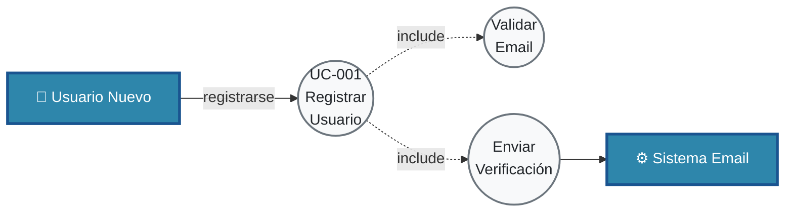
```mermaid
graph LR
    A[👤 Usuario Nuevo]:::actor
    UC1((UC-001<br/>Registrar<br/>Usuario)):::usecase
    UC2((Validar<br/>Email)):::usecase
    UC3((Enviar<br/>Verificación)):::usecase
    SYS[⚙️ Sistema Email]:::actor
    
    A -->|registrarse| UC1
    UC1 -.->|include| UC2
    UC1 -.->|include| UC3
    UC3 --> SYS
    
    classDef actor fill:#2E86AB,stroke:#1A5490,stroke-width:3px,color:#fff
    classDef usecase fill:#F8F9FA,stroke:#6C757D,stroke-width:2px,color:#212529
```

#### **UC-002: Autenticar Usuario**
- **Actor Principal**: Asistente, Organizador, Administrador
- **Descripción**: Permite a usuarios iniciar sesión con credenciales válidas
- **Precondiciones**: Usuario registrado
- **Postcondiciones**: Usuario autenticado con sesión activa

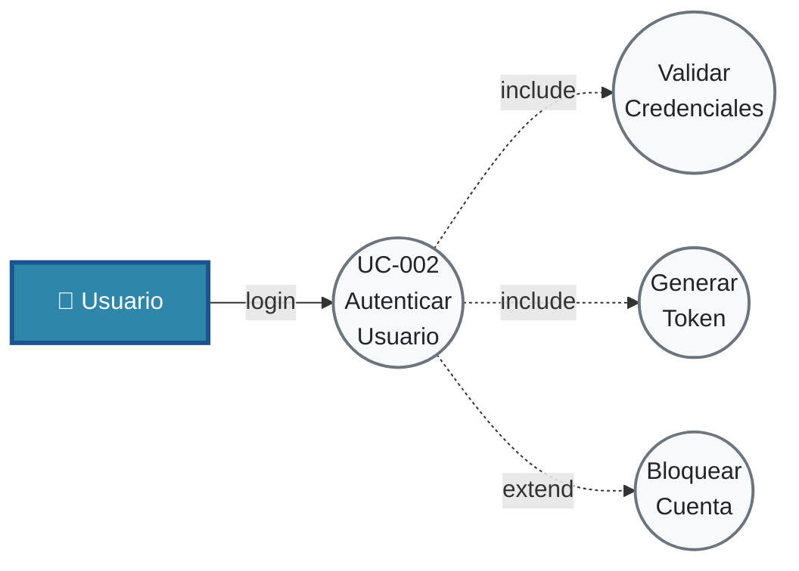
```mermaid
graph LR
    A[👤 Usuario]:::actor
    UC1((UC-002<br/>Autenticar<br/>Usuario)):::usecase
    UC2((Validar<br/>Credenciales)):::usecase
    UC3((Generar<br/>Token)):::usecase
    UC4((Bloquear<br/>Cuenta)):::usecase
    
    A -->|login| UC1
    UC1 -.->|include| UC2
    UC1 -.->|include| UC3
    UC1 -.->|extend| UC4
    
    classDef actor fill:#2E86AB,stroke:#1A5490,stroke-width:3px,color:#fff
    classDef usecase fill:#F8F9FA,stroke:#6C757D,stroke-width:2px,color:#212529
```

#### **UC-003: Cerrar Sesión**
- **Actor Principal**: Asistente, Organizador, Administrador
- **Descripción**: Permite a usuarios cerrar su sesión de forma segura
- **Precondiciones**: Usuario autenticado
- **Postcondiciones**: Sesión cerrada, usuario desautenticado

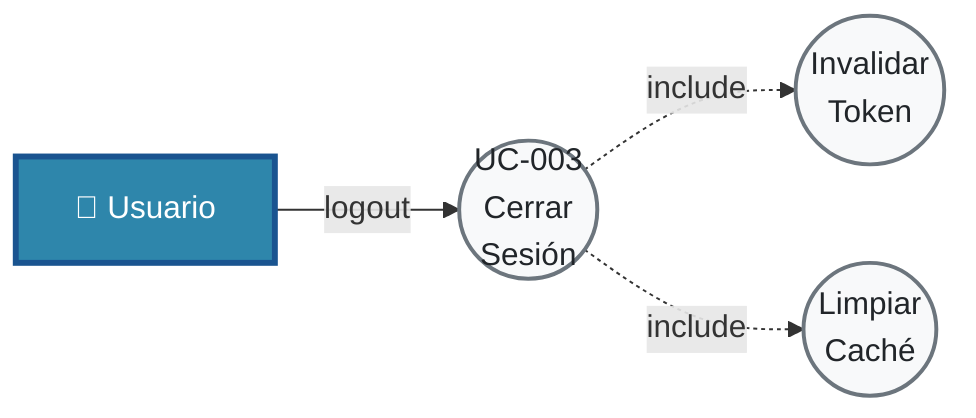
```mermaid
graph LR
    A[👤 Usuario]:::actor
    UC1((UC-003<br/>Cerrar<br/>Sesión)):::usecase
    UC2((Invalidar<br/>Token)):::usecase
    UC3((Limpiar<br/>Caché)):::usecase
    
    A -->|logout| UC1
    UC1 -.->|include| UC2
    UC1 -.->|include| UC3
    
    classDef actor fill:#2E86AB,stroke:#1A5490,stroke-width:3px,color:#fff
    classDef usecase fill:#F8F9FA,stroke:#6C757D,stroke-width:2px,color:#212529
```

#### **UC-004: Recuperar Contraseña**
- **Actor Principal**: Asistente, Organizador, Administrador
- **Descripción**: Permite a usuarios recuperar su contraseña mediante email
- **Precondiciones**: Usuario registrado
- **Postcondiciones**: Email de recuperación enviado

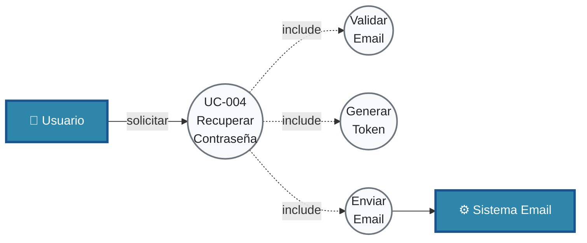
```mermaid
graph LR
    A[👤 Usuario]:::actor
    UC1((UC-004<br/>Recuperar<br/>Contraseña)):::usecase
    UC2((Validar<br/>Email)):::usecase
    UC3((Generar<br/>Token)):::usecase
    UC4((Enviar<br/>Email)):::usecase
    SYS[⚙️ Sistema Email]:::actor
    
    A -->|solicitar| UC1
    UC1 -.->|include| UC2
    UC1 -.->|include| UC3
    UC1 -.->|include| UC4
    UC4 --> SYS
    
    classDef actor fill:#2E86AB,stroke:#1A5490,stroke-width:3px,color:#fff
    classDef usecase fill:#F8F9FA,stroke:#6C757D,stroke-width:2px,color:#212529
```

#### **UC-005: Cambiar Contraseña**
- **Actor Principal**: Asistente, Organizador, Administrador
- **Descripción**: Permite a usuarios cambiar su contraseña actual
- **Precondiciones**: Usuario autenticado
- **Postcondiciones**: Contraseña actualizada

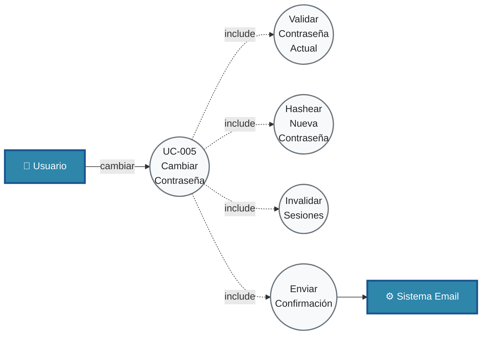
```mermaid
graph LR
    A[👤 Usuario]:::actor
    UC1((UC-005<br/>Cambiar<br/>Contraseña)):::usecase
    UC2((Validar<br/>Contraseña<br/>Actual)):::usecase
    UC3((Hashear<br/>Nueva<br/>Contraseña)):::usecase
    UC4((Invalidar<br/>Sesiones)):::usecase
    UC5((Enviar<br/>Confirmación)):::usecase
    SYS[⚙️ Sistema Email]:::actor
    
    A -->|cambiar| UC1
    UC1 -.->|include| UC2
    UC1 -.->|include| UC3
    UC1 -.->|include| UC4
    UC1 -.->|include| UC5
    UC5 --> SYS
    
    classDef actor fill:#2E86AB,stroke:#1A5490,stroke-width:3px,color:#fff
    classDef usecase fill:#F8F9FA,stroke:#6C757D,stroke-width:2px,color:#212529
```

#### **UC-006: Gestionar Perfil**
- **Actor Principal**: Asistente, Organizador, Administrador
- **Descripción**: Permite a usuarios gestionar su perfil personal
- **Precondiciones**: Usuario autenticado
- **Postcondiciones**: Perfil actualizado

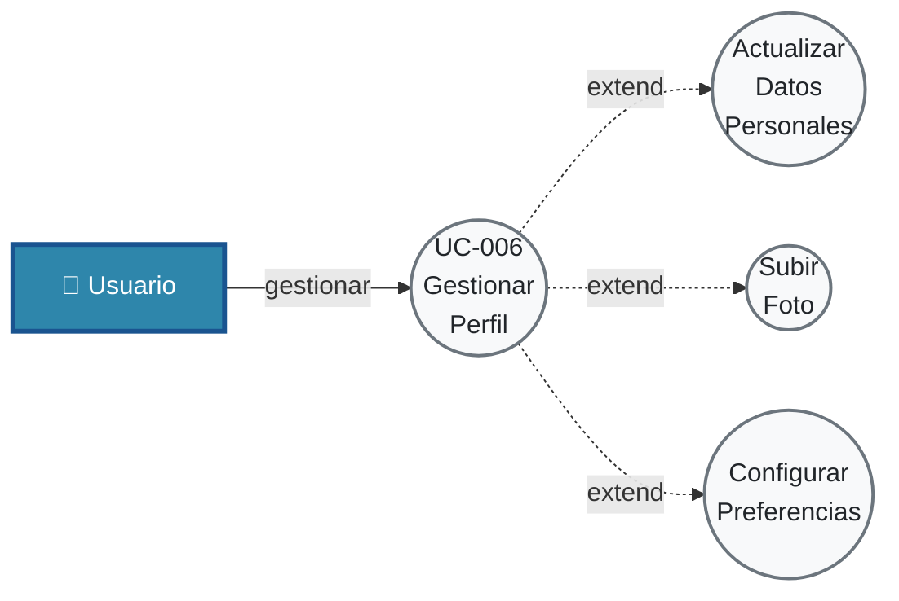
```mermaid
graph LR
    A[👤 Usuario]:::actor
    UC1((UC-006<br/>Gestionar<br/>Perfil)):::usecase
    UC2((Actualizar<br/>Datos<br/>Personales)):::usecase
    UC3((Subir<br/>Foto)):::usecase
    UC4((Configurar<br/>Preferencias)):::usecase
    
    A -->|gestionar| UC1
    UC1 -.->|extend| UC2
    UC1 -.->|extend| UC3
    UC1 -.->|extend| UC4
    
    classDef actor fill:#2E86AB,stroke:#1A5490,stroke-width:3px,color:#fff
    classDef usecase fill:#F8F9FA,stroke:#6C757D,stroke-width:2px,color:#212529
```

#### **UC-007: Ver Historial**
- **Actor Principal**: Asistente, Organizador, Administrador
- **Descripción**: Permite a usuarios consultar su historial de actividades
- **Precondiciones**: Usuario autenticado
- **Postcondiciones**: Historial de actividades mostrado

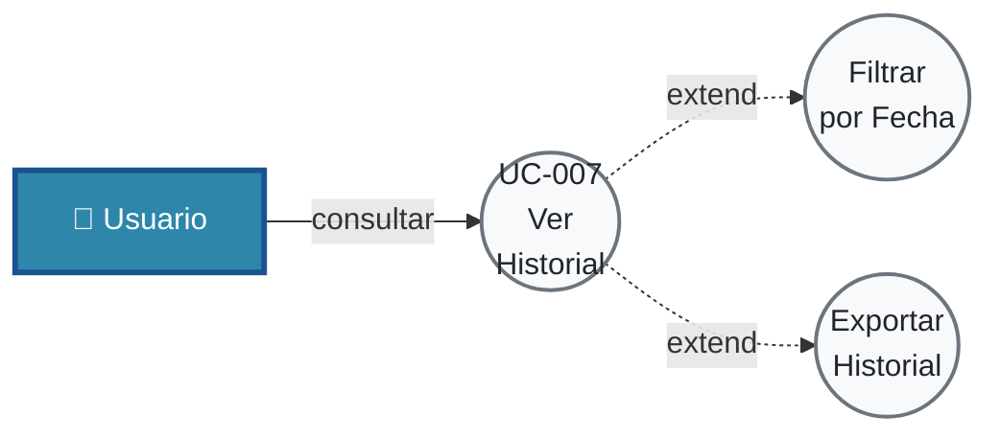
```mermaid
graph LR
    A[👤 Usuario]:::actor
    UC1((UC-007<br/>Ver<br/>Historial)):::usecase
    UC2((Filtrar<br/>por Fecha)):::usecase
    UC3((Exportar<br/>Historial)):::usecase
    
    A -->|consultar| UC1
    UC1 -.->|extend| UC2
    UC1 -.->|extend| UC3
    
    classDef actor fill:#2E86AB,stroke:#1A5490,stroke-width:3px,color:#fff
    classDef usecase fill:#F8F9FA,stroke:#6C757D,stroke-width:2px,color:#212529
```

#### **UC-008: Actualizar Datos**
- **Actor Principal**: Asistente, Administrador
- **Descripción**: Permite a usuarios modificar su información personal
- **Precondiciones**: Usuario autenticado
- **Postcondiciones**: Datos personales actualizados

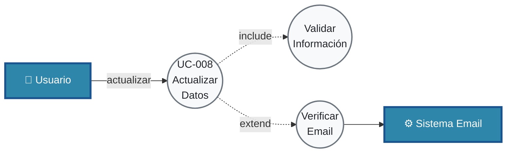
```mermaid
graph LR
    A[👤 Usuario]:::actor
    UC1((UC-008<br/>Actualizar<br/>Datos)):::usecase
    UC2((Validar<br/>Información)):::usecase
    UC3((Verificar<br/>Email)):::usecase
    SYS[⚙️ Sistema Email]:::actor
    
    A -->|actualizar| UC1
    UC1 -.->|include| UC2
    UC1 -.->|extend| UC3
    UC3 --> SYS
    
    classDef actor fill:#2E86AB,stroke:#1A5490,stroke-width:3px,color:#fff
    classDef usecase fill:#F8F9FA,stroke:#6C757D,stroke-width:2px,color:#212529
```

#### **UC-009: Gestionar Usuarios**
- **Actor Principal**: Administrador
- **Descripción**: Permite a administradores gestionar usuarios del sistema
- **Precondiciones**: Usuario autenticado como administrador
- **Postcondiciones**: Usuarios gestionados según operación

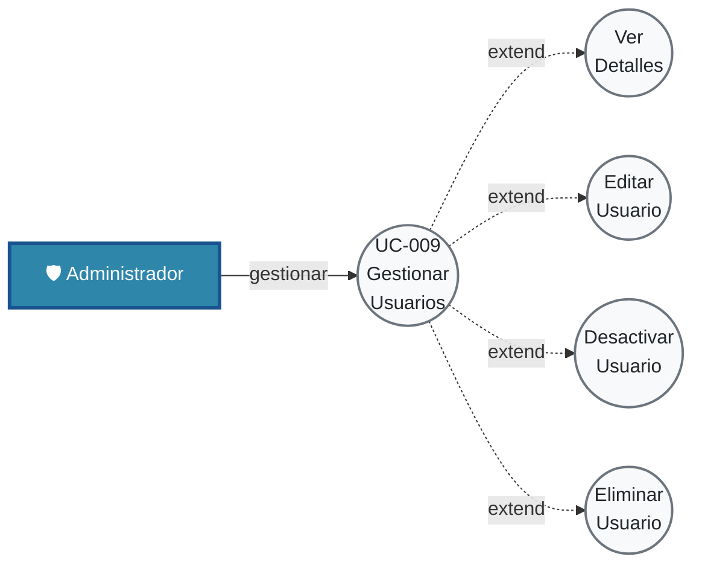
```mermaid
graph LR
    A[🛡️ Administrador]:::actor
    UC1((UC-009<br/>Gestionar<br/>Usuarios)):::usecase
    UC2((Ver<br/>Detalles)):::usecase
    UC3((Editar<br/>Usuario)):::usecase
    UC4((Desactivar<br/>Usuario)):::usecase
    UC5((Eliminar<br/>Usuario)):::usecase
    
    A -->|gestionar| UC1
    UC1 -.->|extend| UC2
    UC1 -.->|extend| UC3
    UC1 -.->|extend| UC4
    UC1 -.->|extend| UC5
    
    classDef actor fill:#2E86AB,stroke:#1A5490,stroke-width:3px,color:#fff
    classDef usecase fill:#F8F9FA,stroke:#6C757D,stroke-width:2px,color:#212529
```

#### **UC-010: Asignar Roles**
- **Actor Principal**: Administrador
- **Descripción**: Permite a administradores asignar y modificar roles de usuario
- **Precondiciones**: Usuario autenticado como administrador
- **Postcondiciones**: Rol asignado al usuario

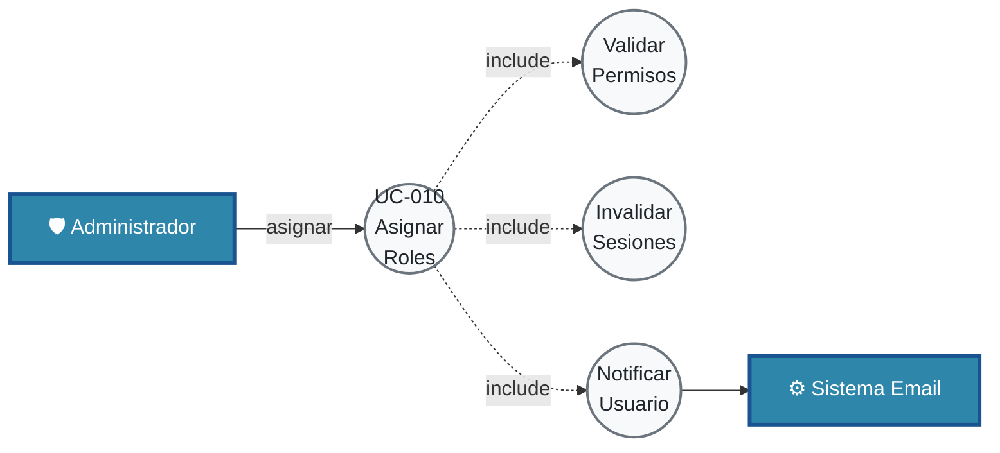
```mermaid
graph LR
    A[🛡️ Administrador]:::actor
    UC1((UC-010<br/>Asignar<br/>Roles)):::usecase
    UC2((Validar<br/>Permisos)):::usecase
    UC3((Invalidar<br/>Sesiones)):::usecase
    UC4((Notificar<br/>Usuario)):::usecase
    SYS[⚙️ Sistema Email]:::actor
    
    A -->|asignar| UC1
    UC1 -.->|include| UC2
    UC1 -.->|include| UC3
    UC1 -.->|include| UC4
    UC4 --> SYS
    
    classDef actor fill:#2E86AB,stroke:#1A5490,stroke-width:3px,color:#fff
    classDef usecase fill:#F8F9FA,stroke:#6C757D,stroke-width:2px,color:#212529
```

### **📅 Gestión de Eventos (UC-011 a UC-016)**

#### **UC-011: Explorar Eventos**
- **Actor Principal**: Asistente
- **Descripción**: Permite a usuarios explorar eventos públicos con filtros
- **Precondiciones**: Usuario autenticado
- **Postcondiciones**: Lista de eventos disponibles mostrada

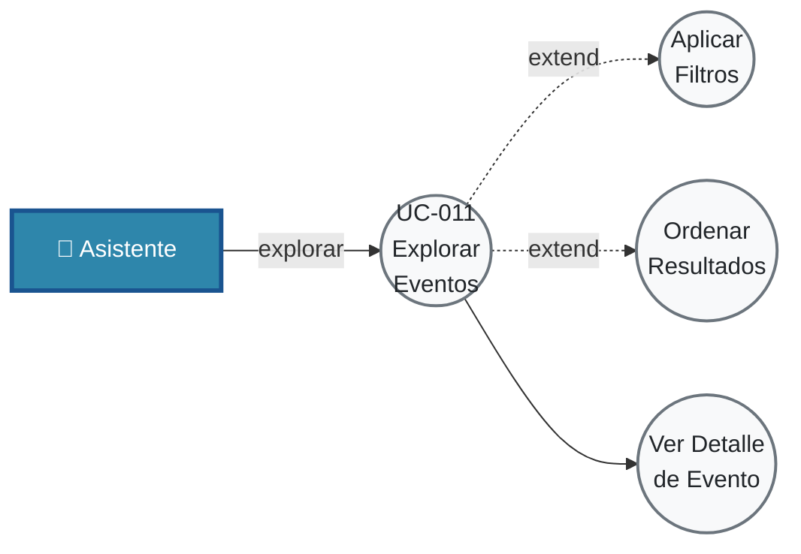
```mermaid
graph LR
    A[👤 Asistente]:::actor
    UC1((UC-011<br/>Explorar<br/>Eventos)):::usecase
    UC2((Aplicar<br/>Filtros)):::usecase
    UC3((Ordenar<br/>Resultados)):::usecase
    UC4((Ver Detalle<br/>de Evento)):::usecase
    
    A -->|explorar| UC1
    UC1 -.->|extend| UC2
    UC1 -.->|extend| UC3
    UC1 --> UC4
    
    classDef actor fill:#2E86AB,stroke:#1A5490,stroke-width:3px,color:#fff
    classDef usecase fill:#F8F9FA,stroke:#6C757D,stroke-width:2px,color:#212529
```

#### **UC-012: Buscar Eventos**
- **Actor Principal**: Asistente
- **Descripción**: Permite a usuarios buscar eventos específicos
- **Precondiciones**: Usuario autenticado
- **Postcondiciones**: Resultados de búsqueda mostrados

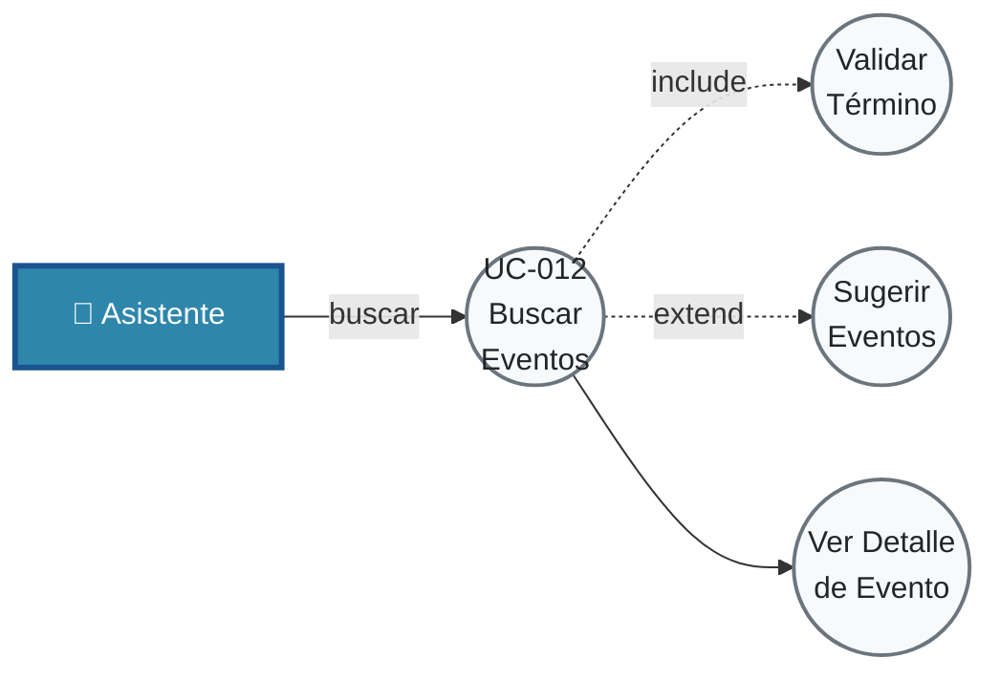
```mermaid
graph LR
    A[👤 Asistente]:::actor
    UC1((UC-012<br/>Buscar<br/>Eventos)):::usecase
    UC2((Validar<br/>Término)):::usecase
    UC3((Sugerir<br/>Eventos)):::usecase
    UC4((Ver Detalle<br/>de Evento)):::usecase
    
    A -->|buscar| UC1
    UC1 -.->|include| UC2
    UC1 -.->|extend| UC3
    UC1 --> UC4
    
    classDef actor fill:#2E86AB,stroke:#1A5490,stroke-width:3px,color:#fff
    classDef usecase fill:#F8F9FA,stroke:#6C757D,stroke-width:2px,color:#212529
```

#### **UC-013: Ver Detalle de Evento**
- **Actor Principal**: Asistente
- **Descripción**: Permite a usuarios ver información detallada de un evento
- **Precondiciones**: Usuario autenticado
- **Postcondiciones**: Detalles completos del evento mostrados

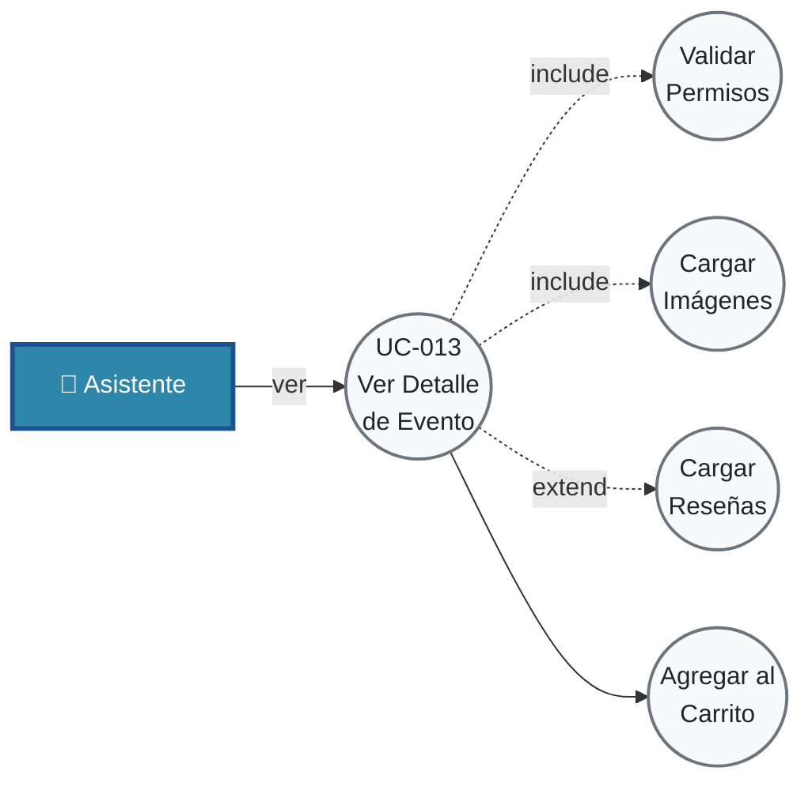
```mermaid
graph LR
    A[👤 Asistente]:::actor
    UC1((UC-013<br/>Ver Detalle<br/>de Evento)):::usecase
    UC2((Validar<br/>Permisos)):::usecase
    UC3((Cargar<br/>Imágenes)):::usecase
    UC4((Cargar<br/>Reseñas)):::usecase
    UC5((Agregar al<br/>Carrito)):::usecase
    
    A -->|ver| UC1
    UC1 -.->|include| UC2
    UC1 -.->|include| UC3
    UC1 -.->|extend| UC4
    UC1 --> UC5
    
    classDef actor fill:#2E86AB,stroke:#1A5490,stroke-width:3px,color:#fff
    classDef usecase fill:#F8F9FA,stroke:#6C757D,stroke-width:2px,color:#212529
```

#### **UC-014: Crear Evento**
- **Actor Principal**: Organizador, Administrador
- **Descripción**: Permite a organizadores crear eventos con información completa
- **Precondiciones**: Usuario autenticado como organizador
- **Postcondiciones**: Evento creado con información completa

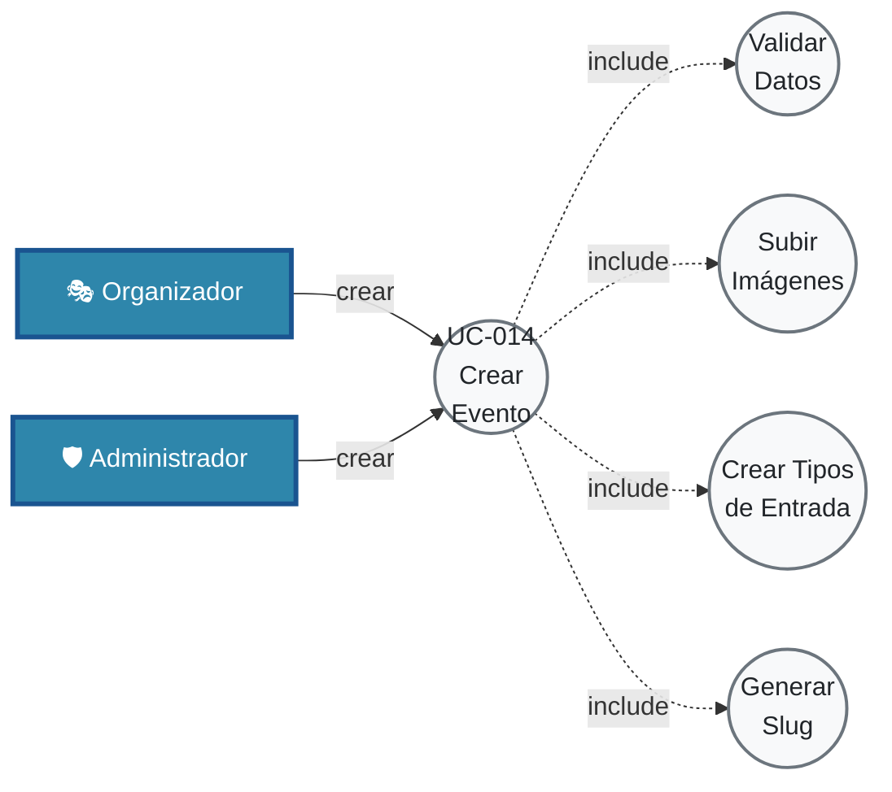
```mermaid
graph LR
    A[🎭 Organizador]:::actor
    B[🛡️ Administrador]:::actor
    UC1((UC-014<br/>Crear<br/>Evento)):::usecase
    UC2((Validar<br/>Datos)):::usecase
    UC3((Subir<br/>Imágenes)):::usecase
    UC4((Crear Tipos<br/>de Entrada)):::usecase
    UC5((Generar<br/>Slug)):::usecase
    
    A -->|crear| UC1
    B -->|crear| UC1
    UC1 -.->|include| UC2
    UC1 -.->|include| UC3
    UC1 -.->|include| UC4
    UC1 -.->|include| UC5
    
    classDef actor fill:#2E86AB,stroke:#1A5490,stroke-width:3px,color:#fff
    classDef usecase fill:#F8F9FA,stroke:#6C757D,stroke-width:2px,color:#212529
```

#### **UC-015: Editar Evento**
- **Actor Principal**: Organizador, Administrador
- **Descripción**: Permite a organizadores modificar información de eventos
- **Precondiciones**: Usuario autenticado como organizador, evento existente
- **Postcondiciones**: Evento actualizado con nuevos datos

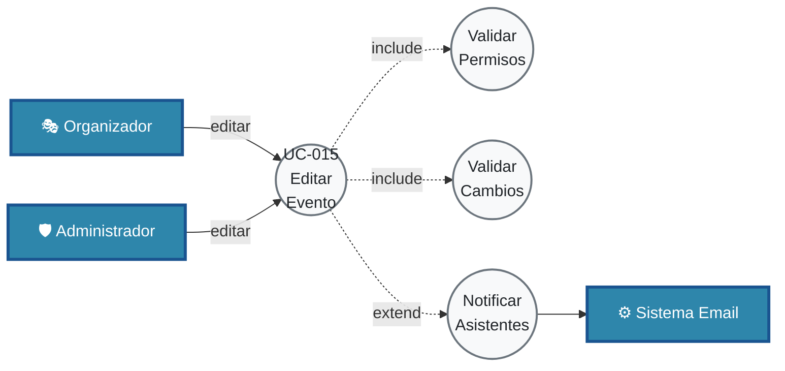
```mermaid
graph LR
    A[🎭 Organizador]:::actor
    B[🛡️ Administrador]:::actor
    UC1((UC-015<br/>Editar<br/>Evento)):::usecase
    UC2((Validar<br/>Permisos)):::usecase
    UC3((Validar<br/>Cambios)):::usecase
    UC4((Notificar<br/>Asistentes)):::usecase
    SYS[⚙️ Sistema Email]:::actor
    
    A -->|editar| UC1
    B -->|editar| UC1
    UC1 -.->|include| UC2
    UC1 -.->|include| UC3
    UC1 -.->|extend| UC4
    UC4 --> SYS
    
    classDef actor fill:#2E86AB,stroke:#1A5490,stroke-width:3px,color:#fff
    classDef usecase fill:#F8F9FA,stroke:#6C757D,stroke-width:2px,color:#212529
```

#### **UC-016: Eliminar Evento**
- **Actor Principal**: Organizador, Administrador
- **Descripción**: Permite a organizadores eliminar eventos sin compras
- **Precondiciones**: Usuario autenticado como organizador, evento sin compras
- **Postcondiciones**: Evento eliminado del sistema

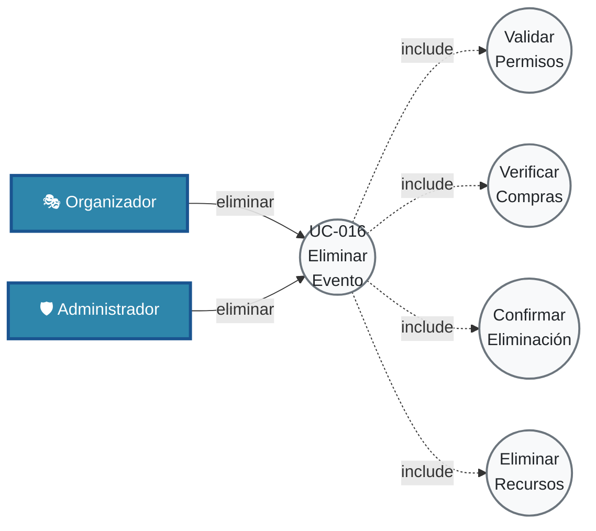
```mermaid
graph LR
    A[🎭 Organizador]:::actor
    B[🛡️ Administrador]:::actor
    UC1((UC-016<br/>Eliminar<br/>Evento)):::usecase
    UC2((Validar<br/>Permisos)):::usecase
    UC3((Verificar<br/>Compras)):::usecase
    UC4((Confirmar<br/>Eliminación)):::usecase
    UC5((Eliminar<br/>Recursos)):::usecase
    
    A -->|eliminar| UC1
    B -->|eliminar| UC1
    UC1 -.->|include| UC2
    UC1 -.->|include| UC3
    UC1 -.->|include| UC4
    UC1 -.->|include| UC5
    
    classDef actor fill:#2E86AB,stroke:#1A5490,stroke-width:3px,color:#fff
    classDef usecase fill:#F8F9FA,stroke:#6C757D,stroke-width:2px,color:#212529
```

### **🎫 Gestión de Pagos (UC-017 a UC-021)**

#### **UC-017: Agregar al Carrito**
- **Actor Principal**: Asistente
- **Descripción**: Permite a usuarios agregar entradas a su carrito
- **Precondiciones**: Usuario autenticado, evento con entradas disponibles
- **Postcondiciones**: Entradas agregadas al carrito

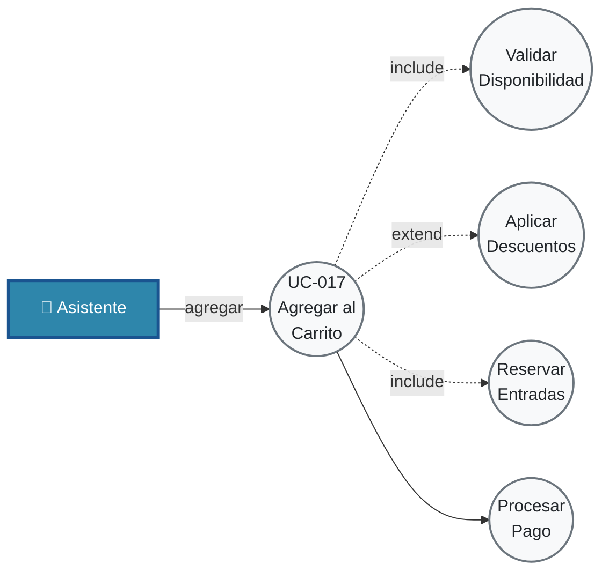
```mermaid
graph LR
    A[👤 Asistente]:::actor
    UC1((UC-017<br/>Agregar al<br/>Carrito)):::usecase
    UC2((Validar<br/>Disponibilidad)):::usecase
    UC3((Aplicar<br/>Descuentos)):::usecase
    UC4((Reservar<br/>Entradas)):::usecase
    UC5((Procesar<br/>Pago)):::usecase
    
    A -->|agregar| UC1
    UC1 -.->|include| UC2
    UC1 -.->|extend| UC3
    UC1 -.->|include| UC4
    UC1 --> UC5
    
    classDef actor fill:#2E86AB,stroke:#1A5490,stroke-width:3px,color:#fff
    classDef usecase fill:#F8F9FA,stroke:#6C757D,stroke-width:2px,color:#212529
```

#### **UC-018: Procesar Pago**
- **Actor Principal**: Asistente
- **Descripción**: Procesa el pago de entradas de forma segura
- **Precondiciones**: Usuario autenticado con entradas en carrito
- **Postcondiciones**: Pago procesado, entradas generadas

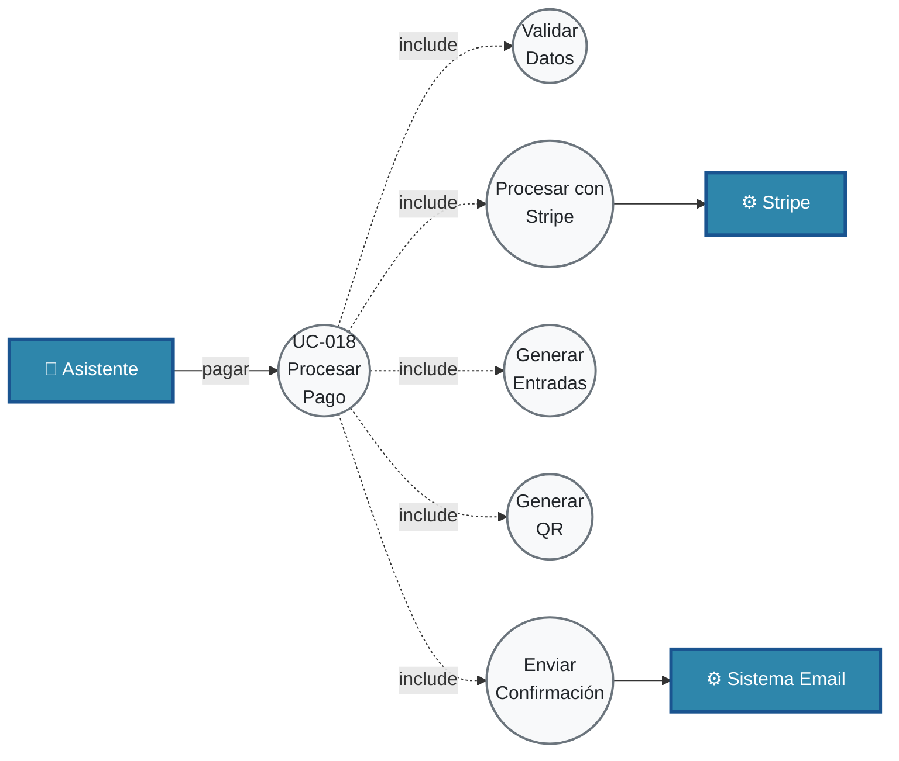
```mermaid
graph LR
    A[👤 Asistente]:::actor
    UC1((UC-018<br/>Procesar<br/>Pago)):::usecase
    UC2((Validar<br/>Datos)):::usecase
    UC3((Procesar con<br/>Stripe)):::usecase
    UC4((Generar<br/>Entradas)):::usecase
    UC5((Generar<br/>QR)):::usecase
    UC6((Enviar<br/>Confirmación)):::usecase
    SYS1[⚙️ Stripe]:::actor
    SYS2[⚙️ Sistema Email]:::actor
    
    A -->|pagar| UC1
    UC1 -.->|include| UC2
    UC1 -.->|include| UC3
    UC3 --> SYS1
    UC1 -.->|include| UC4
    UC1 -.->|include| UC5
    UC1 -.->|include| UC6
    UC6 --> SYS2
    
    classDef actor fill:#2E86AB,stroke:#1A5490,stroke-width:3px,color:#fff
    classDef usecase fill:#F8F9FA,stroke:#6C757D,stroke-width:2px,color:#212529
```

#### **UC-019: Ver Entradas**
- **Actor Principal**: Asistente
- **Descripción**: Permite a usuarios ver todas sus entradas compradas
- **Precondiciones**: Usuario autenticado con entradas compradas
- **Postcondiciones**: Lista de entradas mostrada

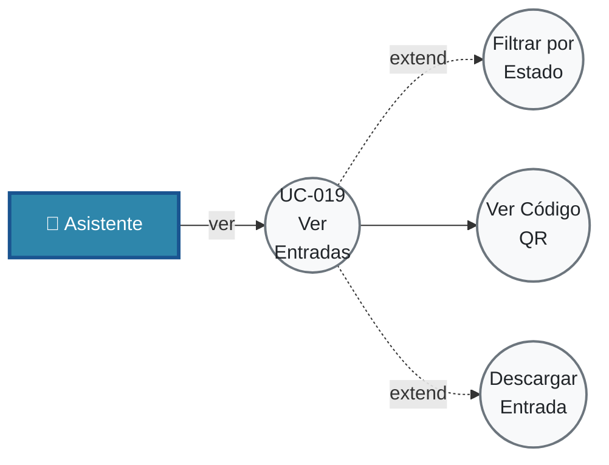
```mermaid
graph LR
    A[👤 Asistente]:::actor
    UC1((UC-019<br/>Ver<br/>Entradas)):::usecase
    UC2((Filtrar por<br/>Estado)):::usecase
    UC3((Ver Código<br/>QR)):::usecase
    UC4((Descargar<br/>Entrada)):::usecase
    
    A -->|ver| UC1
    UC1 -.->|extend| UC2
    UC1 --> UC3
    UC1 -.->|extend| UC4
    
    classDef actor fill:#2E86AB,stroke:#1A5490,stroke-width:3px,color:#fff
    classDef usecase fill:#F8F9FA,stroke:#6C757D,stroke-width:2px,color:#212529
```

#### **UC-020: Generar QR**
- **Actor Principal**: Sistema
- **Descripción**: Genera automáticamente códigos QR únicos para cada entrada
- **Precondiciones**: Entrada válida creada
- **Postcondiciones**: Código QR generado y guardado

```mermaid
graph LR
    SYS[⚙️ Sistema]:::actor
    UC1((UC-020<br/>Generar<br/>QR)):::usecase
    UC2((Generar<br/>UUID)):::usecase
    UC3((Cifrar<br/>Datos)):::usecase
    UC4((Guardar<br/>Imagen)):::usecase
    
    SYS -->|generar| UC1
    UC1 -.->|include| UC2
    UC1 -.->|include| UC3
    UC1 -.->|include| UC4
    
    classDef actor fill:#2E86AB,stroke:#1A5490,stroke-width:3px,color:#fff
    classDef usecase fill:#F8F9FA,stroke:#6C757D,stroke-width:2px,color:#212529
```

#### **UC-021: Validar Entrada**
- **Actor Principal**: Organizador
- **Descripción**: Permite a organizadores validar entradas mediante códigos QR
- **Precondiciones**: Evento activo, entrada válida
- **Postcondiciones**: Asistencia registrada, entrada marcada como usada

```mermaid
graph LR
    A[🎭 Organizador]:::actor
    UC1((UC-021<br/>Validar<br/>Entrada)):::usecase
    UC2((Escanear<br/>QR)):::usecase
    UC3((Validar<br/>Autenticidad)):::usecase
    UC4((Verificar<br/>Estado)):::usecase
    UC5((Registrar<br/>Asistencia)):::usecase
    
    A -->|validar| UC1
    UC1 -.->|include| UC2
    UC1 -.->|include| UC3
    UC1 -.->|include| UC4
    UC1 -.->|include| UC5
    
    classDef actor fill:#2E86AB,stroke:#1A5490,stroke-width:3px,color:#fff
    classDef usecase fill:#F8F9FA,stroke:#6C757D,stroke-width:2px,color:#212529
```

### **🔔 Gestión de Notificaciones (UC-022 a UC-024)**

#### **UC-022: Enviar Notificación**
- **Actor Principal**: Organizador, Administrador
- **Descripción**: Permite enviar notificaciones masivas por email y push
- **Precondiciones**: Usuario autenticado con permisos
- **Postcondiciones**: Notificaciones enviadas a usuarios objetivo

```mermaid
graph LR
    A[🎭 Organizador]:::actor
    B[🛡️ Administrador]:::actor
    UC1((UC-022<br/>Enviar<br/>Notificación)):::usecase
    UC2((Seleccionar<br/>Destinatarios)):::usecase
    UC3((Redactar<br/>Mensaje)):::usecase
    UC4((Programar<br/>Envío)):::usecase
    UC5((Enviar por<br/>Email)):::usecase
    UC6((Enviar<br/>Push)):::usecase
    SYS1[⚙️ Sistema Email]:::actor
    SYS2[⚙️ Sistema Push]:::actor
    
    A -->|enviar| UC1
    B -->|enviar| UC1
    UC1 -.->|include| UC2
    UC1 -.->|include| UC3
    UC1 -.->|extend| UC4
    UC1 -.->|extend| UC5
    UC1 -.->|extend| UC6
    UC5 --> SYS1
    UC6 --> SYS2
    
    classDef actor fill:#2E86AB,stroke:#1A5490,stroke-width:3px,color:#fff
    classDef usecase fill:#F8F9FA,stroke:#6C757D,stroke-width:2px,color:#212529
```

#### **UC-023: Ver Notificaciones**
- **Actor Principal**: Asistente, Organizador, Administrador
- **Descripción**: Permite a usuarios ver todas sus notificaciones recibidas
- **Precondiciones**: Usuario autenticado
- **Postcondiciones**: Notificaciones mostradas

```mermaid
graph LR
    A[👤 Usuario]:::actor
    UC1((UC-023<br/>Ver<br/>Notificaciones)):::usecase
    UC2((Marcar como<br/>Leída)):::usecase
    UC3((Eliminar<br/>Notificación)):::usecase
    UC4((Filtrar<br/>Notificaciones)):::usecase
    
    A -->|ver| UC1
    UC1 -.->|extend| UC2
    UC1 -.->|extend| UC3
    UC1 -.->|extend| UC4
    
    classDef actor fill:#2E86AB,stroke:#1A5490,stroke-width:3px,color:#fff
    classDef usecase fill:#F8F9FA,stroke:#6C757D,stroke-width:2px,color:#212529
```

#### **UC-024: Configurar Preferencias**
- **Actor Principal**: Asistente, Organizador, Administrador
- **Descripción**: Permite a usuarios configurar sus preferencias de notificación
- **Precondiciones**: Usuario autenticado
- **Postcondiciones**: Preferencias de notificación actualizadas

```mermaid
graph LR
    A[👤 Usuario]:::actor
    UC1((UC-024<br/>Configurar<br/>Preferencias)):::usecase
    UC2((Activar/Desactivar<br/>Email)):::usecase
    UC3((Activar/Desactivar<br/>Push)):::usecase
    UC4((Configurar<br/>Frecuencia)):::usecase
    
    A -->|configurar| UC1
    UC1 -.->|extend| UC2
    UC1 -.->|extend| UC3
    UC1 -.->|extend| UC4
    
    classDef actor fill:#2E86AB,stroke:#1A5490,stroke-width:3px,color:#fff
    classDef usecase fill:#F8F9FA,stroke:#6C757D,stroke-width:2px,color:#212529
```

### **📊 Gestión de Analytics (UC-025 a UC-030)**

#### **UC-025: Ver Dashboard**
- **Actor Principal**: Asistente, Organizador, Administrador
- **Descripción**: Muestra dashboard personalizado según el rol del usuario
- **Precondiciones**: Usuario autenticado
- **Postcondiciones**: Dashboard personalizado mostrado

```mermaid
graph LR
    A[👤 Asistente]:::actor
    B[🎭 Organizador]:::actor
    C[🛡️ Administrador]:::actor
    UC1((UC-025<br/>Ver<br/>Dashboard)):::usecase
    UC2((Cargar<br/>Métricas)):::usecase
    UC3((Generar<br/>Gráficos)):::usecase
    UC4((Actualizar en<br/>Tiempo Real)):::usecase
    
    A -->|ver| UC1
    B -->|ver| UC1
    C -->|ver| UC1
    UC1 -.->|include| UC2
    UC1 -.->|include| UC3
    UC1 -.->|extend| UC4
    
    classDef actor fill:#2E86AB,stroke:#1A5490,stroke-width:3px,color:#fff
    classDef usecase fill:#F8F9FA,stroke:#6C757D,stroke-width:2px,color:#212529
```

#### **UC-026: Generar Reportes**
- **Actor Principal**: Asistente, Organizador, Administrador
- **Descripción**: Permite generar reportes personalizados con métricas
- **Precondiciones**: Usuario autenticado con permisos
- **Postcondiciones**: Reporte generado y descargable

```mermaid
graph LR
    A[👤 Usuario]:::actor
    UC1((UC-026<br/>Generar<br/>Reportes)):::usecase
    UC2((Seleccionar<br/>Tipo)):::usecase
    UC3((Aplicar<br/>Filtros)):::usecase
    UC4((Seleccionar<br/>Formato)):::usecase
    UC5((Exportar<br/>Reporte)):::usecase
    
    A -->|generar| UC1
    UC1 -.->|include| UC2
    UC1 -.->|extend| UC3
    UC1 -.->|include| UC4
    UC1 -.->|include| UC5
    
    classDef actor fill:#2E86AB,stroke:#1A5490,stroke-width:3px,color:#fff
    classDef usecase fill:#F8F9FA,stroke:#6C757D,stroke-width:2px,color:#212529
```

#### **UC-027: Ver Métricas**
- **Actor Principal**: Sistema
- **Descripción**: Procesa y actualiza métricas del sistema en tiempo real
- **Precondiciones**: Sistema activo
- **Postcondiciones**: Métricas actualizadas en tiempo real

```mermaid
graph LR
    SYS[⚙️ Sistema]:::actor
    UC1((UC-027<br/>Ver<br/>Métricas)):::usecase
    UC2((Recopilar<br/>Datos)):::usecase
    UC3((Calcular<br/>KPIs)):::usecase
    UC4((Actualizar<br/>Caché)):::usecase
    UC5((Generar<br/>Alertas)):::usecase
    
    SYS -->|procesar| UC1
    UC1 -.->|include| UC2
    UC1 -.->|include| UC3
    UC1 -.->|include| UC4
    UC1 -.->|extend| UC5
    
    classDef actor fill:#2E86AB,stroke:#1A5490,stroke-width:3px,color:#fff
    classDef usecase fill:#F8F9FA,stroke:#6C757D,stroke-width:2px,color:#212529
```

#### **UC-028: Dashboard del Organizador**
- **Actor Principal**: Organizador
- **Descripción**: Muestra dashboard especializado para organizadores
- **Precondiciones**: Usuario autenticado como organizador
- **Postcondiciones**: Dashboard personalizado mostrado

```mermaid
graph LR
    A[🎭 Organizador]:::actor
    UC1((UC-028<br/>Dashboard del<br/>Organizador)):::usecase
    UC2((Cargar<br/>Eventos)):::usecase
    UC3((Calcular<br/>Ventas)):::usecase
    UC4((Mostrar<br/>Tendencias)):::usecase
    UC5((Ver Métricas<br/>de Eventos)):::usecase
    
    A -->|ver| UC1
    UC1 -.->|include| UC2
    UC1 -.->|include| UC3
    UC1 -.->|include| UC4
    UC1 --> UC5
    
    classDef actor fill:#2E86AB,stroke:#1A5490,stroke-width:3px,color:#fff
    classDef usecase fill:#F8F9FA,stroke:#6C757D,stroke-width:2px,color:#212529
```

#### **UC-029: Gestionar Asistentes**
- **Actor Principal**: Organizador
- **Descripción**: Permite a organizadores gestionar lista de asistentes
- **Precondiciones**: Usuario autenticado como organizador, evento con asistentes
- **Postcondiciones**: Asistentes gestionados según operación

```mermaid
graph LR
    A[🎭 Organizador]:::actor
    UC1((UC-029<br/>Gestionar<br/>Asistentes)):::usecase
    UC2((Ver<br/>Detalles)):::usecase
    UC3((Exportar<br/>Lista)):::usecase
    UC4((Enviar<br/>Mensaje)):::usecase
    UC5((Check-in<br/>Manual)):::usecase
    SYS[⚙️ Sistema Email]:::actor
    
    A -->|gestionar| UC1
    UC1 -.->|extend| UC2
    UC1 -.->|extend| UC3
    UC1 -.->|extend| UC4
    UC1 -.->|extend| UC5
    UC4 --> SYS
    
    classDef actor fill:#2E86AB,stroke:#1A5490,stroke-width:3px,color:#fff
    classDef usecase fill:#F8F9FA,stroke:#6C757D,stroke-width:2px,color:#212529
```

#### **UC-030: Ver Métricas de Eventos**
- **Actor Principal**: Organizador, Administrador
- **Descripción**: Permite ver métricas específicas de eventos
- **Precondiciones**: Usuario autenticado como organizador, evento existente
- **Postcondiciones**: Métricas del evento mostradas

```mermaid
graph LR
    A[🎭 Organizador]:::actor
    B[🛡️ Administrador]:::actor
    UC1((UC-030<br/>Ver Métricas<br/>de Eventos)):::usecase
    UC2((Calcular<br/>Ocupación)):::usecase
    UC3((Analizar<br/>Ventas)):::usecase
    UC4((Comparar<br/>Eventos)):::usecase
    UC5((Exportar<br/>Datos)):::usecase
    
    A -->|ver| UC1
    B -->|ver| UC1
    UC1 -.->|include| UC2
    UC1 -.->|include| UC3
    UC1 -.->|extend| UC4
    UC1 -.->|extend| UC5
    
    classDef actor fill:#2E86AB,stroke:#1A5490,stroke-width:3px,color:#fff
    classDef usecase fill:#F8F9FA,stroke:#6C757D,stroke-width:2px,color:#212529
```

### **⚙️ Gestión de Administración (UC-031 a UC-039)**

#### **UC-031: Crear Códigos Promocionales**
- **Actor Principal**: Organizador
- **Descripción**: Permite a organizadores crear códigos promocionales
- **Precondiciones**: Usuario autenticado como organizador
- **Postcondiciones**: Código promocional creado

```mermaid
graph LR
    A[🎭 Organizador]:::actor
    UC1((UC-031<br/>Crear Códigos<br/>Promocionales)):::usecase
    UC2((Configurar<br/>Descuento)):::usecase
    UC3((Validar<br/>Disponibilidad)):::usecase
    UC4((Establecer<br/>Límites)):::usecase
    UC5((Configurar<br/>Vigencia)):::usecase
    
    A -->|crear| UC1
    UC1 -.->|include| UC2
    UC1 -.->|include| UC3
    UC1 -.->|include| UC4
    UC1 -.->|include| UC5
    
    classDef actor fill:#2E86AB,stroke:#1A5490,stroke-width:3px,color:#fff
    classDef usecase fill:#F8F9FA,stroke:#6C757D,stroke-width:2px,color:#212529
```

#### **UC-032: Gestionar Lista de Espera**
- **Actor Principal**: Organizador
- **Descripción**: Permite a organizadores gestionar listas de espera
- **Precondiciones**: Usuario autenticado como organizador, evento con lista de espera
- **Postcondiciones**: Lista de espera gestionada

```mermaid
graph LR
    A[🎭 Organizador]:::actor
    UC1((UC-032<br/>Gestionar Lista<br/>de Espera)):::usecase
    UC2((Ver<br/>Lista)):::usecase
    UC3((Liberar<br/>Entradas)):::usecase
    UC4((Notificar<br/>Usuarios)):::usecase
    UC5((Eliminar de<br/>Lista)):::usecase
    SYS[⚙️ Sistema Email]:::actor
    
    A -->|gestionar| UC1
    UC1 -.->|extend| UC2
    UC1 -.->|extend| UC3
    UC1 -.->|extend| UC4
    UC1 -.->|extend| UC5
    UC4 --> SYS
    
    classDef actor fill:#2E86AB,stroke:#1A5490,stroke-width:3px,color:#fff
    classDef usecase fill:#F8F9FA,stroke:#6C757D,stroke-width:2px,color:#212529
```

#### **UC-033: Configurar Check-in**
- **Actor Principal**: Organizador
- **Descripción**: Permite a organizadores configurar parámetros de check-in
- **Precondiciones**: Usuario autenticado como organizador
- **Postcondiciones**: Check-in configurado

```mermaid
graph LR
    A[🎭 Organizador]:::actor
    UC1((UC-033<br/>Configurar<br/>Check-in)):::usecase
    UC2((Seleccionar<br/>Método)):::usecase
    UC3((Configurar<br/>Horarios)):::usecase
    UC4((Asignar<br/>Personal)):::usecase
    UC5((Configurar<br/>Reglas)):::usecase
    
    A -->|configurar| UC1
    UC1 -.->|include| UC2
    UC1 -.->|include| UC3
    UC1 -.->|extend| UC4
    UC1 -.->|include| UC5
    
    classDef actor fill:#2E86AB,stroke:#1A5490,stroke-width:3px,color:#fff
    classDef usecase fill:#F8F9FA,stroke:#6C757D,stroke-width:2px,color:#212529
```

#### **UC-034: Dashboard de Administración**
- **Actor Principal**: Administrador
- **Descripción**: Muestra dashboard especializado para administradores
- **Precondiciones**: Usuario autenticado como administrador
- **Postcondiciones**: Dashboard de administración mostrado

```mermaid
graph LR
    A[🛡️ Administrador]:::actor
    UC1((UC-034<br/>Dashboard de<br/>Administración)):::usecase
    UC2((Cargar Métricas<br/>Globales)):::usecase
    UC3((Monitorear<br/>Sistema)):::usecase
    UC4((Ver<br/>Alertas)):::usecase
    UC5((Generar<br/>Reportes)):::usecase
    
    A -->|ver| UC1
    UC1 -.->|include| UC2
    UC1 -.->|include| UC3
    UC1 -.->|extend| UC4
    UC1 --> UC5
    
    classDef actor fill:#2E86AB,stroke:#1A5490,stroke-width:3px,color:#fff
    classDef usecase fill:#F8F9FA,stroke:#6C757D,stroke-width:2px,color:#212529
```

#### **UC-035: Gestionar Configuración del Sistema**
- **Actor Principal**: Administrador
- **Descripción**: Permite a administradores gestionar parámetros globales
- **Precondiciones**: Usuario autenticado como administrador
- **Postcondiciones**: Configuración del sistema actualizada

```mermaid
graph LR
    A[🛡️ Administrador]:::actor
    UC1((UC-035<br/>Gestionar<br/>Configuración)):::usecase
    UC2((Configurar<br/>Parámetros)):::usecase
    UC3((Configurar<br/>Pagos)):::usecase
    UC4((Configurar<br/>Email)):::usecase
    UC5((Configurar<br/>Seguridad)):::usecase
    
    A -->|gestionar| UC1
    UC1 -.->|extend| UC2
    UC1 -.->|extend| UC3
    UC1 -.->|extend| UC4
    UC1 -.->|extend| UC5
    
    classDef actor fill:#2E86AB,stroke:#1A5490,stroke-width:3px,color:#fff
    classDef usecase fill:#F8F9FA,stroke:#6C757D,stroke-width:2px,color:#212529
```

#### **UC-036: Ver Métricas Globales**
- **Actor Principal**: Administrador
- **Descripción**: Permite a administradores ver métricas globales del sistema
- **Precondiciones**: Usuario autenticado como administrador
- **Postcondiciones**: Métricas globales mostradas

```mermaid
graph LR
    A[🛡️ Administrador]:::actor
    UC1((UC-036<br/>Ver Métricas<br/>Globales)):::usecase
    UC2((Calcular<br/>KPIs)):::usecase
    UC3((Analizar<br/>Tendencias)):::usecase
    UC4((Comparar<br/>Períodos)):::usecase
    UC5((Exportar<br/>Métricas)):::usecase
    
    A -->|ver| UC1
    UC1 -.->|include| UC2
    UC1 -.->|include| UC3
    UC1 -.->|extend| UC4
    UC1 -.->|extend| UC5
    
    classDef actor fill:#2E86AB,stroke:#1A5490,stroke-width:3px,color:#fff
    classDef usecase fill:#F8F9FA,stroke:#6C757D,stroke-width:2px,color:#212529
```

#### **UC-037: Monitorear Rendimiento**
- **Actor Principal**: Administrador
- **Descripción**: Permite a administradores monitorear el rendimiento del sistema
- **Precondiciones**: Usuario autenticado como administrador
- **Postcondiciones**: Estado del sistema monitoreado

```mermaid
graph LR
    A[🛡️ Administrador]:::actor
    UC1((UC-037<br/>Monitorear<br/>Rendimiento)):::usecase
    UC2((Verificar<br/>Recursos)):::usecase
    UC3((Detectar<br/>Problemas)):::usecase
    UC4((Generar<br/>Alertas)):::usecase
    UC5((Notificar<br/>Equipo)):::usecase
    SYS[⚙️ Sistema Email]:::actor
    
    A -->|monitorear| UC1
    UC1 -.->|include| UC2
    UC1 -.->|extend| UC3
    UC1 -.->|extend| UC4
    UC4 -.->|extend| UC5
    UC5 --> SYS
    
    classDef actor fill:#2E86AB,stroke:#1A5490,stroke-width:3px,color:#fff
    classDef usecase fill:#F8F9FA,stroke:#6C757D,stroke-width:2px,color:#212529
```

#### **UC-038: Gestionar Backup y Restauración**
- **Actor Principal**: Administrador
- **Descripción**: Permite a administradores crear respaldos del sistema
- **Precondiciones**: Usuario autenticado como administrador
- **Postcondiciones**: Backup creado o restauración completada

```mermaid
graph LR
    A[🛡️ Administrador]:::actor
    UC1((UC-038<br/>Gestionar Backup<br/>y Restauración)):::usecase
    UC2((Crear<br/>Backup)):::usecase
    UC3((Restaurar<br/>Backup)):::usecase
    UC4((Verificar<br/>Integridad)):::usecase
    UC5((Programar<br/>Backups)):::usecase
    
    A -->|gestionar| UC1
    UC1 -.->|extend| UC2
    UC1 -.->|extend| UC3
    UC1 -.->|include| UC4
    UC1 -.->|extend| UC5
    
    classDef actor fill:#2E86AB,stroke:#1A5490,stroke-width:3px,color:#fff
    classDef usecase fill:#F8F9FA,stroke:#6C757D,stroke-width:2px,color:#212529
```

#### **UC-039: Configurar Integraciones**
- **Actor Principal**: Administrador
- **Descripción**: Permite a administradores configurar integraciones externas
- **Precondiciones**: Usuario autenticado como administrador
- **Postcondiciones**: Integración configurada y activa

```mermaid
graph LR
    A[🛡️ Administrador]:::actor
    UC1((UC-039<br/>Configurar<br/>Integraciones)):::usecase
    UC2((Seleccionar<br/>Integración)):::usecase
    UC3((Ingresar<br/>Credenciales)):::usecase
    UC4((Probar<br/>Conexión)):::usecase
    UC5((Activar<br/>Integración)):::usecase
    SYS[⚙️ Servicio Externo]:::actor
    
    A -->|configurar| UC1
    UC1 -.->|include| UC2
    UC1 -.->|include| UC3
    UC1 -.->|include| UC4
    UC1 -.->|include| UC5
    UC4 --> SYS
    
    classDef actor fill:#2E86AB,stroke:#1A5490,stroke-width:3px,color:#fff
    classDef usecase fill:#F8F9FA,stroke:#6C757D,stroke-width:2px,color:#212529
```

---

## 🎯 **Mapeo de Historias de Usuario a Casos de Uso**

### **Épica 1: Gestión de Usuarios y Permisos**
- **HU1** → UC-001: Registrar Usuario
- **HU2** → UC-001: Registrar Usuario (con redes sociales)
- **HU3** → UC-010: Asignar Roles

### **Épica 2: Creación y Gestión de Eventos**
- **HU4** → UC-014: Crear Evento
- **HU5** → UC-015: Editar Evento, UC-016: Eliminar Evento
- **HU6** → UC-014: Crear Evento (personalización)
- **HU7** → UC-014: Crear Evento (duplicar)

### **Épica 3: Gestión de Tipos de Entradas y Precios**
- **HU8** → UC-014: Crear Evento (tipos de entrada)
- **HU9** → UC-031: Crear Códigos Promocionales
- **HU10** → UC-014: Crear Evento (límites de compra)

### **Épica 4: Proceso de Reserva y Compra de Entradas**
- **HU11** → UC-011: Explorar Eventos, UC-012: Buscar Eventos
- **HU12** → UC-017: Agregar al Carrito, UC-018: Procesar Pago
- **HU13** → UC-019: Ver Entradas, UC-020: Generar QR

### **Épica 5: Sistema de Pagos Integrado**
- **HU14** → UC-018: Procesar Pago (métodos de pago)
- **HU15** → UC-018: Procesar Pago (seguridad)
- **HU16** → UC-026: Generar Reportes (reconciliación)

### **Épica 6: Sistema de Control de Asistencia**
- **HU17** → UC-021: Validar Entrada
- **HU18** → UC-021: Validar Entrada, UC-033: Configurar Check-in
- **HU19** → UC-030: Ver Métricas de Eventos

### **Épica 7: Comunicación y Notificaciones**
- **HU20** → UC-022: Enviar Notificación
- **HU21** → UC-022: Enviar Notificación (recordatorios)
- **HU22** → UC-022: Enviar Notificación (encuestas)

### **Épica 8: Panel de Control y Analytics**
- **HU23** → UC-025: Ver Dashboard, UC-028: Dashboard del Organizador
- **HU24** → UC-026: Generar Reportes
- **HU25** → UC-034: Dashboard de Administración, UC-036: Ver Métricas Globales

### **Épica 9: Experiencia Móvil**
- **HU26** → UC-011: Explorar Eventos (responsive)
- **HU27** → UC-021: Validar Entrada (móvil)

### **Épica 10: Sistema de Recomendaciones y Descubrimiento**
- **HU28** → UC-011: Explorar Eventos (recomendaciones)
- **HU29** → UC-022: Enviar Notificación (seguimiento)

---

## 📊 **Estadísticas del Sistema**

### **Casos de Uso por Actor**
- **Asistente**: 15 casos de uso
- **Organizador**: 20 casos de uso
- **Administrador**: 25 casos de uso
- **Sistema Externo**: 3 casos de uso

### **Casos de Uso por Categoría**
- **Gestión de Usuarios**: 10 casos de uso
- **Gestión de Eventos**: 6 casos de uso
- **Gestión de Pagos**: 5 casos de uso
- **Gestión de Notificaciones**: 3 casos de uso
- **Gestión de Analytics**: 6 casos de uso
- **Gestión de Administración**: 9 casos de uso

### **Total de Casos de Uso**: 39 casos de uso

---

*Este diagrama de casos de uso representa la funcionalidad completa del sistema EventHub, mostrando todas las interacciones entre actores y casos de uso, proporcionando una visión integral del sistema de gestión de eventos.*
