# 🏗️ Diagrama de Clases - EventHub 

## 🎯 **Representación de las Clases del Sistema**

Este diagrama muestra la estructura de clases del sistema EventHub, basado en la documentación de la base de datos y la implementación del código. Representa las entidades principales, sus atributos, métodos y relaciones.

```mermaid
classDiagram
    %% ==========================================
    %% ENTIDADES PRINCIPALES DEL DOMINIO
    %% ==========================================
    
    class Usuario {
        -String id
        -String correo_electronico
        -String nombre_completo
        -UserRole rol
        -String url_avatar
        -JSONB preferencias
        -String contraseña
        -DateTime fecha_creacion
        -DateTime fecha_actualizacion
        
        +login(email: String, password: String) Boolean
        +logout() void
        +updateProfile(data: UserData) void
        +getPreferences() JSONB
        +setPreferences(prefs: JSONB) void
        +validateEmail() Boolean
        +changePassword(oldPass: String, newPass: String) Boolean
    }

    class Evento {
        -String id
        -String titulo
        -String descripcion
        -String url_imagen
        -Date fecha_evento
        -Time hora_evento
        -String ubicacion
        -String categoria
        -Integer maximo_asistentes
        -Integer asistentes_actuales
        -String id_organizador
        -String nombre_organizador
        -EventStatus estado
        -String[] etiquetas
        -Boolean destacado
        -DateTime fecha_creacion
        -DateTime fecha_actualizacion
        
        +create() Evento
        +update(data: EventData) void
        +publish() void
        +cancel() void
        +pause() void
        +finalize() void
        +getTicketTypes() TicketType[]
        +addTicketType(ticket: TicketType) void
        +removeTicketType(ticketId: String) void
        +getAnalytics() EventAnalytics
        +checkAvailability() Boolean
        +getAttendees() Usuario[]
        +getFollowers() Usuario[]
    }

    class TicketType {
        -String id
        -String id_evento
        -String nombre_tipo
        -Decimal precio
        -String descripcion
        -Integer cantidad_maxima
        -Integer cantidad_disponible
        -DateTime fecha_creacion
        -DateTime fecha_actualizacion
        -String nombre_evento
        
        +create() TicketType
        +update(data: TicketTypeData) void
        +delete() void
        +checkAvailability() Boolean
        +reserveTickets(quantity: Integer) Boolean
        +releaseTickets(quantity: Integer) void
        +getPrice() Decimal
        +calculateTotal(quantity: Integer) Decimal
    }

    class Compra {
        -String id
        -String id_usuario
        -String id_evento
        -String id_tipo_entrada
        -Integer cantidad
        -Decimal precio_unitario
        -Decimal total_pagado
        -Decimal descuento
        -String id_metodo_pago
        -PurchaseStatus estado
        -String codigo_qr
        -String numero_orden
        -DateTime fecha_creacion
        -DateTime fecha_actualizacion
        
        +create() Compra
        +confirm() void
        +cancel() void
        +refund() void
        +generateQR() String
        +validateQR() Boolean
        +getTotal() Decimal
        +getEvent() Evento
        +getUser() Usuario
        +getTicketType() TicketType
        +getPaymentMethod() MetodoPago
    }

    %% ==========================================
    %% ENTIDADES DE SOPORTE
    %% ==========================================
    
    class Notificacion {
        -String id
        -String id_usuario
        -NotificationType tipo
        -String titulo
        -String mensaje
        -Boolean leida
        -String url_accion
        -String texto_accion
        -DateTime fecha_creacion
        
        +create() Notificacion
        +markAsRead() void
        +send() void
        +getUser() Usuario
        +isRead() Boolean
    }

    class PlantillaEmail {
        -String id
        -String nombre_plantilla
        -String asunto
        -String contenido
        -EmailTemplateType tipo
        -DateTime fecha_creacion
        -DateTime fecha_actualizacion
        
        +create() PlantillaEmail
        +update(data: TemplateData) void
        +delete() void
        +render(variables: JSONB) String
        +getSubject() String
        +getContent() String
    }

    class AnaliticasEvento {
        -String id
        -String id_evento
        -Integer total_visualizaciones
        -Integer total_ventas
        -Decimal ingresos_totales
        -Decimal tasa_conversion
        -Decimal precio_promedio_entrada
        -String tipo_entrada_mas_vendida
        -Decimal tasa_asistencia
        -Integer reembolsos
        -Decimal monto_reembolsos
        -DateTime fecha_creacion
        -DateTime fecha_actualizacion
        
        +calculateMetrics() void
        +updateViews() void
        +updateSales() void
        +getConversionRate() Decimal
        +getRevenue() Decimal
        +getEvent() Evento
    }

    class CodigoPromocional {
        -String id
        -String codigo
        -String descripcion
        -String tipo_descuento
        -Decimal valor_descuento
        -DateTime fecha_inicio
        -DateTime fecha_fin
        -Integer uso_maximo
        -Integer usos_actuales
        -String id_evento
        -String id_organizador
        -Boolean activo
        -DateTime fecha_creacion
        -DateTime fecha_actualizacion
        
        +create() CodigoPromocional
        +update(data: CodeData) void
        +activate() void
        +deactivate() void
        +validate() Boolean
        +applyDiscount(amount: Decimal) Decimal
        +checkUsage() Boolean
        +getEvent() Evento
        +getOrganizer() Usuario
    }

    class AsistenciaEvento {
        -String id
        -String id_compra
        -String id_evento
        -String id_usuario
        -DateTime fecha_asistencia
        -String validado_por
        -String metodo_validacion
        -String observaciones
        -String estado_asistencia
        -Point ubicacion_validacion
        -JSONB dispositivo_validacion
        -DateTime fecha_creacion
        -DateTime fecha_actualizacion
        
        +register() void
        +validate() void
        +confirmAttendance() void
        +getPurchase() Compra
        +getEvent() Evento
        +getUser() Usuario
        +getValidator() Usuario
    }

    class FavoritoUsuario {
        -String id
        -String id_usuario
        -String id_evento
        -String categoria_favorito
        -String notas_personales
        -Boolean recordatorio_activo
        -DateTime fecha_recordatorio
        -Integer prioridad
        -Boolean visible
        -DateTime fecha_creacion
        -DateTime fecha_actualizacion
        
        +add() void
        +remove() void
        +update(data: FavoriteData) void
        +setReminder(date: DateTime) void
        +getUser() Usuario
        +getEvent() Evento
        +isActive() Boolean
    }

    class CalificacionEvento {
        -String id
        -String id_evento
        -String id_usuario
        -Integer calificacion
        -String comentario
        -String[] aspectos_positivos
        -String[] aspectos_negativos
        -Boolean recomendaria
        -String categoria_calificacion
        -Date fecha_evento_asistido
        -Boolean anonima
        -Boolean moderada
        -Boolean visible
        -DateTime fecha_creacion
        -DateTime fecha_actualizacion
        
        +create() CalificacionEvento
        +update(data: RatingData) void
        +moderate() void
        +getEvent() Evento
        +getUser() Usuario
        +getAverageRating() Decimal
        +isModerated() Boolean
    }

    class ConfiguracionSistema {
        -String id
        -String clave
        -String valor
        -String tipo
        -String descripcion
        -String categoria
        -Boolean es_sensible
        -Boolean solo_lectura
        -String valor_por_defecto
        -DateTime fecha_creacion
        -DateTime fecha_actualizacion
        -String actualizado_por
        
        +get(key: String) String
        +set(key: String, value: String) void
        +delete(key: String) void
        +getByCategory(category: String) ConfiguracionSistema[]
        +isSensitive() Boolean
        +isReadOnly() Boolean
        +getUpdatedBy() Usuario
    }

    class SeguidorOrganizador {
        -String id
        -String id_usuario_seguidor
        -String id_organizador
        -DateTime fecha_creacion
        
        +follow() void
        +unfollow() void
        +getFollower() Usuario
        +getOrganizer() Usuario
        +isFollowing() Boolean
    }

    class MetodoPago {
        -String id
        -String nombre
        -String tipo
        -String proveedor
        -String descripcion
        -Boolean activo
        -Decimal comision_porcentaje
        -Decimal comision_fija
        -Decimal monto_minimo
        -Decimal monto_maximo
        -String[] monedas_soportadas
        -Boolean requiere_verificacion
        -String tiempo_procesamiento
        -JSONB configuracion
        -String id_organizador
        -DateTime fecha_creacion
        -DateTime fecha_actualizacion
        
        +create() MetodoPago
        +update(data: PaymentMethodData) void
        +activate() void
        +deactivate() void
        +validateTransaction(amount: Decimal) Boolean
        +calculateFees(amount: Decimal) Decimal
        +getOrganizer() Usuario
        +isActive() Boolean
    }

    %% ==========================================
    %% ENUMS Y TIPOS
    %% ==========================================
    
    class UserRole {
        +ADMINISTRADOR
        +ORGANIZADOR
        +ASISTENTE
    }

    class EventStatus {
        +BORRADOR
        +PUBLICADO
        +CANCELADO
        +FINALIZADO
        +PAUSADO
    }

    class PurchaseStatus {
        +PENDIENTE
        +PROCESANDO
        +COMPLETADA
        +CANCELADA
        +REEMBOLSADA
        +FALLIDA
    }

    class NotificationType {
        +SISTEMA
        +EVENTO
        +COMPRA
        +ASISTENCIA
        +PROMOCION
        +RECORDATORIO
    }

    class EmailTemplateType {
        +BIENVENIDA
        +CONFIRMACION_COMPRA
        +RECORDATORIO_EVENTO
        +CANCELACION_EVENTO
        +CODIGO_QR
        +PROMOCION
        +FEEDBACK
    }

    %% ==========================================
    %% RELACIONES ENTRE CLASES
    %% ==========================================
    
    %% Relaciones principales
    Usuario --> Evento
    Usuario --> Compra
    Usuario --> Notificacion
    Usuario --> FavoritoUsuario
    Usuario --> CalificacionEvento
    Usuario --> CodigoPromocional
    Usuario --> AsistenciaEvento
    Usuario --> ConfiguracionSistema
    Usuario --> MetodoPago
    
    Evento --> TicketType
    Evento --> Compra
    Evento --> AnaliticasEvento
    Evento --> CodigoPromocional
    Evento --> AsistenciaEvento
    Evento --> FavoritoUsuario
    Evento --> CalificacionEvento
    
    TicketType --> Compra
    Compra --> AsistenciaEvento
    Compra --> MetodoPago
    
    %% Relaciones muchos a muchos
    Usuario "seguidor" --> SeguidorOrganizador
    Usuario "organizador" --> SeguidorOrganizador
    
    %% Relaciones con enums
    Usuario --> UserRole
    Evento --> EventStatus
    Compra --> PurchaseStatus
    Notificacion --> NotificationType
    PlantillaEmail --> EmailTemplateType
```

## 📊 **Características del Diagrama de Clases**

### 🏗️ **Estructura de Clases**

#### **Entidades Principales (4)**
1. **Usuario** - Gestión de usuarios del sistema
2. **Evento** - Gestión de eventos
3. **TicketType** - Tipos de entradas para eventos
4. **Compra** - Proceso de compra de entradas

#### **Entidades de Soporte (10)**
1. **Notificacion** - Sistema de notificaciones
2. **PlantillaEmail** - Plantillas de correo electrónico
3. **AnaliticasEvento** - Métricas y analytics
4. **CodigoPromocional** - Códigos de descuento
5. **AsistenciaEvento** - Control de asistencia
6. **FavoritoUsuario** - Sistema de favoritos
7. **CalificacionEvento** - Sistema de calificaciones
8. **ConfiguracionSistema** - Configuraciones globales
9. **SeguidorOrganizador** - Relación seguidores-organizadores
10. **MetodoPago** - Gestión de métodos de pago

### 🔗 **Relaciones Implementadas**

#### **Relaciones 1:N (Uno a Muchos)**
- Usuario → Eventos (como organizador)
- Usuario → Compras (como comprador)
- Usuario → Notificaciones (como destinatario)
- Usuario → Favoritos (como usuario)
- Usuario → Calificaciones (como calificador)
- Usuario → Códigos Promocionales (como organizador)
- Usuario → Asistencias (como asistente)
- Usuario → Asistencias (como validador)
- Usuario → Configuraciones (como actualizador)
- Usuario → Métodos de Pago (como organizador)
- Evento → Tipos de Entrada
- Evento → Compras
- Evento → Analytics
- Evento → Códigos Promocionales
- Evento → Asistencias
- Evento → Favoritos
- Evento → Calificaciones
- TicketType → Compras
- Compra → Asistencias
- MetodoPago → Compras

#### **Relaciones N:M (Muchos a Muchos)**
- Usuario → Usuario (seguidores-organizadores) a través de SeguidorOrganizador

### 🎯 **Métodos Principales por Clase**

#### **Usuario**
- `login()` - Autenticación
- `logout()` - Cerrar sesión
- `updateProfile()` - Actualizar perfil
- `getPreferences()` - Obtener preferencias

#### **Evento**
- `create()` - Crear evento
- `publish()` - Publicar evento
- `cancel()` - Cancelar evento
- `pause()` - Pausar evento
- `finalize()` - Finalizar evento
- `getAnalytics()` - Obtener métricas
- `getFollowers()` - Obtener seguidores

#### **Compra**
- `confirm()` - Confirmar compra
- `cancel()` - Cancelar compra
- `refund()` - Procesar reembolso
- `generateQR()` - Generar código QR
- `getPaymentMethod()` - Obtener método de pago

#### **TicketType**
- `checkAvailability()` - Verificar disponibilidad
- `reserveTickets()` - Reservar entradas
- `calculateTotal()` - Calcular total

#### **MetodoPago**
- `activate()` - Activar método
- `deactivate()` - Desactivar método
- `validateTransaction()` - Validar transacción
- `calculateFees()` - Calcular comisiones

### 📈 **Patrones de Diseño Implementados**

#### **Repository Pattern**
- Cada entidad tiene métodos para CRUD
- Separación entre lógica de negocio y persistencia

#### **Factory Pattern**
- Métodos `create()` en cada entidad
- Creación consistente de objetos

#### **Observer Pattern**
- Sistema de notificaciones
- Actualizaciones automáticas de analytics

#### **Strategy Pattern**
- Diferentes tipos de descuentos
- Múltiples métodos de validación

### 🔧 **Características Técnicas**

#### **Atributos**
- **UUIDs** como identificadores únicos
- **Timestamps** para auditoría
- **JSONB** para datos flexibles
- **Enums** para dominios controlados

#### **Métodos**
- **CRUD** completo en cada entidad
- **Validaciones** de negocio
- **Cálculos** automáticos
- **Relaciones** 1:N implementadas

#### **Integridad**
- **Foreign Keys** explícitas
- **Validaciones** de datos
- **Constraints** de negocio
- **Auditoría** automática

## 🎯 **Beneficios del Diseño**

### ✅ **Escalabilidad**
- Estructura modular
- Relaciones bien definidas
- Separación de responsabilidades

### ✅ **Mantenibilidad**
- Código organizado
- Métodos específicos
- Documentación clara

### ✅ **Extensibilidad**
- Fácil agregar nuevas entidades
- Patrones consistentes
- Interfaces bien definidas

### ✅ **Reutilización**
- Métodos genéricos
- Patrones estándar
- Código modular

---

## 📋 **Resumen del Diagrama**

- **Total de Clases:** 14 entidades + 5 enums
- **Relaciones:** 20+ relaciones implementadas (1:N y N:M)
- **Métodos:** 60+ métodos de negocio
- **Atributos:** 120+ atributos totales
- **Patrones:** 4 patrones de diseño aplicados

Este diagrama representa la arquitectura completa del sistema EventHub, mostrando cómo las diferentes entidades interactúan entre sí para proporcionar una plataforma robusta de gestión de eventos.
