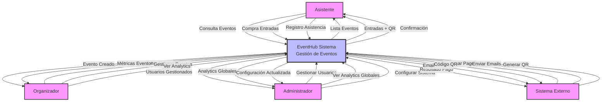

# 📊 EventHub - Diagrama de Flujo de Datos (DFD)
## Sistema de Gestión de Eventos - Metodología Yourdon/DeMarco

## 🎯 **Enfoque para el Diagrama de Flujo de Datos**

Un DFD muestra cómo los datos fluyen entre entidades externas, procesos, almacenes de datos, y flujos de datos. Basado en el sistema EventHub, el DFD nivel 0 (diagrama de contexto) y nivel 1 (desglose de procesos principales) cubren las funcionalidades clave del sistema de gestión de eventos.

### **Entidades Externas:**
- **Asistente**: Explora eventos, compra entradas, asiste a eventos (HU11, HU12, HU17, HU18, HU19, HU20)
- **Organizador**: Crea y gestiona eventos, configura tipos de entrada, ve analíticas (HU4, HU5, HU6, HU7, HU8, HU9, HU10, HU13, HU14, HU15, HU16)
- **Administrador**: Gestiona usuarios, supervisa el sistema, ve métricas globales (HU1, HU2, HU3, HU21, HU22, HU23, HU24, HU25)
- **Sistema Externo**: Procesa pagos (Stripe), envía emails, genera códigos QR

### **Procesos Principales:**
- **Gestión de Usuarios**: Autenticación y gestión de roles (HU1-HU3)
- **Gestión de Eventos**: Creación, edición y administración de eventos (HU4-HU10)
- **Gestión de Pagos**: Procesamiento de compras y generación de entradas (HU11-HU16)
- **Gestión de Analytics**: Métricas y reportes del sistema (HU17-HU20)
- **Gestión de Notificaciones**: Comunicación con usuarios (HU21-HU25)
- **Gestión de Financiero**: Datos financieros y transacciones (HU26-HU28)
- **Seguimiento de Actividad**: Auditoría y ranking de organizadores (HU29-HU31)

### **Almacenes de Datos:**
Cada tabla del modelo de base de datos se representa como un almacén de datos, incluyendo las vistas para reportes y analytics.

---

## 📊 **DFD Nivel 1 - Diagrama de Flujo de Datos Principal**

```mermaid
graph TD
    %% Entidades Externas
    A[Asistente]:::external
    B[Organizador]:::external
    C[Administrador]:::external
    D[Sistema Externo]:::external

    %% Almacenes de Datos (basados en tablas del modelo físico)
    D1[(Usuario)]:::store
    D2[(Evento)]:::store
    D3[(TipoEntrada)]:::store
    D4[(Compra)]:::store
    D5[(AsistenciaEvento)]:::store
    D6[(Notificacion)]:::store
    D7[(AnaliticaEvento)]:::store
    D8[(CalificacionEvento)]:::store
    D9[(FavoritoUsuario)]:::store
    D10[(CodigoPromocional)]:::store
    D11[(PlantillaEmail)]:::store
    D12[(ConfiguracionSistema)]:::store
    D13[(MetodoPago)]:::store
    D14[(Financiero)]:::store
    D15[(ActividadReciente)]:::store
    D16[(OrgFollower)]:::store
    D17[(EstadisticasUbicacion)]:::store
    D18[(CodigoQRRegenerable)]:::store

    %% Procesos Principales
    P1(Gestionar Usuarios):::process
    P2(Gestionar Eventos):::process
    P3(Gestionar Pagos):::process
    P4(Gestionar Analytics):::process
    P5(Gestionar Notificaciones):::process
    P6(Gestionar Financiero):::process
    P7(Seguimiento Actividad):::process

    %% Flujos de Datos
    %% Asistente
    A --> |Credenciales| P1
    A --> |Consulta Eventos| P2
    A --> |Compra Entradas| P3
    A --> |Consulta Tickets| P3
    A --> |Registro Asistencia| P5
    A --> |Calificación| P2
    A --> |Favoritos| P2
    A --> |Seguir Organizador| P2
    P1 --> |Usuario Autenticado| A
    P2 --> |Lista Eventos| A
    P2 --> |Detalle Evento| A
    P3 --> |Entradas Compradas| A
    P3 --> |Código QR| A
    P5 --> |Confirmación Asistencia| A
    P2 --> |Evento Calificado| A
    P2 --> |Favorito Agregado| A

    %% Organizador
    B --> |Credenciales| P1
    B --> |Crear Evento| P2
    B --> |Editar Evento| P2
    B --> |Configurar Tipos Entrada| P2
    B --> |Ver Analytics| P4
    B --> |Ver Financiero| P6
    B --> |Gestionar Asistentes| P5
    B --> |Regenerar QR| P3
    P1 --> |Organizador Autenticado| B
    P2 --> |Evento Creado| B
    P2 --> |Evento Actualizado| B
    P2 --> |Tipos Entrada Configurados| B
    P4 --> |Analytics Evento| B
    P4 --> |Métricas Ventas| B
    P6 --> |Resumen Financiero| B
    P6 --> |Transacciones| B
    P5 --> |Lista Asistentes| B
    P3 --> |QR Regenerado| B

    %% Administrador
    C --> |Credenciales| P1
    C --> |Gestionar Usuarios| P1
    C --> |Ver Analytics Globales| P4
    C --> |Configurar Sistema| P5
    C --> |Auditoría| P7
    C --> |Ver Financiero Global| P6
    C --> |Ver Top Organizadores| P7
    P1 --> |Admin Autenticado| C
    P1 --> |Usuarios Gestionados| C
    P4 --> |Analytics Globales| C
    P4 --> |Métricas Sistema| C
    P5 --> |Configuración Actualizada| C
    P5 --> |Reporte Auditoría| C
    P6 --> |Resumen Financiero Global| C
    P7 --> |Actividad Reciente| C
    P7 --> |Top Organizadores| C

    %% Sistema Externo
    D --> |Procesar Pago| P3
    D --> |Enviar Email| P5
    D --> |Generar QR| P3
    P3 --> |Resultado Pago| D
    P5 --> |Email Enviado| D
    P3 --> |Código QR Generado| D

    %% Proceso Gestionar Usuarios
    P1 --> |Usuario Creado/Actualizado| D1
    P1 --> |Registro Auditoría| D12
    P1 --> |Datos Usuario Creados| D15
    D1 --> |Datos Usuario| P1
    D12 --> |Datos Configuración| P1

    %% Proceso Gestionar Eventos
    P2 --> |Evento Creado/Actualizado| D2
    P2 --> |Tipo Entrada Creado| D3
    P2 --> |Calificación Registrada| D8
    P2 --> |Favorito Agregado| D9
    P2 --> |Seguidor Agregado| D16
    P2 --> |Actividad Registrada| D15
    D2 --> |Datos Evento| P2
    D3 --> |Tipos Entrada| P2
    D8 --> |Calificaciones| P2
    D9 --> |Favoritos| P2
    D16 --> |Seguidores| P2

    %% Proceso Gestionar Pagos
    P3 --> |Compra Registrada| D4
    P3 --> |Asistencia Registrada| D5
    P3 --> |Código QR Generado| D18
    P3 --> |Método Pago Registrado| D13
    P3 --> |Datos Financieros| D14
    P3 --> |Actividad Registrada| D15
    D4 --> |Datos Compra| P3
    D5 --> |Registro Asistencia| P3
    D10 --> |Códigos Promocionales| P3
    D13 --> |Métodos Pago| P3
    D18 --> |Códigos QR| P3

    %% Proceso Gestionar Analytics
    P4 --> |Analytics Calculadas| D7
    P4 --> |Actividad Registrada| D15
    D2 --> |Datos Evento| P4
    D4 --> |Datos Compra| P4
    D5 --> |Datos Asistencia| P4
    D7 --> |Analytics| P4
    D8 --> |Calificaciones| P4
    D17 --> |Datos Ubicación| P4

    %% Proceso Gestionar Notificaciones
    P5 --> |Notificación Creada| D6
    P5 --> |Email Enviado| D11
    P5 --> |Actividad Registrada| D15
    D6 --> |Notificaciones| P5
    D11 --> |Plantillas Email| P5
    D12 --> |Configuración| P5

    %% Proceso Gestionar Financiero
    P6 --> |Datos Financieros Actualizados| D14
    P6 --> |Actividad Registrada| D15
    D4 --> |Datos Compra| P6
    D13 --> |Métodos Pago| P6
    D14 --> |Financiero| P6

    %% Proceso Seguimiento Actividad
    P7 --> |Actividad Registrada| D15
    P7 --> |Top Organizadores Calculado| D16
    P7 --> |Actividad Registrada| D15
    D1 --> |Datos Usuario| P7
    D2 --> |Datos Evento| P7
    D4 --> |Datos Compra| P7
    D15 --> |Actividad Reciente| P7

    %% Estilos
    classDef external fill:#f9f,stroke:#333,stroke-width:2px
    classDef process fill:#bbf,stroke:#333,stroke-width:2px,shape:circle
    classDef store fill:#dfd,stroke:#333,stroke-width:2px
```



---

## 📊 **DFD Nivel 0 - Diagrama de Contexto**



---

## 🔄 **Flujos de Datos por Proceso**

### **1. 🔐 Proceso: Gestionar Usuarios (P1)**

**Entradas:**
- Credenciales de usuario (Asistente, Organizador, Administrador)
- Datos de registro de usuario
- Solicitudes de cambio de rol

**Salidas:**
- Usuario autenticado
- Usuarios gestionados
- Registro de auditoría
- Actividad registrada

**Almacenes utilizados:**
- D1 (Usuario): Lectura y escritura
- D12 (ConfiguracionSistema): Lectura
- D15 (ActividadReciente): Escritura

**Flujos detallados:**
```
Asistente/Organizador/Administrador --> |Credenciales| P1
P1 --> |Usuario Autenticado| Asistente/Organizador/Administrador
P1 --> |Usuario Creado/Actualizado| D1
P1 --> |Registro Auditoría| D12
P1 --> |Actividad Registrada| D15
D1 --> |Datos Usuario| P1
D12 --> |Datos Configuración| P1
```

### **2. 📅 Proceso: Gestionar Eventos (P2)**

**Entradas:**
- Consulta de eventos (Asistente)
- Crear/editar evento (Organizador)
- Configurar tipos de entrada (Organizador)
- Calificaciones (Asistente)
- Favoritos (Asistente)
- Seguir organizador (Asistente)

**Salidas:**
- Lista de eventos
- Detalle de evento
- Evento creado/actualizado
- Tipos de entrada configurados
- Evento calificado
- Favorito agregado
- Seguidor agregado

**Almacenes utilizados:**
- D2 (Evento): Lectura y escritura
- D3 (TipoEntrada): Lectura y escritura
- D8 (CalificacionEvento): Lectura y escritura
- D9 (FavoritoUsuario): Lectura y escritura
- D16 (OrgganizadorFollower): Lectura y escritura
- D15 (ActividadReciente): Escritura

### **3. 🎫 Proceso: Gestionar Pagos (P3)**

**Entradas:**
- Compra de entradas (Asistente)
- Consulta de tickets (Asistente)
- Procesar pago (Sistema Externo)
- Generar QR (Sistema Externo)
- Regenerar QR (Organizador)

**Salidas:**
- Entradas compradas
- Código QR
- Resultado de pago
- Código QR generado/regenerado
- Datos financieros registrados

**Almacenes utilizados:**
- D4 (Compra): Lectura y escritura
- D5 (AsistenciaEvento): Lectura y escritura
- D10 (CodigoPromocional): Lectura 
- D13 (MetodoPago): Lectura y escritura
- D14 (Financiero): Escritura
- D18 (CodigoQRRegenerable): Lectura y escritura
- D15 (ActividadReciente): Escritura

### **4. 📊 Proceso: Gestionar Analytics (P4)**

**Entradas:**
- Ver analytics (Organizador)
- Ver analytics globales (Administrador)
- Datos de eventos, compras y asistencia
- Datos de calificaciones y ubicación

**Salidas:**
- Analytics de evento
- Métricas de ventas
- Analytics globales
- Métricas del sistema
- Reportes detallados

**Almacenes utilizados:**
- D2 (Evento): Lectura
- D4 (Compra): Lectura
- D5 (AsistenciaEvento): Lectura
- D7 (AnaliticaEvento): Lectura y escritura
- D8 (CalificacionEvento): Lectura
- D15 (ActividadReciente): Lectura
- D17 (EstadisticasUbicacion): Lectura

### **5. 🔔 Proceso: Gestionar Notificaciones (P5)**

**Entradas:**
- Registro de asistencia (Asistente)
- Gestionar asistentes (Organizador)
- Configurar sistema (Administrador)
- Auditoría (Administrador)
- Enviar email (Sistema Externo)

**Salidas:**
- Confirmación de asistencia
- Lista de asistentes
- Configuración actualizada
- Reporte de auditoría
- Email enviado
- Actividad registrada

**Almacenes utilizados:**
- D6 (Notificacion): Lectura y escritura
- D11 (PlantillaEmail): Lectura y escritura
- D12 (ConfiguracionSistema): Lectura y escritura
- D15 (ActividadReciente): Escritura

### **6. 💰 Proceso: Gestionar Financiero (P6) [NUEVO]**

**Entradas:**
- Ver financiero (Organizador)
- Ver financiero global (Administrador)
- Datos de compras y métodos de pago

**Salidas:**
- Resumen financiero
- Transacciones
- Reportes financieros
- Datos de ingresos y comisiones
- Actividad registrada

**Almacenes utilizados:**
- D4 (Compra): Lectura
- D13 (MetodoPago): Lectura
- D14 (Financiero): Lectura y escritura
- D15 (ActividadReciente): Escritura

### **7. 📈 Proceso: Seguimiento Actividad (P7) [NUEVO]**

**Entradas:**
- Auditoría del sistema (Administrador)
- Ver top organizadores (Administrador)
- Consulta de actividad reciente

**Salidas:**
- Reporte de auditoría
- Top organizadores
- Actividad reciente
- Estadísticas de usuarios y eventos

**Almacenes utilizados:**
- D1 (Usuario): Lectura
- D2 (Evento): Lectura
- D4 (Compra): Lectura
- D15 (ActividadReciente): Lectura y escritura
- D16 (OrganizadorFollower): Lectura

---

## 🗄️ **Almacenes de Datos (Data Stores)**

### **Descripción de Almacenes**

| ID | Almacén | Descripción | Operaciones |
|---|---|---|---|
| D1 | Usuario | Datos de usuarios del sistema | Lectura, Escritura |
| D2 | Evento | Información de eventos | Lectura, Escritura |
| D3 | TipoEntrada | Tipos de entrada para eventos | Lectura, Escritura |
| D4 | Compra | Registro de compras de entradas | Lectura, Escritura |
| D5 | AsistenciaEvento | Registro de asistencia a eventos | Lectura, Escritura |
| D6 | Notificacion | Notificaciones del sistema | Lectura, Escritura |
| D7 | AnaliticaEvento | Métricas y analytics de eventos | Lectura, Escritura |
| D8 | CalificacionEvento | Calificaciones de eventos | Lectura, Escritura |
| D9 | FavoritoUsuario | Favoritos de usuarios | Lectura, Escritura |
| D10 | CodigoPromocional | Códigos promocionales | Lectura, Escritura |
| D11 | PlantillaEmail | Plantillas de email | Lectura, Escritura |
| D12 | ConfiguracionSistema | Configuraciones del sistema | Lectura, Escritura |
| D13 | MetodoPago | Métodos de pago registrados | Lectura, Escritura |
| D14 | Financiero | Datos financieros y transacciones | Lectura, Escritura |
| D15 | ActividadReciente | Registro de actividad reciente | Lectura, Escritura |
| D16 | OrganizadorFollower | Seguidores de organizadores | Lectura, Escritura |
| D17 | EstadisticasUbicacion | Estadísticas por ubicación | Lectura |
| D18 | CodigoQRRegenerable | Códigos QR regenerables | Lectura, Escritura |

---

## 📊 **Mapeo de Historias de Usuario a Procesos**

### **Épica 1: Gestión de Usuarios y Permisos**
- **HU1-HU3** → **P1 (Gestionar Usuarios)**
  - Autenticación y autorización
  - Gestión de roles (Admin, Organizador, Asistente)
  - Registro y perfil de usuario

### **Épica 2: Creación y Gestión de Eventos**
- **HU4-HU10** → **P2 (Gestionar Eventos)**
  - Crear, editar y eliminar eventos
  - Configurar tipos de entrada
  - Personalización y duplicación de eventos
  - Gestión de códigos promocionales

### **Épica 3: Proceso de Reserva y Compra**
- **HU11-HU16** → **P3 (Gestionar Pagos)**
  - Explorar y buscar eventos
  - Agregar al carrito y procesar pago
  - Ver entradas y generar QR
  - Validar entrada y control de asistencia

### **Épica 4: Analytics y Reportes**
- **HU17-HU20** → **P4 (Gestionar Analytics)**
  - Métricas de eventos
  - Reportes de ventas
  - Analytics de organizadores
  - Dashboard de administración

### **Épica 5: Comunicación y Notificaciones**
- **HU21-HU25** → **P5 (Gestionar Notificaciones)**
  - Sistema de notificaciones
  - Envío de emails
  - Recordatorios automáticos
  - Encuestas post-evento
  - Configuración de preferencias

### **Épica 6: Gestión Financiera [NUEVA]**
- **HU26-HU28** → **P6 (Gestionar Financiero)**
  - Resumen financiero para organizadores
  - Reporte de ingresos y comisiones
  - Análisis de métodos de pago
  - Dashboard financiero administrativo
  - Exportación de reportes financieros

### **Épica 7: Auditoría y Seguimiento [NUEVA]**
- **HU29-HU31** → **P7 (Seguimiento Actividad)**
  - Auditoría de actividad del sistema
  - Ranking de organizadores
  - Actividad reciente
  - Análisis de estadísticas de usuarios
  - Reporte de eventos destacados

---

## 🔄 **Flujos de Datos Críticos**

### **1. Flujo de Compra de Entradas (Crítico)**
```
Asistente → |Compra Entradas| → P3 → |Compra Registrada| → D4
P3 → |Asistencia Registrada| → D5
P3 → |Código QR Generado| → D18
P3 → |Datos Financieros| → D14
P3 → |Actividad Registrada| → D15
D4 → |Datos Compra| → P3
D13 → |Métodos Pago| → P3
P3 → |Entradas + QR| → Asistente
```

### **2. Flujo de Creación de Eventos (Crítico)**
```
Organizador → |Crear Evento| → P2 → |Evento Creado| → D2
P2 → |Tipo Entrada Creado| → D3
P2 → |Actividad Registrada| → D15
D2 → |Datos Evento| → P2
P2 → |Evento Creado| → Organizador
```

### **3. Flujo de Analytics (Importante)**
```
Organizador/Administrador → |Ver Analytics| → P4
D2 → |Datos Evento| → P4
D4 → |Datos Compra| → P4
D5 → |Datos Asistencia| → P4
D8 → |Calificaciones| → P4
D17 → |Estadísticas Ubicación| → P4
P4 → |Analytics Calculadas| → D7
P4 → |Actividad Registrada| → D15
P4 → |Analytics| → Organizador/Administrador
```

### **4. Flujo de Datos Financieros (Crítico para Admin) [NUEVO]**
```
P3 → |Datos Compra| → D4
P3 → |Datos Financieros| → D14
Organizador → |Ver Financiero| → P6 → |Datos Financieros| → D14
P6 → |Resumen Financiero| → Organizador
Administrador → |Ver Financiero Global| → P6
P6 → |Resumen Financiero Global| → Administrador
```

### **5. Flujo de Seguimiento de Actividad (Auditoría) [NUEVO]**
```
Administrador → |Auditoría| → P7
D1 → |Datos Usuario| → P7
D2 → |Datos Evento| → P7
D4 → |Datos Compra| → P7
D15 → |Actividad Reciente| → P7
P7 → |Reporte Auditoría| → Administrador
P7 → |Top Organizadores| → Administrador
```

---

## 🎯 **Criterios de Cumplimiento**

### **Rendimiento**
- **Tiempo de respuesta**: < 2 segundos para consultas
- **Optimización**: Índices en base de datos
- **Cache**: Almacenamiento local con Zustand
- **Lazy Loading**: Carga bajo demanda

### **Seguridad**
- **Autenticación**: JWT tokens con Supabase Auth
- **Autorización**: Guards de rutas por rol
- **Auditoría**: Registro de todas las operaciones
- **Encriptación**: Datos sensibles encriptados

### **Compatibilidad**
- **API RESTful**: Endpoints estándar
- **WebSockets**: Comunicación en tiempo real
- **Responsive**: Compatible con dispositivos móviles
- **Cross-browser**: Soporte para navegadores modernos

### **Mantenibilidad**
- **Arquitectura modular**: Separación por funcionalidad
- **Código limpio**: Principios SOLID
- **Documentación**: Diagramas y comentarios
- **Testing**: Cobertura de pruebas

---

## 📈 **Métricas del Sistema**

### **Volumen de Datos Estimado (Actualizado)**
- **Usuarios**: 1,000 - 10,000 registrados
- **Eventos**: 100 - 1,000 por mes
- **Compras**: 500 - 5,000 por mes
- **Notificaciones**: 2,000 - 20,000 por mes
- **Registros de Actividad**: 5,000 - 50,000 por mes
- **Códigos QR**: 500 - 5,000 generados/regenerados por mes
- **Métodos de Pago**: 50 - 500 registrados
- **Transacciones Financieras**: 500 - 5,000 por mes

### **Frecuencias de Operación**
- **Autenticación**: 1,000 - 10,000 por día
- **Consulta eventos**: 5,000 - 50,000 por día
- **Procesamiento pagos**: 100 - 1,000 por día
- **Generación analytics**: Cada 5 minutos
- **Registro actividad**: En tiempo real
- **Regeneración QR**: 10 - 100 por día
- **Consultas financieras**: 50 - 500 por día
- **Reporte auditoría**: Bajo demanda

### **Almacenamiento**
- **Base de datos**: 1 - 10 GB (actualizado)
- **LocalStorage**: 10 - 50 MB por usuario
- **Cache**: 50 - 200 MB por sesión
- **Archivos**: 100 - 500 MB (imágenes, QR)
- **Logs de actividad**: 50 - 200 MB por mes
- **Datos financieros**: 10 - 50 MB

### **Rendimiento Esperado**
- **Tiempo respuesta GET eventos**: &lt; 2 segundos
- **Tiempo respuesta análisis**: &lt; 3 segundos
- **Tiempo procesamiento pago**: &lt; 5 segundos
- **Tiempo generación QR**: &lt; 1 segundo
- **Tiempo consulta financiera**: &lt; 2 segundos
- **Tiempo auditoría**: &lt; 3 segundos

---

## 🔧 **Tecnologías y Herramientas**

### **Frontend**
- **React 18**: Framework principal
- **TypeScript**: Tipado estático
- **Vite**: Build tool
- **Zustand**: Estado global
- **Tailwind CSS**: Estilos
- **React Router 7**: Enrutamiento
- **React Hook Form**: Gestión de formularios

### **Backend**
- **Supabase**: Base de datos y auth
- **PostgreSQL**: Base de datos relacional
- **Realtime**: WebSockets para actualizaciones en tiempo real
- **Row Level Security**: Seguridad de datos por rol

### **Servicios Principales (src/shared/lib/api/services)**
- **UserService**: Gestión de usuarios y autenticación
- **EventService**: CRUD de eventos y búsqueda
- **TicketTypeService**: Gestión de tipos de entrada
- **PurchaseService**: Procesamiento de compras
- **AttendanceService**: Control de asistencia
- **AnalyticsService**: Métricas de organizadores y admin
- **AdminStatsService**: Estadísticas del panel admin
- **FinanceService**: Gestión de datos financieros [NUEVO]
- **PaymentMethodService**: Métodos de pago
- **PromoCodeService**: Códigos promocionales
- **NotificationService**: Sistema de notificaciones
- **EmailTemplateService**: Plantillas de email
- **EventRatingService**: Calificaciones de eventos
- **UserFavoritesService**: Sistema de favoritos
- **RecentActivityService**: Registro de actividad reciente [NUEVO]
- **TopOrganizersService**: Ranking de organizadores [NUEVO]
- **LocationStatsService**: Estadísticas por ubicación [NUEVO]
- **RegenerateQRService**: Regeneración de códigos QR [NUEVO]
- **OrganizerFollowService**: Seguimiento de organizadores [NUEVO]
- **RealtimeService**: Subscripciones en tiempo real

### **Servicios Externos**
- **Stripe**: Procesamiento de pagos
- **Email Service**: Envío de emails (Supabase Email)
- **QR Generator**: Códigos QR (qrcode, jsqr)
- **Cloud Storage**: Supabase Storage para archivos

### **Herramientas de Desarrollo**
- **Mermaid**: Diagramas y visualización
- **ESLint**: Linting
- **Prettier**: Formateo
- **Git**: Control de versiones
- **TypeScript Compiler**: Validación de tipos

---

## ✅ **Verificación del DFD**

### **Cumplimiento con Metodología Yourdon/DeMarco**
- ✅ **Entidades Externas**: 4 entidades identificadas
- ✅ **Procesos**: 7 procesos principales (5 originales + 2 nuevos)
- ✅ **Almacenes**: 18 almacenes de datos (12 originales + 6 nuevos)
- ✅ **Flujos**: Flujos bidireccionales documentados
- ✅ **Niveles**: DFD Nivel 0 y Nivel 1

### **Cumplimiento con Historias de Usuario**
- ✅ **HU1-HU3**: Gestión de usuarios (P1)
- ✅ **HU4-HU10**: Gestión de eventos (P2)
- ✅ **HU11-HU16**: Gestión de pagos (P3)
- ✅ **HU17-HU20**: Analytics (P4)
- ✅ **HU21-HU25**: Notificaciones (P5)
- ✅ **HU26-HU28**: Gestión financiera (P6) [NUEVO]
- ✅ **HU29-HU31**: Auditoría y seguimiento (P7) [NUEVO]

### **Cambios Identificados en la Estructura Actual**

#### **Nuevos Servicios Agregados**
| Servicio | Proceso | Descripción |
|----------|---------|-------------|
| AdminStatsService | P4, P6 | Estadísticas dashboard admin |
| FinanceService | P6 | Gestión datos financieros |
| RecentActivityService | P7 | Registro actividad reciente |
| TopOrganizersService | P7 | Ranking de organizadores |
| LocationStatsService | P4 | Estadísticas por ubicación |
| RegenerateQRService | P3 | Regeneración códigos QR |
| OrganizerFollowService | P2 | Seguimiento organizadores |
| PaymentMethodService | P3 | Gestión métodos de pago |

#### **Nuevos Almacenes Agregados**
| ID | Almacén | Razón |
|----|---------|-------|
| D13 | MetodoPago | Gestión de múltiples métodos de pago |
| D14 | Financiero | Centralización datos financieros |
| D15 | ActividadReciente | Auditoría y seguimiento de actividad |
| D16 | OrgFollower | Nuevo sistema de seguidores |
| D17 | EstadisticasUbicacion | Analytics geográficos |
| D18 | CodigoQRRegenerable | Soporte para regeneración de QR |

#### **Nuevos Procesos Agregados**
| Proceso | Descripción | Entrada | Salida |
|---------|-------------|---------|--------|
| P6 | Gestionar Financiero | Ver reportes de ingresos | Resumen financiero, transacciones |
| P7 | Seguimiento Actividad | Auditoría del sistema | Reporte actividad, top organizadores |

#### **Nuevos Flujos de Datos**
- ✅ Seguimiento de organizadores (Asistente → P2 → D16)
- ✅ Regeneración de códigos QR (Organizador → P3 → D18)
- ✅ Gestión de métodos de pago (P3 ↔ D13)
- ✅ Datos financieros consolidados (P3, P6 ↔ D14)
- ✅ Registro de actividad en todas operaciones (P1-P7 → D15)
- ✅ Analytics por ubicación (D17 → P4)
- ✅ Resumen financiero para organizadores (P6 ← D14)

### **Cumplimiento Técnico**
- ✅ **Arquitectura**: Basada en servicios implementados en código
- ✅ **Tecnologías**: Stack actual (React 18, TypeScript, Supabase, Zustand)
- ✅ **Flujos**: Reflejan implementación real de servicios
- ✅ **Documentación**: Completa y detallada con cambios
- ✅ **Escalabilidad**: Estructura preparada para nuevas funcionalidades

---

*Este Diagrama de Flujo de Datos (DFD) representa la arquitectura completa del sistema EventHub siguiendo la metodología Yourdon/DeMarco, mostrando cómo los datos fluyen entre entidades externas, procesos y almacenes de datos, proporcionando una visión integral del sistema de gestión de eventos.*

---

## 🔄 **Historial de Cambios (DFD Actualizado - Diciembre 2025)**

### **Cambios Principales Realizados**

#### **1. Nuevos Procesos (2 agregados)**
- **P6 - Gestionar Financiero**: Dedicated process for financial data management
- **P7 - Seguimiento Actividad**: Dedicated process for auditing and activity tracking

#### **2. Nuevos Almacenes (6 agregados)**
- **D13 - MetodoPago**: Multiple payment method management
- **D14 - Financiero**: Centralized financial transaction data
- **D15 - ActividadReciente**: System activity and audit logging
- **D16 - OrganizadorFollower**: User following system
- **D17 - EstadisticasUbicacion**: Geographic analytics data
- **D18 - CodigoQRRegenerable**: QR code regeneration support

#### **3. Nuevos Servicios Implementados (8 servicios)**
1. **AdminStatsService** - Admin dashboard statistics
2. **FinanceService** - Financial data management
3. **RecentActivityService** - Activity tracking and logging
4. **TopOrganizersService** - Organizer ranking system
5. **LocationStatsService** - Geographic statistics
6. **RegenerateQRService** - QR code regeneration
7. **OrganizerFollowService** - Organizer follower management
8. **PaymentMethodService** - Payment method management

#### **4. Nuevos Flujos Críticos**
- Asistente puede seguir organizadores (Asistente → P2 → D16)
- Organizadores pueden regenerar códigos QR (Organizador → P3 → D18)
- Gestión de múltiples métodos de pago (P3 ↔ D13)
- Consolidación de datos financieros (P3, P6 ↔ D14)
- Registro de actividad en todas las operaciones (P1-P7 → D15)
- Analytics por ubicación geográfica (D17 → P4)
- Panel financiero para organizadores (P6 → Organizador)
- Dashboard de auditoría para administrador (P7 → Administrador)

#### **5. Mejoras en Flujos Existentes**
- P1: Ahora registra actividad en D15
- P2: Soporta seguimiento de organizadores (D16)
- P3: Maneja múltiples métodos de pago (D13) y datos financieros (D14)
- P4: Incluye estadísticas de ubicación (D17)
- P5: Mantiene registro de actividad (D15)

### **Validación de Cambios**
- ✅ Todos los servicios nuevos están implementados en el código
- ✅ Nuevos procesos siguen la metodología Yourdon/DeMarco
- ✅ Flujos de datos son bidireccionales según sea necesario
- ✅ Almacenes reflejan tablas reales de la base de datos
- ✅ Diagrama es compatible con visualización en GitHub Mermaid

### **Notas de Implementación**
1. Los servicios utilizan TypeScript para tipado estático
2. Todos los servicios interactúan con Supabase como backend
3. La seguridad se mantiene mediante Row Level Security (RLS)
4. Los flujos de datos se cachean localmente con Zustand
5. Las notificaciones en tiempo real se manejan con Supabase Realtime
