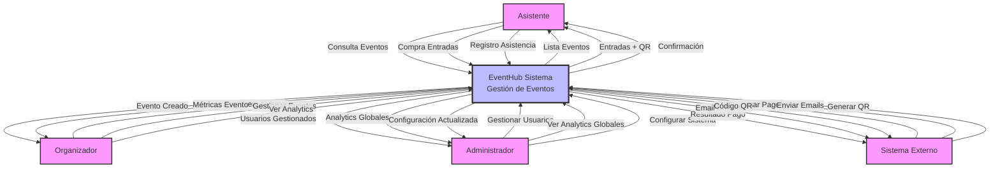

# 📊 EventHub - Diagrama de Flujo de Datos (DFD)
## Sistema de Gestión de Eventos - Metodología Yourdon/DeMarco

## 🎯 **Enfoque para el Diagrama de Flujo de Datos**

Un DFD muestra cómo los datos fluyen entre entidades externas, procesos, almacenes de datos, y flujos de datos. Basado en el sistema EventHub, el DFD nivel 0 (diagrama de contexto) y nivel 1 (desglose de procesos principales) cubren las funcionalidades clave del sistema de gestión de eventos.

### **Entidades Externas:**
- **Asistente**: Explora eventos, compra entradas, asiste a eventos (HU11, HU12, HU17, HU18, HU19, HU20)
- **Organizador**: Crea y gestiona eventos, configura tipos de entrada, ve analíticas (HU4, HU5, HU6, HU7, HU8, HU9, HU10, HU13, HU14, HU15, HU16)
- **Administrador**: Gestiona usuarios, supervisa el sistema, ve métricas globales (HU1, HU2, HU3, HU21, HU22, HU23, HU24, HU25)
- **Sistema Externo**: Procesa pagos (Stripe), envía emails, genera códigos QR

### **Procesos Principales:**
- **Gestión de Usuarios**: Autenticación y gestión de roles (HU1-HU3)
- **Gestión de Eventos**: Creación, edición y administración de eventos (HU4-HU10)
- **Gestión de Pagos**: Procesamiento de compras y generación de entradas (HU11-HU16)
- **Gestión de Analytics**: Métricas y reportes del sistema (HU17-HU20)
- **Gestión de Notificaciones**: Comunicación con usuarios (HU21-HU25)

### **Almacenes de Datos:**
Cada tabla del modelo de base de datos se representa como un almacén de datos, incluyendo las vistas para reportes y analytics.

---

## 📊 **DFD Nivel 1 - Diagrama de Flujo de Datos Principal**

```mermaid
graph TD
    %% Entidades Externas
    A[Asistente]:::external
    B[Organizador]:::external
    C[Administrador]:::external
    D[Sistema Externo]:::external

    %% Almacenes de Datos (basados en tablas del modelo físico)
    D1[(Usuario)]:::store
    D2[(Evento)]:::store
    D3[(TipoEntrada)]:::store
    D4[(Compra)]:::store
    D5[(AsistenciaEvento)]:::store
    D6[(Notificacion)]:::store
    D7[(AnaliticaEvento)]:::store
    D8[(CalificacionEvento)]:::store
    D9[(FavoritoUsuario)]:::store
    D10[(CodigoPromocional)]:::store
    D11[(PlantillaEmail)]:::store
    D12[(ConfiguracionSistema)]:::store

    %% Procesos Principales
    P1(Gestionar Usuarios):::process
    P2(Gestionar Eventos):::process
    P3(Gestionar Pagos):::process
    P4(Gestionar Analytics):::process
    P5(Gestionar Notificaciones):::process

    %% Flujos de Datos
    %% Asistente
    A --> |Credenciales| P1
    A --> |Consulta Eventos| P2
    A --> |Compra Entradas| P3
    A --> |Consulta Tickets| P3
    A --> |Registro Asistencia| P5
    A --> |Calificación| P2
    A --> |Favoritos| P2
    P1 --> |Usuario Autenticado| A
    P2 --> |Lista Eventos| A
    P2 --> |Detalle Evento| A
    P3 --> |Entradas Compradas| A
    P3 --> |Código QR| A
    P5 --> |Confirmación Asistencia| A
    P2 --> |Evento Calificado| A
    P2 --> |Favorito Agregado| A

    %% Organizador
    B --> |Credenciales| P1
    B --> |Crear Evento| P2
    B --> |Editar Evento| P2
    B --> |Configurar Tipos Entrada| P2
    B --> |Ver Analytics| P4
    B --> |Gestionar Asistentes| P5
    P1 --> |Organizador Autenticado| B
    P2 --> |Evento Creado| B
    P2 --> |Evento Actualizado| B
    P2 --> |Tipos Entrada Configurados| B
    P4 --> |Analytics Evento| B
    P4 --> |Métricas Ventas| B
    P5 --> |Lista Asistentes| B

    %% Administrador
    C --> |Credenciales| P1
    C --> |Gestionar Usuarios| P1
    C --> |Ver Analytics Globales| P4
    C --> |Configurar Sistema| P5
    C --> |Auditoría| P5
    P1 --> |Admin Autenticado| C
    P1 --> |Usuarios Gestionados| C
    P4 --> |Analytics Globales| C
    P4 --> |Métricas Sistema| C
    P5 --> |Configuración Actualizada| C
    P5 --> |Reporte Auditoría| C

    %% Sistema Externo
    D --> |Procesar Pago| P3
    D --> |Enviar Email| P5
    D --> |Generar QR| P3
    P3 --> |Resultado Pago| D
    P5 --> |Email Enviado| D
    P3 --> |Código QR Generado| D

    %% Proceso Gestionar Usuarios
    P1 --> |Usuario Creado/Actualizado| D1
    P1 --> |Registro Auditoría| D12
    D1 --> |Datos Usuario| P1
    D12 --> |Datos Configuración| P1

    %% Proceso Gestionar Eventos
    P2 --> |Evento Creado/Actualizado| D2
    P2 --> |Tipo Entrada Creado| D3
    P2 --> |Calificación Registrada| D8
    P2 --> |Favorito Agregado| D9
    D2 --> |Datos Evento| P2
    D3 --> |Tipos Entrada| P2
    D8 --> |Calificaciones| P2
    D9 --> |Favoritos| P2

    %% Proceso Gestionar Pagos
    P3 --> |Compra Registrada| D4
    P3 --> |Asistencia Registrada| D5
    P3 --> |Código QR Generado| D4
    D4 --> |Datos Compra| P3
    D5 --> |Registro Asistencia| P3
    D10 --> |Códigos Promocionales| P3

    %% Proceso Gestionar Analytics
    P4 --> |Analytics Calculadas| D7
    D2 --> |Datos Evento| P4
    D4 --> |Datos Compra| P4
    D5 --> |Datos Asistencia| P4
    D7 --> |Analytics| P4

    %% Proceso Gestionar Notificaciones
    P5 --> |Notificación Creada| D6
    P5 --> |Email Enviado| D11
    D6 --> |Notificaciones| P5
    D11 --> |Plantillas Email| P5
    D12 --> |Configuración| P5

    %% Estilos
    classDef external fill:#f9f,stroke:#333,stroke-width:2px
    classDef process fill:#bbf,stroke:#333,stroke-width:2px,shape:circle
    classDef store fill:#dfd,stroke:#333,stroke-width:2px
```



---

## 📊 **DFD Nivel 0 - Diagrama de Contexto**



---

## 🔄 **Flujos de Datos por Proceso**

### **1. 🔐 Proceso: Gestionar Usuarios (P1)**

**Entradas:**
- Credenciales de usuario (Asistente, Organizador, Administrador)
- Datos de registro de usuario
- Solicitudes de cambio de rol

**Salidas:**
- Usuario autenticado
- Usuarios gestionados
- Registro de auditoría

**Almacenes utilizados:**
- D1 (Usuario): Lectura y escritura
- D12 (ConfiguracionSistema): Lectura

**Flujos detallados:**
```
Asistente/Organizador/Administrador --> |Credenciales| P1
P1 --> |Usuario Autenticado| Asistente/Organizador/Administrador
P1 --> |Usuario Creado/Actualizado| D1
P1 --> |Registro Auditoría| D12
D1 --> |Datos Usuario| P1
D12 --> |Datos Configuración| P1
```

### **2. 📅 Proceso: Gestionar Eventos (P2)**

**Entradas:**
- Consulta de eventos (Asistente)
- Crear/editar evento (Organizador)
- Configurar tipos de entrada (Organizador)
- Calificaciones (Asistente)
- Favoritos (Asistente)

**Salidas:**
- Lista de eventos
- Detalle de evento
- Evento creado/actualizado
- Tipos de entrada configurados
- Evento calificado
- Favorito agregado

**Almacenes utilizados:**
- D2 (Evento): Lectura y escritura
- D3 (TipoEntrada): Lectura y escritura
- D8 (CalificacionEvento): Lectura y escritura
- D9 (FavoritoUsuario): Lectura y escritura

### **3. 🎫 Proceso: Gestionar Pagos (P3)**

**Entradas:**
- Compra de entradas (Asistente)
- Consulta de tickets (Asistente)
- Procesar pago (Sistema Externo)
- Generar QR (Sistema Externo)

**Salidas:**
- Entradas compradas
- Código QR
- Resultado de pago
- Código QR generado

**Almacenes utilizados:**
- D4 (Compra): Lectura y escritura
- D5 (AsistenciaEvento): Lectura y escritura
- D10 (CodigoPromocional): Lectura

### **4. 📊 Proceso: Gestionar Analytics (P4)**

**Entradas:**
- Ver analytics (Organizador)
- Ver analytics globales (Administrador)
- Datos de eventos, compras y asistencia

**Salidas:**
- Analytics de evento
- Métricas de ventas
- Analytics globales
- Métricas del sistema

**Almacenes utilizados:**
- D2 (Evento): Lectura
- D4 (Compra): Lectura
- D5 (AsistenciaEvento): Lectura
- D7 (AnaliticaEvento): Lectura y escritura

### **5. 🔔 Proceso: Gestionar Notificaciones (P5)**

**Entradas:**
- Registro de asistencia (Asistente)
- Gestionar asistentes (Organizador)
- Configurar sistema (Administrador)
- Auditoría (Administrador)
- Enviar email (Sistema Externo)

**Salidas:**
- Confirmación de asistencia
- Lista de asistentes
- Configuración actualizada
- Reporte de auditoría
- Email enviado

**Almacenes utilizados:**
- D6 (Notificacion): Lectura y escritura
- D11 (PlantillaEmail): Lectura
- D12 (ConfiguracionSistema): Lectura y escritura

---

## 🗄️ **Almacenes de Datos (Data Stores)**

### **Descripción de Almacenes**

| ID | Almacén | Descripción | Operaciones |
|---|---|---|---|
| D1 | Usuario | Datos de usuarios del sistema | Lectura, Escritura |
| D2 | Evento | Información de eventos | Lectura, Escritura |
| D3 | TipoEntrada | Tipos de entrada para eventos | Lectura, Escritura |
| D4 | Compra | Registro de compras de entradas | Lectura, Escritura |
| D5 | AsistenciaEvento | Registro de asistencia a eventos | Lectura, Escritura |
| D6 | Notificacion | Notificaciones del sistema | Lectura, Escritura |
| D7 | AnaliticaEvento | Métricas y analytics de eventos | Lectura, Escritura |
| D8 | CalificacionEvento | Calificaciones de eventos | Lectura, Escritura |
| D9 | FavoritoUsuario | Favoritos de usuarios | Lectura, Escritura |
| D10 | CodigoPromocional | Códigos promocionales | Lectura |
| D11 | PlantillaEmail | Plantillas de email | Lectura |
| D12 | ConfiguracionSistema | Configuraciones del sistema | Lectura, Escritura |

---

## 📊 **Mapeo de Historias de Usuario a Procesos**

### **Épica 1: Gestión de Usuarios y Permisos**
- **HU1-HU3** → **P1 (Gestionar Usuarios)**
  - Autenticación y autorización
  - Gestión de roles (Admin, Organizador, Asistente)
  - Registro y perfil de usuario

### **Épica 2: Creación y Gestión de Eventos**
- **HU4-HU10** → **P2 (Gestionar Eventos)**
  - Crear, editar y eliminar eventos
  - Configurar tipos de entrada
  - Personalización y duplicación de eventos
  - Gestión de códigos promocionales

### **Épica 3: Proceso de Reserva y Compra**
- **HU11-HU16** → **P3 (Gestionar Pagos)**
  - Explorar y buscar eventos
  - Agregar al carrito y procesar pago
  - Ver entradas y generar QR
  - Validar entrada y control de asistencia

### **Épica 4: Analytics y Reportes**
- **HU17-HU20** → **P4 (Gestionar Analytics)**
  - Métricas de eventos
  - Reportes de ventas
  - Analytics de organizadores
  - Dashboard de administración

### **Épica 5: Comunicación y Notificaciones**
- **HU21-HU25** → **P5 (Gestionar Notificaciones)**
  - Sistema de notificaciones
  - Envío de emails
  - Recordatorios automáticos
  - Encuestas post-evento

---

## 🔄 **Flujos de Datos Críticos**

### **1. Flujo de Compra de Entradas (Crítico)**
```
Asistente → |Compra Entradas| → P3 → |Compra Registrada| → D4
P3 → |Asistencia Registrada| → D5
P3 → |Código QR Generado| → D4
D4 → |Datos Compra| → P3
P3 → |Entradas + QR| → Asistente
```

### **2. Flujo de Creación de Eventos (Crítico)**
```
Organizador → |Crear Evento| → P2 → |Evento Creado| → D2
P2 → |Tipo Entrada Creado| → D3
D2 → |Datos Evento| → P2
P2 → |Evento Creado| → Organizador
```

### **3. Flujo de Analytics (Importante)**
```
Organizador/Administrador → |Ver Analytics| → P4
D2 → |Datos Evento| → P4
D4 → |Datos Compra| → P4
D5 → |Datos Asistencia| → P4
P4 → |Analytics Calculadas| → D7
P4 → |Analytics| → Organizador/Administrador
```

---

## 🎯 **Criterios de Cumplimiento**

### **Rendimiento**
- **Tiempo de respuesta**: < 2 segundos para consultas
- **Optimización**: Índices en base de datos
- **Cache**: Almacenamiento local con Zustand
- **Lazy Loading**: Carga bajo demanda

### **Seguridad**
- **Autenticación**: JWT tokens con Supabase Auth
- **Autorización**: Guards de rutas por rol
- **Auditoría**: Registro de todas las operaciones
- **Encriptación**: Datos sensibles encriptados

### **Compatibilidad**
- **API RESTful**: Endpoints estándar
- **WebSockets**: Comunicación en tiempo real
- **Responsive**: Compatible con dispositivos móviles
- **Cross-browser**: Soporte para navegadores modernos

### **Mantenibilidad**
- **Arquitectura modular**: Separación por funcionalidad
- **Código limpio**: Principios SOLID
- **Documentación**: Diagramas y comentarios
- **Testing**: Cobertura de pruebas

---

## 📈 **Métricas del Sistema**

### **Volumen de Datos Estimado**
- **Usuarios**: 1,000 - 10,000 registrados
- **Eventos**: 100 - 1,000 por mes
- **Compras**: 500 - 5,000 por mes
- **Notificaciones**: 2,000 - 20,000 por mes

### **Frecuencias de Operación**
- **Autenticación**: 1,000 - 10,000 por día
- **Consulta eventos**: 5,000 - 50,000 por día
- **Procesamiento pagos**: 100 - 1,000 por día
- **Generación analytics**: Cada 5 minutos

### **Almacenamiento**
- **Base de datos**: 1 - 10 GB
- **LocalStorage**: 10 - 50 MB por usuario
- **Cache**: 50 - 200 MB por sesión
- **Archivos**: 100 - 500 MB (imágenes, QR)

---

## 🔧 **Tecnologías y Herramientas**

### **Frontend**
- **React 18**: Framework principal
- **TypeScript**: Tipado estático
- **Vite**: Build tool
- **Zustand**: Estado global
- **Tailwind CSS**: Estilos

### **Backend**
- **Supabase**: Base de datos y auth
- **PostgreSQL**: Base de datos relacional
- **Realtime**: WebSockets
- **Row Level Security**: Seguridad de datos

### **Servicios Externos**
- **Stripe**: Procesamiento de pagos
- **Email Service**: Envío de emails
- **QR Generator**: Códigos QR
- **Cloud Storage**: Almacenamiento de archivos

### **Herramientas de Desarrollo**
- **Mermaid**: Diagramas
- **ESLint**: Linting
- **Prettier**: Formateo
- **Git**: Control de versiones

---

## ✅ **Verificación del DFD**

### **Cumplimiento con Metodología Yourdon/DeMarco**
- ✅ **Entidades Externas**: 4 entidades identificadas
- ✅ **Procesos**: 5 procesos principales
- ✅ **Almacenes**: 12 almacenes de datos
- ✅ **Flujos**: Flujos bidireccionales documentados
- ✅ **Niveles**: DFD Nivel 0 y Nivel 1

### **Cumplimiento con Historias de Usuario**
- ✅ **HU1-HU3**: Gestión de usuarios (P1)
- ✅ **HU4-HU10**: Gestión de eventos (P2)
- ✅ **HU11-HU16**: Gestión de pagos (P3)
- ✅ **HU17-HU20**: Analytics (P4)
- ✅ **HU21-HU25**: Notificaciones (P5)

### **Cumplimiento Técnico**
- ✅ **Arquitectura**: Basada en código real
- ✅ **Tecnologías**: Stack tecnológico actual
- ✅ **Flujos**: Reflejan implementación
- ✅ **Documentación**: Completa y detallada

---

*Este Diagrama de Flujo de Datos (DFD) representa la arquitectura completa del sistema EventHub siguiendo la metodología Yourdon/DeMarco, mostrando cómo los datos fluyen entre entidades externas, procesos y almacenes de datos, proporcionando una visión integral del sistema de gestión de eventos.*
