# 🔄 EventHub - Diagramas de Secuencia
## Sistema de Gestión de Eventos - Flujos de Interacción Detallados

## 🎯 **Resumen del Sistema**

**EventHub** es una plataforma integral de gestión de eventos que maneja múltiples flujos de interacción entre actores, sistema y servicios externos.

### 🚀 **Características Principales**
- **Autenticación y Autorización**: Flujos de login, registro y gestión de sesiones
- **Gestión de Eventos**: Creación, edición y administración de eventos
- **Procesamiento de Pagos**: Flujos de compra y generación de entradas
- **Sistema de Notificaciones**: Comunicación en tiempo real
- **Analytics y Reportes**: Generación de métricas y reportes

---

## 📊 **Diagramas de Secuencia por Categoría**

### **🔐 Autenticación y Gestión de Usuarios**

#### **UC-001: Registrar Usuario**
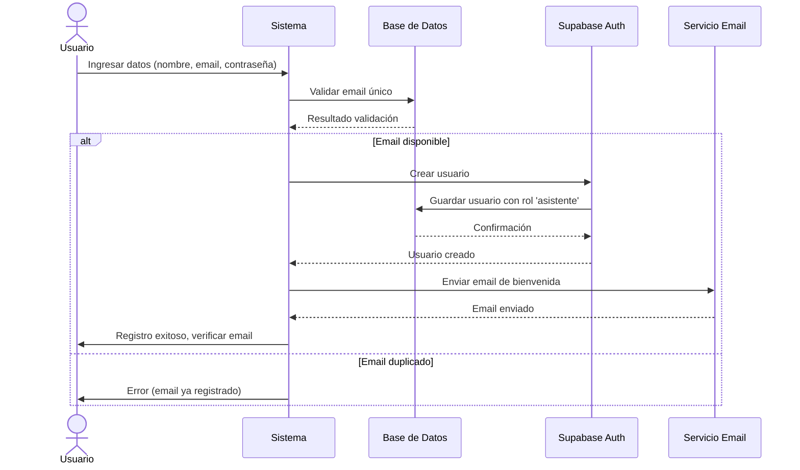
```mermaid
sequenceDiagram
    actor Usuario
    participant Sistema
    participant BD as Base de Datos
    participant Auth as Supabase Auth
    participant Email as Servicio Email
    
    Usuario->>Sistema: Ingresar datos (nombre, email, contraseña)
    Sistema->>BD: Validar email único
    BD-->>Sistema: Resultado validación
    alt Email disponible
        Sistema->>Auth: Crear usuario
        Auth->>BD: Guardar usuario con rol 'asistente'
        BD-->>Auth: Confirmación
        Auth-->>Sistema: Usuario creado
        Sistema->>Email: Enviar email de bienvenida
        Email-->>Sistema: Email enviado
        Sistema->>Usuario: Registro exitoso, verificar email
    else Email duplicado
        Sistema->>Usuario: Error (email ya registrado)
    end
```

#### **UC-002: Autenticar Usuario**
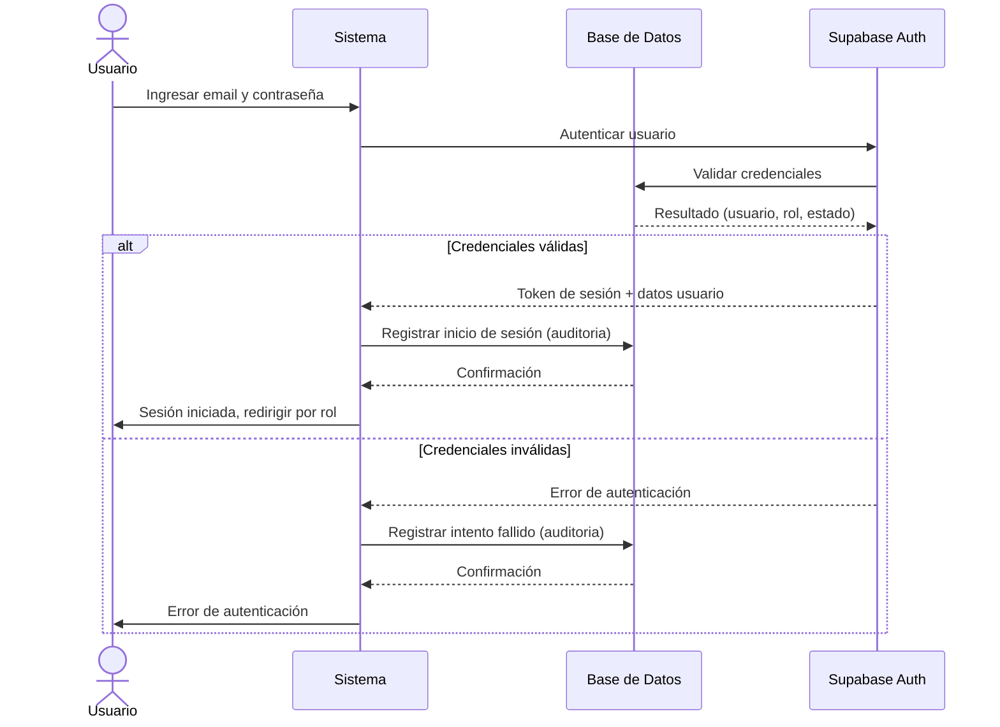
```mermaid
sequenceDiagram
    actor Usuario
    participant Sistema
    participant BD as Base de Datos
    participant Auth as Supabase Auth
    
    Usuario->>Sistema: Ingresar email y contraseña
    Sistema->>Auth: Autenticar usuario
    Auth->>BD: Validar credenciales
    BD-->>Auth: Resultado (usuario, rol, estado)
    alt Credenciales válidas
        Auth-->>Sistema: Token de sesión + datos usuario
        Sistema->>BD: Registrar inicio de sesión (auditoria)
        BD-->>Sistema: Confirmación
        Sistema->>Usuario: Sesión iniciada, redirigir por rol
    else Credenciales inválidas
        Auth-->>Sistema: Error de autenticación
        Sistema->>BD: Registrar intento fallido (auditoria)
        BD-->>Sistema: Confirmación
        Sistema->>Usuario: Error de autenticación
    end
```

#### **UC-003: Cerrar Sesión**
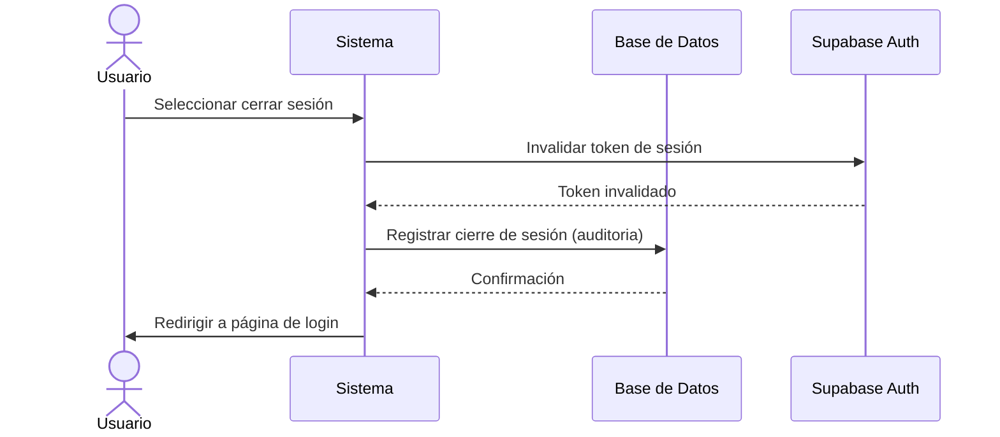
```mermaid
sequenceDiagram
    actor Usuario
    participant Sistema
    participant BD as Base de Datos
    participant Auth as Supabase Auth
    
    Usuario->>Sistema: Seleccionar cerrar sesión
    Sistema->>Auth: Invalidar token de sesión
    Auth-->>Sistema: Token invalidado
    Sistema->>BD: Registrar cierre de sesión (auditoria)
    BD-->>Sistema: Confirmación
    Sistema->>Usuario: Redirigir a página de login
```

#### **UC-004: Recuperar Contraseña**
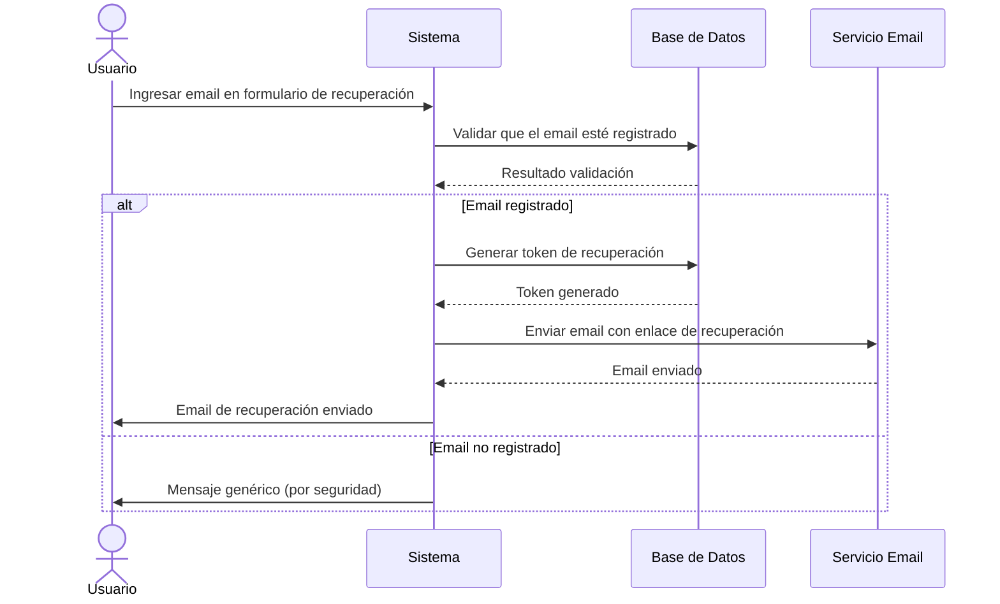
```mermaid
sequenceDiagram
    actor Usuario
    participant Sistema
    participant BD as Base de Datos
    participant Email as Servicio Email
    
    Usuario->>Sistema: Ingresar email en formulario de recuperación
    Sistema->>BD: Validar que el email esté registrado
    BD-->>Sistema: Resultado validación
    alt Email registrado
        Sistema->>BD: Generar token de recuperación
        BD-->>Sistema: Token generado
        Sistema->>Email: Enviar email con enlace de recuperación
        Email-->>Sistema: Email enviado
        Sistema->>Usuario: Email de recuperación enviado
    else Email no registrado
        Sistema->>Usuario: Mensaje genérico (por seguridad)
    end
```

#### **UC-005: Cambiar Contraseña**
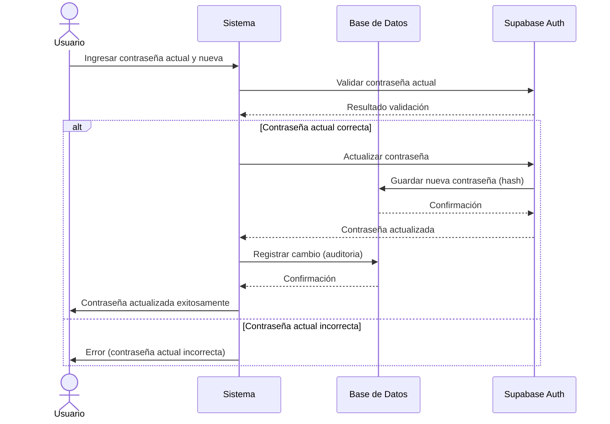
```mermaid
sequenceDiagram
    actor Usuario
    participant Sistema
    participant BD as Base de Datos
    participant Auth as Supabase Auth
    
    Usuario->>Sistema: Ingresar contraseña actual y nueva
    Sistema->>Auth: Validar contraseña actual
    Auth-->>Sistema: Resultado validación
    alt Contraseña actual correcta
        Sistema->>Auth: Actualizar contraseña
        Auth->>BD: Guardar nueva contraseña (hash)
        BD-->>Auth: Confirmación
        Auth-->>Sistema: Contraseña actualizada
        Sistema->>BD: Registrar cambio (auditoria)
        BD-->>Sistema: Confirmación
        Sistema->>Usuario: Contraseña actualizada exitosamente
    else Contraseña actual incorrecta
        Sistema->>Usuario: Error (contraseña actual incorrecta)
    end
```

### **📅 Gestión de Eventos**

#### **UC-011: Explorar Eventos**
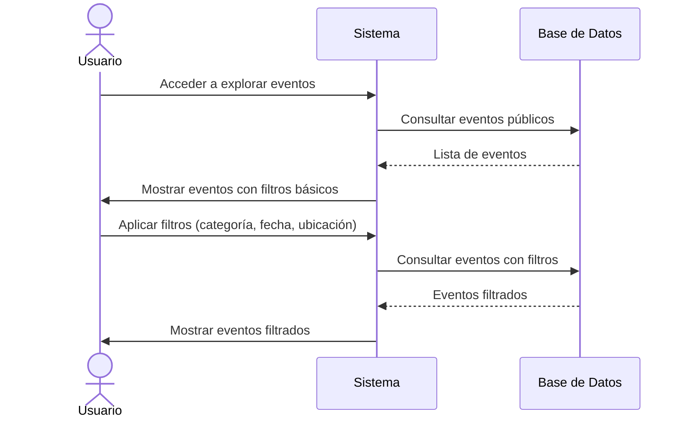
```mermaid
sequenceDiagram
    actor Usuario
    participant Sistema
    participant BD as Base de Datos
    
    Usuario->>Sistema: Acceder a explorar eventos
    Sistema->>BD: Consultar eventos públicos
    BD-->>Sistema: Lista de eventos
    Sistema->>Usuario: Mostrar eventos con filtros básicos
    Usuario->>Sistema: Aplicar filtros (categoría, fecha, ubicación)
    Sistema->>BD: Consultar eventos con filtros
    BD-->>Sistema: Eventos filtrados
    Sistema->>Usuario: Mostrar eventos filtrados
```

#### **UC-012: Buscar Eventos**
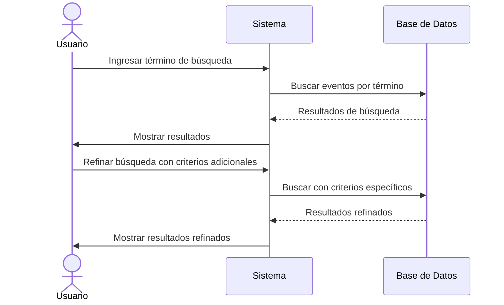
```mermaid
sequenceDiagram
    actor Usuario
    participant Sistema
    participant BD as Base de Datos
    
    Usuario->>Sistema: Ingresar término de búsqueda
    Sistema->>BD: Buscar eventos por término
    BD-->>Sistema: Resultados de búsqueda
    Sistema->>Usuario: Mostrar resultados
    Usuario->>Sistema: Refinar búsqueda con criterios adicionales
    Sistema->>BD: Buscar con criterios específicos
    BD-->>Sistema: Resultados refinados
    Sistema->>Usuario: Mostrar resultados refinados
```

#### **UC-013: Ver Detalle de Evento**
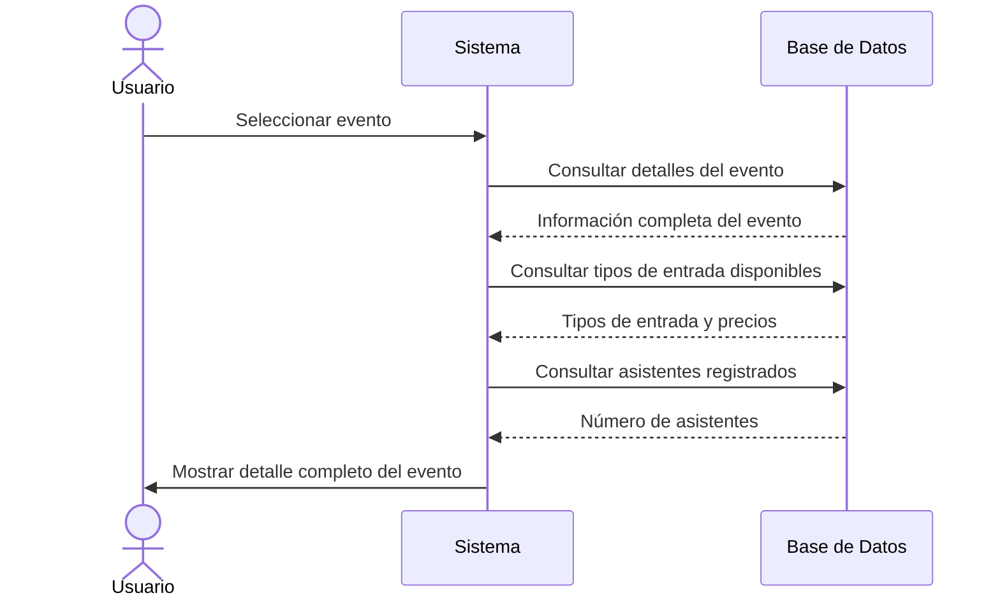
```mermaid
sequenceDiagram
    actor Usuario
    participant Sistema
    participant BD as Base de Datos
    
    Usuario->>Sistema: Seleccionar evento
    Sistema->>BD: Consultar detalles del evento
    BD-->>Sistema: Información completa del evento
    Sistema->>BD: Consultar tipos de entrada disponibles
    BD-->>Sistema: Tipos de entrada y precios
    Sistema->>BD: Consultar asistentes registrados
    BD-->>Sistema: Número de asistentes
    Sistema->>Usuario: Mostrar detalle completo del evento
```

#### **UC-014: Crear Evento**
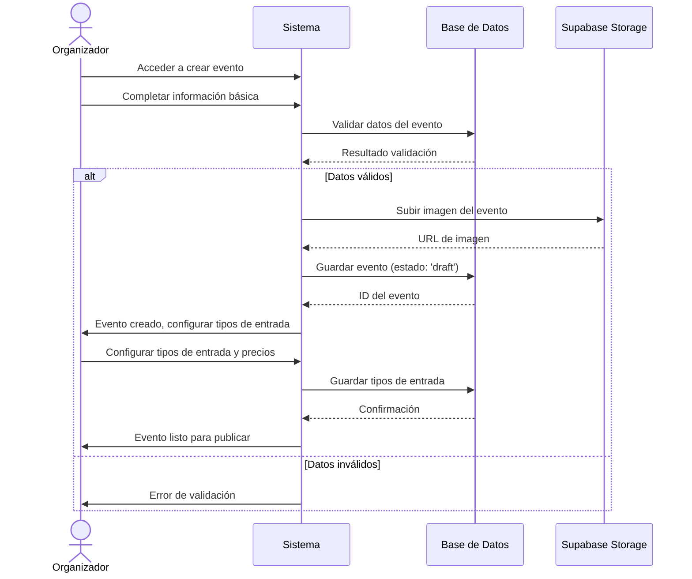
```mermaid
sequenceDiagram
    actor Organizador
    participant Sistema
    participant BD as Base de Datos
    participant Storage as Supabase Storage
    
    Organizador->>Sistema: Acceder a crear evento
    Organizador->>Sistema: Completar información básica
    Sistema->>BD: Validar datos del evento
    BD-->>Sistema: Resultado validación
    alt Datos válidos
        Sistema->>Storage: Subir imagen del evento
        Storage-->>Sistema: URL de imagen
        Sistema->>BD: Guardar evento (estado: 'draft')
        BD-->>Sistema: ID del evento
        Sistema->>Organizador: Evento creado, configurar tipos de entrada
        Organizador->>Sistema: Configurar tipos de entrada y precios
        Sistema->>BD: Guardar tipos de entrada
        BD-->>Sistema: Confirmación
        Sistema->>Organizador: Evento listo para publicar
    else Datos inválidos
        Sistema->>Organizador: Error de validación
    end
```

#### **UC-015: Editar Evento**
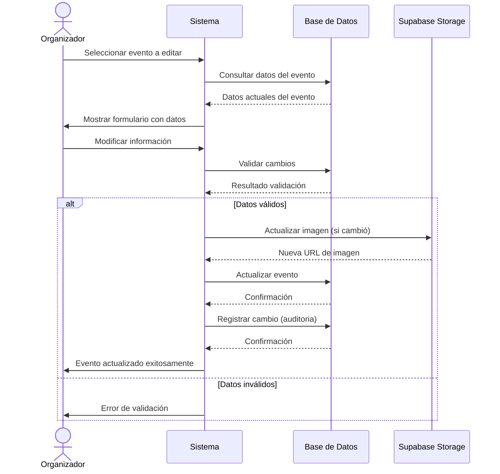
```mermaid
sequenceDiagram
    actor Organizador
    participant Sistema
    participant BD as Base de Datos
    participant Storage as Supabase Storage
    
    Organizador->>Sistema: Seleccionar evento a editar
    Sistema->>BD: Consultar datos del evento
    BD-->>Sistema: Datos actuales del evento
    Sistema->>Organizador: Mostrar formulario con datos
    Organizador->>Sistema: Modificar información
    Sistema->>BD: Validar cambios
    BD-->>Sistema: Resultado validación
    alt Datos válidos
        Sistema->>Storage: Actualizar imagen (si cambió)
        Storage-->>Sistema: Nueva URL de imagen
        Sistema->>BD: Actualizar evento
        BD-->>Sistema: Confirmación
        Sistema->>BD: Registrar cambio (auditoria)
        BD-->>Sistema: Confirmación
        Sistema->>Organizador: Evento actualizado exitosamente
    else Datos inválidos
        Sistema->>Organizador: Error de validación
    end
```

### **🎫 Gestión de Pagos**

#### **UC-017: Agregar al Carrito**
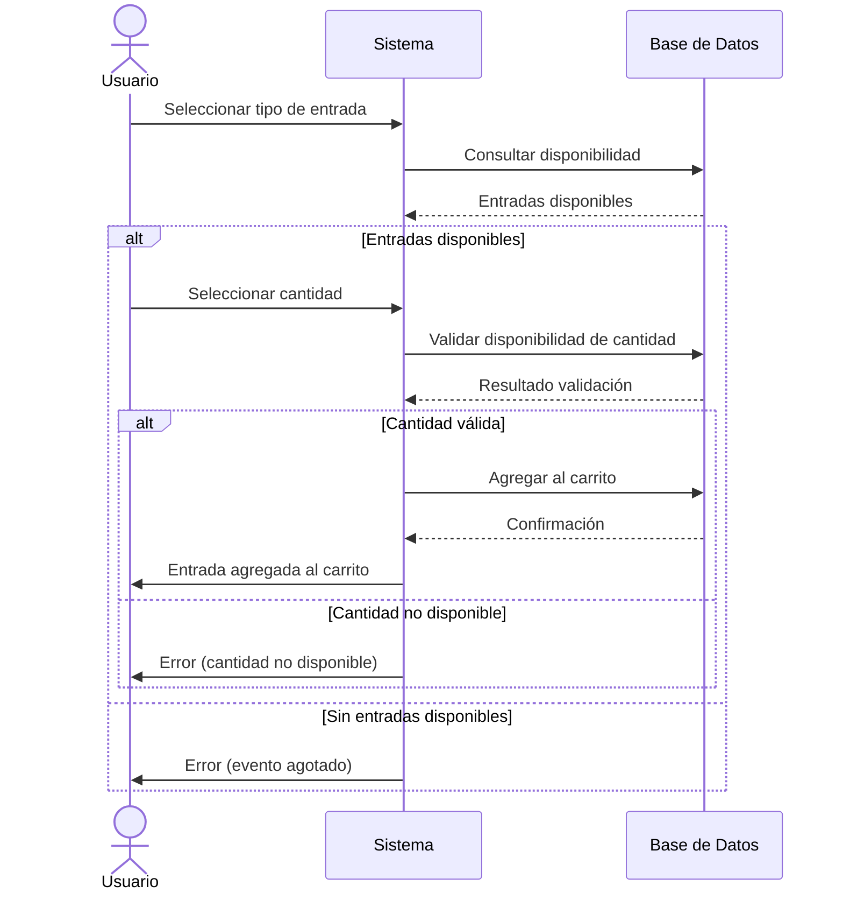
```mermaid
sequenceDiagram
    actor Usuario
    participant Sistema
    participant BD as Base de Datos
    
    Usuario->>Sistema: Seleccionar tipo de entrada
    Sistema->>BD: Consultar disponibilidad
    BD-->>Sistema: Entradas disponibles
    alt Entradas disponibles
        Usuario->>Sistema: Seleccionar cantidad
        Sistema->>BD: Validar disponibilidad de cantidad
        BD-->>Sistema: Resultado validación
        alt Cantidad válida
            Sistema->>BD: Agregar al carrito
            BD-->>Sistema: Confirmación
            Sistema->>Usuario: Entrada agregada al carrito
        else Cantidad no disponible
            Sistema->>Usuario: Error (cantidad no disponible)
        end
    else Sin entradas disponibles
        Sistema->>Usuario: Error (evento agotado)
    end
```

#### **UC-018: Procesar Pago**
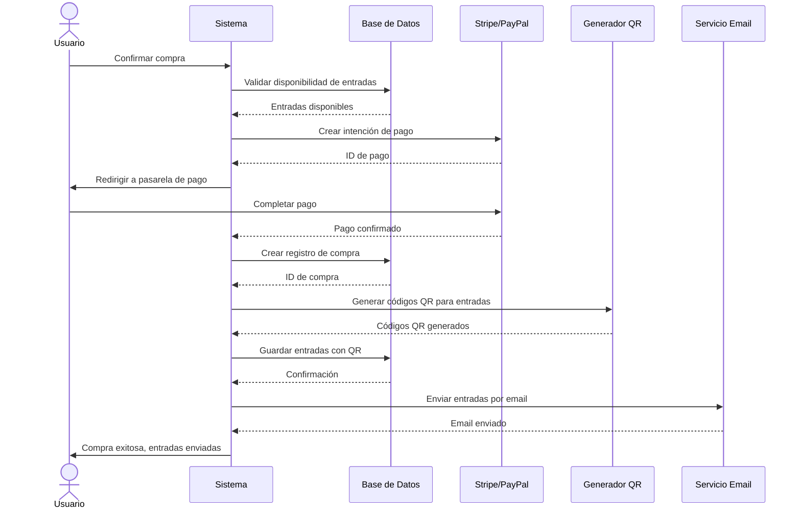
```mermaid
sequenceDiagram
    actor Usuario
    participant Sistema
    participant BD as Base de Datos
    participant Payment as Stripe/PayPal
    participant QR as Generador QR
    participant Email as Servicio Email
    
    Usuario->>Sistema: Confirmar compra
    Sistema->>BD: Validar disponibilidad de entradas
    BD-->>Sistema: Entradas disponibles
    Sistema->>Payment: Crear intención de pago
    Payment-->>Sistema: ID de pago
    Sistema->>Usuario: Redirigir a pasarela de pago
    Usuario->>Payment: Completar pago
    Payment-->>Sistema: Pago confirmado
    Sistema->>BD: Crear registro de compra
    BD-->>Sistema: ID de compra
    Sistema->>QR: Generar códigos QR para entradas
    QR-->>Sistema: Códigos QR generados
    Sistema->>BD: Guardar entradas con QR
    BD-->>Sistema: Confirmación
    Sistema->>Email: Enviar entradas por email
    Email-->>Sistema: Email enviado
    Sistema->>Usuario: Compra exitosa, entradas enviadas
```

#### **UC-019: Ver Entradas**
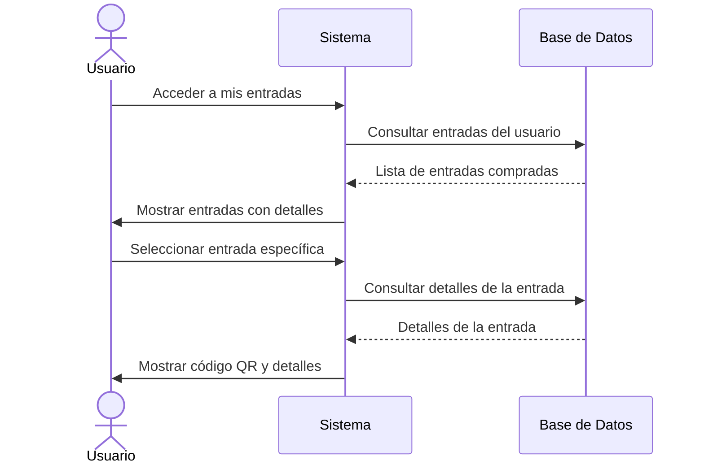
```mermaid
sequenceDiagram
    actor Usuario
    participant Sistema
    participant BD as Base de Datos
    
    Usuario->>Sistema: Acceder a mis entradas
    Sistema->>BD: Consultar entradas del usuario
    BD-->>Sistema: Lista de entradas compradas
    Sistema->>Usuario: Mostrar entradas con detalles
    Usuario->>Sistema: Seleccionar entrada específica
    Sistema->>BD: Consultar detalles de la entrada
    BD-->>Sistema: Detalles de la entrada
    Sistema->>Usuario: Mostrar código QR y detalles
```

#### **UC-020: Generar QR**
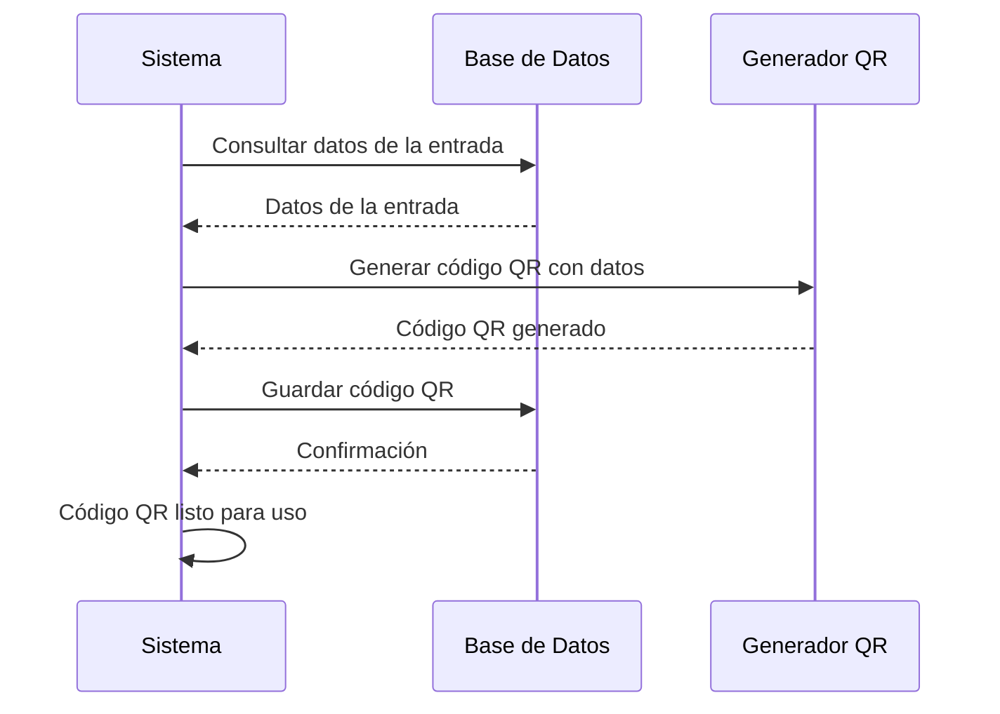
```mermaid
sequenceDiagram
    participant Sistema
    participant BD as Base de Datos
    participant QR as Generador QR
    
    Sistema->>BD: Consultar datos de la entrada
    BD-->>Sistema: Datos de la entrada
    Sistema->>QR: Generar código QR con datos
    QR-->>Sistema: Código QR generado
    Sistema->>BD: Guardar código QR
    BD-->>Sistema: Confirmación
    Sistema->>Sistema: Código QR listo para uso
```

#### **UC-021: Validar Entrada**
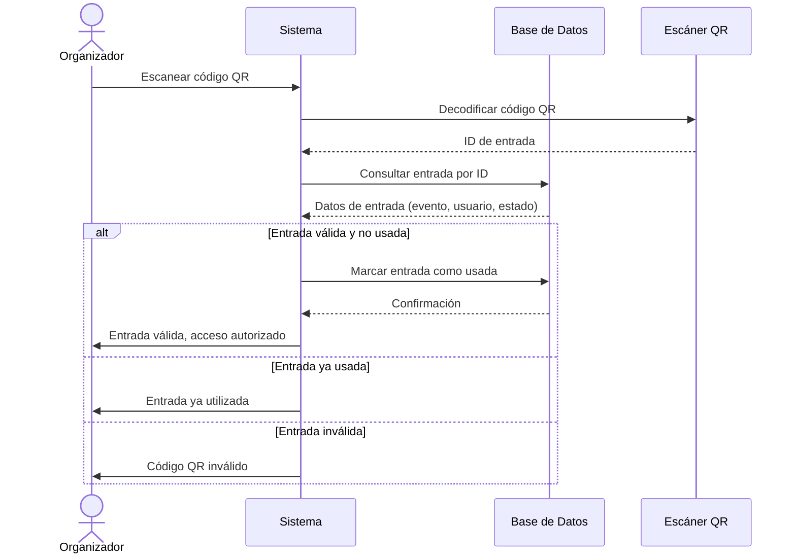
```mermaid
sequenceDiagram
    actor Organizador
    participant Sistema
    participant BD as Base de Datos
    participant QR as Escáner QR
    
    Organizador->>Sistema: Escanear código QR
    Sistema->>QR: Decodificar código QR
    QR-->>Sistema: ID de entrada
    Sistema->>BD: Consultar entrada por ID
    BD-->>Sistema: Datos de entrada (evento, usuario, estado)
    alt Entrada válida y no usada
        Sistema->>BD: Marcar entrada como usada
        BD-->>Sistema: Confirmación
        Sistema->>Organizador: Entrada válida, acceso autorizado
    else Entrada ya usada
        Sistema->>Organizador: Entrada ya utilizada
    else Entrada inválida
        Sistema->>Organizador: Código QR inválido
    end
```

### **🔔 Gestión de Notificaciones**

#### **UC-022: Enviar Notificación**
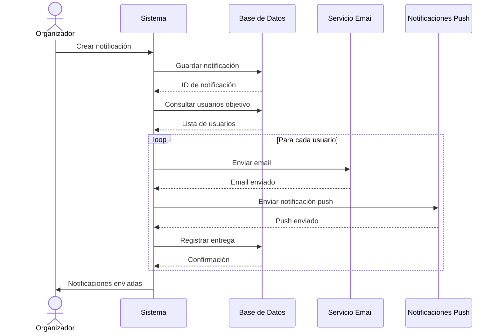
```mermaid
sequenceDiagram
    actor Organizador
    participant Sistema
    participant BD as Base de Datos
    participant Email as Servicio Email
    participant Push as Notificaciones Push
    
    Organizador->>Sistema: Crear notificación
    Sistema->>BD: Guardar notificación
    BD-->>Sistema: ID de notificación
    Sistema->>BD: Consultar usuarios objetivo
    BD-->>Sistema: Lista de usuarios
    loop Para cada usuario
        Sistema->>Email: Enviar email
        Email-->>Sistema: Email enviado
        Sistema->>Push: Enviar notificación push
        Push-->>Sistema: Push enviado
        Sistema->>BD: Registrar entrega
        BD-->>Sistema: Confirmación
    end
    Sistema->>Organizador: Notificaciones enviadas
```

#### **UC-023: Ver Notificaciones**
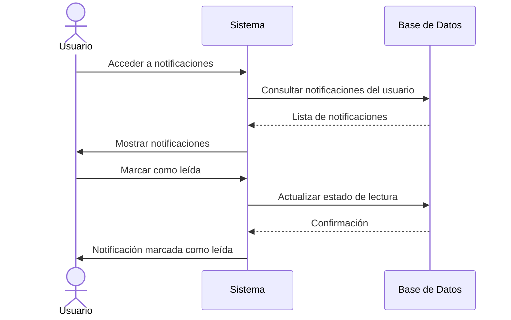
```mermaid
sequenceDiagram
    actor Usuario
    participant Sistema
    participant BD as Base de Datos
    
    Usuario->>Sistema: Acceder a notificaciones
    Sistema->>BD: Consultar notificaciones del usuario
    BD-->>Sistema: Lista de notificaciones
    Sistema->>Usuario: Mostrar notificaciones
    Usuario->>Sistema: Marcar como leída
    Sistema->>BD: Actualizar estado de lectura
    BD-->>Sistema: Confirmación
    Sistema->>Usuario: Notificación marcada como leída
```

#### **UC-024: Configurar Preferencias**
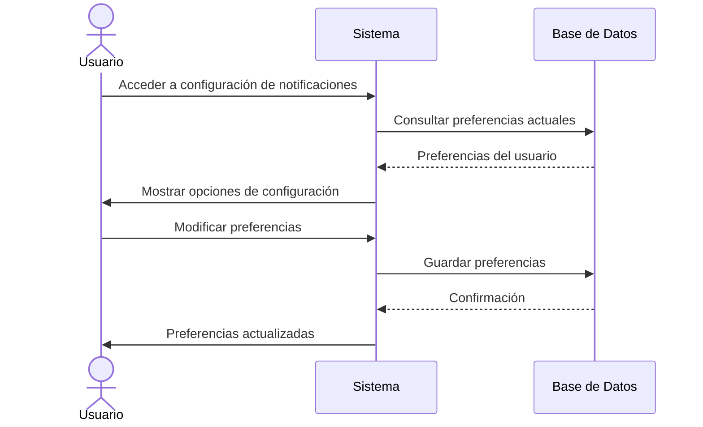
```mermaid
sequenceDiagram
    actor Usuario
    participant Sistema
    participant BD as Base de Datos
    
    Usuario->>Sistema: Acceder a configuración de notificaciones
    Sistema->>BD: Consultar preferencias actuales
    BD-->>Sistema: Preferencias del usuario
    Sistema->>Usuario: Mostrar opciones de configuración
    Usuario->>Sistema: Modificar preferencias
    Sistema->>BD: Guardar preferencias
    BD-->>Sistema: Confirmación
    Sistema->>Usuario: Preferencias actualizadas
```

### **📊 Gestión de Analytics**

#### **UC-025: Ver Dashboard**
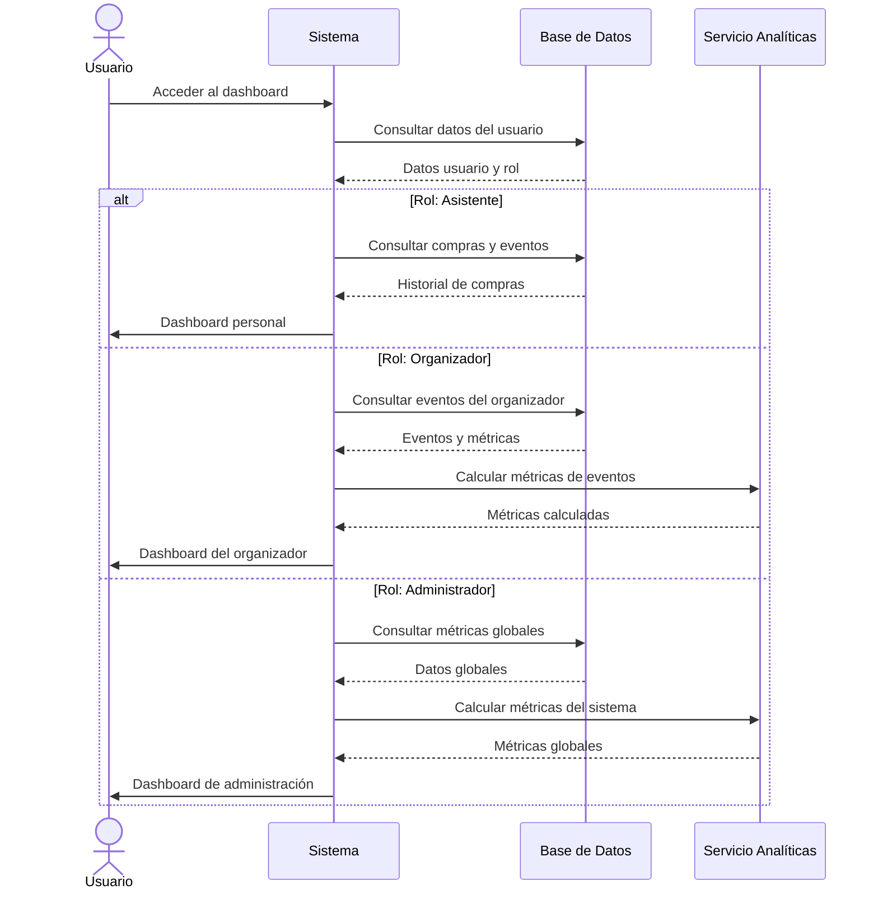
```mermaid
sequenceDiagram
    actor Usuario
    participant Sistema
    participant BD as Base de Datos
    participant Analytics as Servicio Analíticas
    
    Usuario->>Sistema: Acceder al dashboard
    Sistema->>BD: Consultar datos del usuario
    BD-->>Sistema: Datos usuario y rol
    alt Rol: Asistente
        Sistema->>BD: Consultar compras y eventos
        BD-->>Sistema: Historial de compras
        Sistema->>Usuario: Dashboard personal
    else Rol: Organizador
        Sistema->>BD: Consultar eventos del organizador
        BD-->>Sistema: Eventos y métricas
        Sistema->>Analytics: Calcular métricas de eventos
        Analytics-->>Sistema: Métricas calculadas
        Sistema->>Usuario: Dashboard del organizador
    else Rol: Administrador
        Sistema->>BD: Consultar métricas globales
        BD-->>Sistema: Datos globales
        Sistema->>Analytics: Calcular métricas del sistema
        Analytics-->>Sistema: Métricas globales
        Sistema->>Usuario: Dashboard de administración
    end
```

#### **UC-026: Generar Reportes**
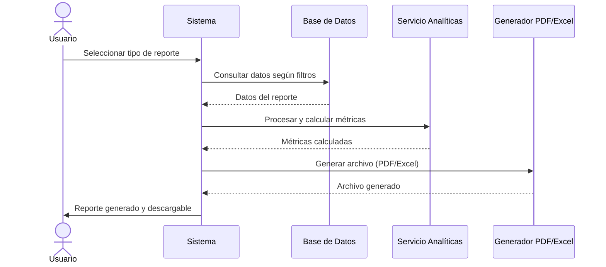
```mermaid
sequenceDiagram
    actor Usuario
    participant Sistema
    participant BD as Base de Datos
    participant Analytics as Servicio Analíticas
    participant Export as Generador PDF/Excel
    
    Usuario->>Sistema: Seleccionar tipo de reporte
    Sistema->>BD: Consultar datos según filtros
    BD-->>Sistema: Datos del reporte
    Sistema->>Analytics: Procesar y calcular métricas
    Analytics-->>Sistema: Métricas calculadas
    Sistema->>Export: Generar archivo (PDF/Excel)
    Export-->>Sistema: Archivo generado
    Sistema->>Usuario: Reporte generado y descargable
```

#### **UC-027: Ver Métricas**
```mermaid
sequenceDiagram
    participant Sistema
    participant BD as Base de Datos
    participant Analytics as Servicio Analíticas
    
    Sistema->>BD: Consultar datos en tiempo real
    BD-->>Sistema: Datos actuales
    Sistema->>Analytics: Procesar métricas
    Analytics-->>Sistema: Métricas calculadas
    Sistema->>Sistema: Actualizar métricas en tiempo real
```

#### **UC-028: Dashboard del Organizador**
```mermaid
sequenceDiagram
    actor Organizador
    participant Sistema
    participant BD as Base de Datos
    participant Analytics as Servicio Analíticas
    
    Organizador->>Sistema: Acceder al dashboard
    Sistema->>BD: Consultar eventos del organizador
    BD-->>Sistema: Lista de eventos
    Sistema->>BD: Consultar métricas de eventos
    BD-->>Sistema: Datos de métricas
    Sistema->>Analytics: Calcular métricas específicas
    Analytics-->>Sistema: Métricas del organizador
    Sistema->>Organizador: Mostrar dashboard personalizado
```

#### **UC-029: Gestionar Asistentes**
```mermaid
sequenceDiagram
    actor Organizador
    participant Sistema
    participant BD as Base de Datos
    participant Email as Servicio Email
    
    Organizador->>Sistema: Seleccionar evento
    Sistema->>BD: Consultar asistentes del evento
    BD-->>Sistema: Lista de asistentes
    Sistema->>Organizador: Mostrar lista de asistentes
    Organizador->>Sistema: Seleccionar acción (enviar mensaje/exportar)
    alt Enviar mensaje
        Sistema->>Email: Enviar mensaje masivo
        Email-->>Sistema: Mensajes enviados
        Sistema->>Organizador: Mensajes enviados exitosamente
    else Exportar lista
        Sistema->>BD: Generar archivo con datos
        BD-->>Sistema: Archivo generado
        Sistema->>Organizador: Lista exportada
    end
```

#### **UC-030: Ver Métricas de Eventos**
```mermaid
sequenceDiagram
    actor Organizador
    participant Sistema
    participant BD as Base de Datos
    participant Analytics as Servicio Analíticas
    
    Organizador->>Sistema: Seleccionar evento
    Sistema->>BD: Consultar datos del evento
    BD-->>Sistema: Datos del evento
    Sistema->>Analytics: Calcular métricas del evento
    Analytics-->>Sistema: Métricas calculadas
    Sistema->>Organizador: Mostrar métricas del evento
```

### **⚙️ Gestión de Administración**

#### **UC-031: Crear Códigos Promocionales**
```mermaid
sequenceDiagram
    actor Organizador
    participant Sistema
    participant BD as Base de Datos
    
    Organizador->>Sistema: Acceder a códigos promocionales
    Organizador->>Sistema: Crear nuevo código (descuento, fecha, límite)
    Sistema->>BD: Validar datos del código
    BD-->>Sistema: Resultado validación
    alt Datos válidos
        Sistema->>BD: Guardar código promocional
        BD-->>Sistema: Confirmación
        Sistema->>Organizador: Código promocional creado
    else Datos inválidos
        Sistema->>Organizador: Error de validación
    end
```

#### **UC-032: Gestionar Lista de Espera**
```mermaid
sequenceDiagram
    actor Organizador
    participant Sistema
    participant BD as Base de Datos
    participant Email as Servicio Email
    
    Organizador->>Sistema: Acceder a lista de espera
    Sistema->>BD: Consultar lista de espera del evento
    BD-->>Sistema: Lista de espera
    Sistema->>Organizador: Mostrar lista de espera
    Organizador->>Sistema: Activar lista de espera
    Sistema->>BD: Activar lista de espera
    BD-->>Sistema: Confirmación
    Sistema->>Email: Notificar usuarios en lista de espera
    Email-->>Sistema: Notificaciones enviadas
    Sistema->>Organizador: Lista de espera activada
```

#### **UC-033: Configurar Check-in**
```mermaid
sequenceDiagram
    actor Organizador
    participant Sistema
    participant BD as Base de Datos
    
    Organizador->>Sistema: Acceder a configuración de check-in
    Organizador->>Sistema: Configurar parámetros de check-in
    Sistema->>BD: Validar configuración
    BD-->>Sistema: Resultado validación
    alt Configuración válida
        Sistema->>BD: Guardar configuración de check-in
        BD-->>Sistema: Confirmación
        Sistema->>Organizador: Check-in configurado exitosamente
    else Configuración inválida
        Sistema->>Organizador: Error de configuración
    end
```

#### **UC-034: Dashboard de Administración**
```mermaid
sequenceDiagram
    actor Administrador
    participant Sistema
    participant BD as Base de Datos
    participant Analytics as Servicio Analíticas
    
    Administrador->>Sistema: Acceder al dashboard de administración
    Sistema->>BD: Consultar métricas globales
    BD-->>Sistema: Datos globales
    Sistema->>Analytics: Calcular métricas del sistema
    Analytics-->>Sistema: Métricas globales
    Sistema->>Administrador: Mostrar dashboard de administración
```

#### **UC-035: Gestionar Configuración del Sistema**
```mermaid
sequenceDiagram
    actor Administrador
    participant Sistema
    participant BD as Base de Datos
    
    Administrador->>Sistema: Acceder a configuración del sistema
    Sistema->>BD: Consultar parámetros actuales
    BD-->>Sistema: Configuración actual
    Sistema->>Administrador: Mostrar configuración
    Administrador->>Sistema: Modificar parámetros
    Sistema->>BD: Validar nuevos parámetros
    BD-->>Sistema: Resultado validación
    alt Parámetros válidos
        Sistema->>BD: Actualizar configuración
        BD-->>Sistema: Confirmación
        Sistema->>BD: Registrar cambio (auditoria)
        BD-->>Sistema: Confirmación
        Sistema->>Administrador: Configuración actualizada
    else Parámetros inválidos
        Sistema->>Administrador: Error en configuración
    end
```

#### **UC-036: Ver Métricas Globales**
```mermaid
sequenceDiagram
    actor Administrador
    participant Sistema
    participant BD as Base de Datos
    participant Analytics as Servicio Analíticas
    
    Administrador->>Sistema: Acceder a métricas globales
    Sistema->>BD: Consultar datos globales
    BD-->>Sistema: Datos del sistema
    Sistema->>Analytics: Calcular métricas globales
    Analytics-->>Sistema: Métricas globales
    Sistema->>Administrador: Mostrar métricas globales
```

#### **UC-037: Monitorear Rendimiento**
```mermaid
sequenceDiagram
    actor Administrador
    participant Sistema
    participant BD as Base de Datos
    participant Monitor as Servicio Monitoreo
    participant Alert as Sistema de Alertas
    
    Administrador->>Sistema: Acceder a monitoreo
    Sistema->>Monitor: Consultar métricas del sistema
    Monitor->>BD: Consultar logs y métricas
    BD-->>Monitor: Datos de rendimiento
    Monitor-->>Sistema: Métricas actuales
    Sistema->>Alert: Verificar umbrales de alerta
    Alert-->>Sistema: Estado de alertas
    alt Sistema estable
        Sistema->>Administrador: Dashboard de monitoreo (verde)
    else Problemas detectados
        Sistema->>Administrador: Dashboard con alertas (amarillo/rojo)
        Sistema->>Alert: Enviar notificaciones
        Alert-->>Sistema: Alertas enviadas
    end
```

#### **UC-038: Gestionar Backup y Restauración**
```mermaid
sequenceDiagram
    actor Administrador
    participant Sistema
    participant BD as Base de Datos
    participant Backup as Servicio Backup
    participant Storage as Almacenamiento
    
    Administrador->>Sistema: Iniciar proceso de backup
    Sistema->>Backup: Crear backup de la base de datos
    Backup->>BD: Exportar datos
    BD-->>Backup: Datos exportados
    Backup->>Storage: Guardar backup
    Storage-->>Backup: Backup guardado
    Backup-->>Sistema: Backup completado
    Sistema->>BD: Registrar operación de backup
    BD-->>Sistema: Confirmación
    Sistema->>Administrador: Backup completado exitosamente
```

#### **UC-039: Configurar Integraciones**
```mermaid
sequenceDiagram
    actor Administrador
    participant Sistema
    participant BD as Base de Datos
    participant Integration as Servicio de Integraciones
    
    Administrador->>Sistema: Acceder a configuración de integraciones
    Sistema->>BD: Consultar integraciones actuales
    BD-->>Sistema: Estado de integraciones
    Sistema->>Administrador: Mostrar integraciones disponibles
    Administrador->>Sistema: Configurar nueva integración
    Sistema->>Integration: Validar configuración
    Integration-->>Sistema: Resultado validación
    alt Configuración válida
        Sistema->>BD: Guardar configuración de integración
        BD-->>Sistema: Confirmación
        Sistema->>Integration: Activar integración
        Integration-->>Sistema: Integración activada
        Sistema->>Administrador: Integración configurada exitosamente
    else Configuración inválida
        Sistema->>Administrador: Error en configuración
    end
```

---

## 📊 **Estadísticas de Diagramas de Secuencia**

### **Diagramas por Categoría**
- **Autenticación y Gestión de Usuarios**: 5 diagramas
- **Gestión de Eventos**: 5 diagramas
- **Gestión de Pagos**: 5 diagramas
- **Gestión de Notificaciones**: 3 diagramas
- **Gestión de Analytics**: 6 diagramas
- **Gestión de Administración**: 9 diagramas

### **Total de Diagramas**: 33 diagramas de secuencia

### **Participantes por Diagrama**
- **Sistema**: 33 diagramas
- **Base de Datos**: 33 diagramas
- **Supabase Auth**: 5 diagramas
- **Servicio Email**: 8 diagramas
- **Stripe/PayPal**: 1 diagrama
- **Generador QR**: 2 diagramas
- **Servicio Analíticas**: 8 diagramas
- **Servicio Monitoreo**: 1 diagrama
- **Servicio Backup**: 1 diagrama
- **Servicio de Integraciones**: 1 diagrama

---

## 🎯 **Patrones de Interacción Identificados**

### **1. Patrón de Autenticación**
- Validación de credenciales
- Generación de tokens
- Registro de auditoría

### **2. Patrón de Validación**
- Validación de datos de entrada
- Verificación de disponibilidad
- Manejo de errores

### **3. Patrón de Procesamiento de Pagos**
- Validación de disponibilidad
- Integración con pasarelas de pago
- Generación de confirmaciones

### **4. Patrón de Notificaciones**
- Envío masivo de notificaciones
- Integración con servicios externos
- Seguimiento de entrega

### **5. Patrón de Analytics**
- Cálculo de métricas en tiempo real
- Generación de reportes
- Actualización de dashboards

---

*Estos diagramas de secuencia representan los flujos de interacción detallados del sistema EventHub, mostrando cómo los actores interactúan con el sistema y los servicios externos para completar cada caso de uso, proporcionando una visión integral del comportamiento del sistema.*
