# 🔄 EventHub - Diagramas de Secuencia (alineados al código actual)
## Sistema de Gestión de Eventos - Flujos de Interacción Detallados

## 🎯 **Resumen del Sistema**

**EventHub** (React + Vite + Supabase) opera con autenticación Supabase Auth, persistencia en el schema público y lógica de negocio en servicios/estados de frontend. Los flujos reflejan la implementación vigente (Zustand, servicios `supabase`, generación de QR, métodos de pago por evento y guards de verificación de email).

### 🚀 **Características Principales (vigentes)**
- **Autenticación y verificación de email** con Supabase Auth + guardas en UI
- **Gestión de eventos** contra tablas `eventos`/`tipos_entrada` y cálculos de asistencia con códigos QR
- **Pagos y compras**: validación de stock, métodos de pago por evento y generación de códigos QR persistidos en `codigos_qr_entradas`
- **Notificaciones internas** mediante tabla `notificaciones` (sin push/email externo implementado)
- **Analytics** calculadas desde tablas `compras`, `codigos_qr_entradas`, `analiticas_eventos`

---

## 📊 **Diagramas de Secuencia por Categoría**

### **🔐 Autenticación y Gestión de Usuarios**

#### **UC-001: Registrar Usuario (email + verificación obligatoria)**
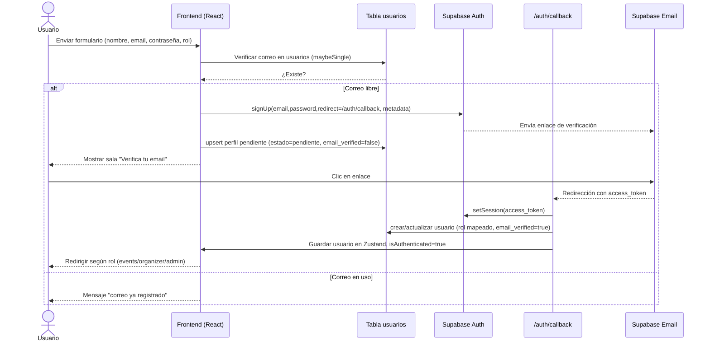

#### **UC-002: Autenticar Usuario (login con password)**
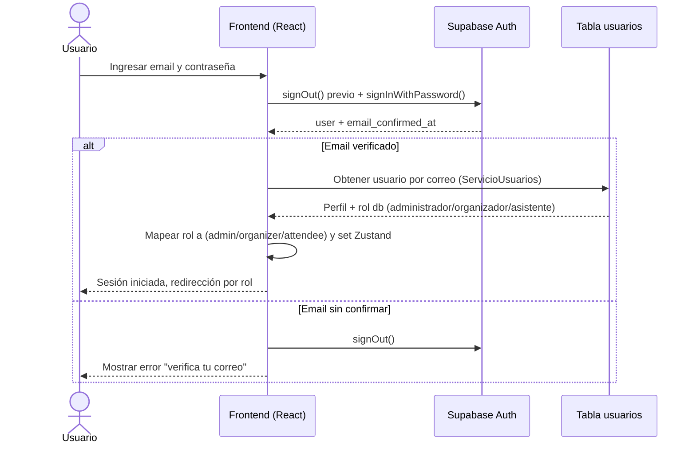

#### **UC-003: Cerrar Sesión**
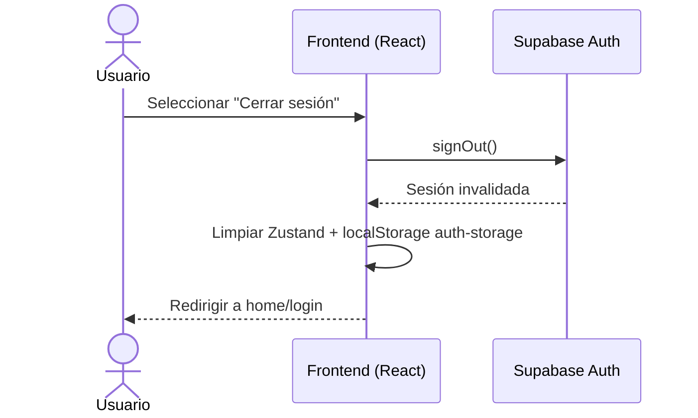

#### **UC-004: Recuperar Contraseña (pendiente de implementación)**
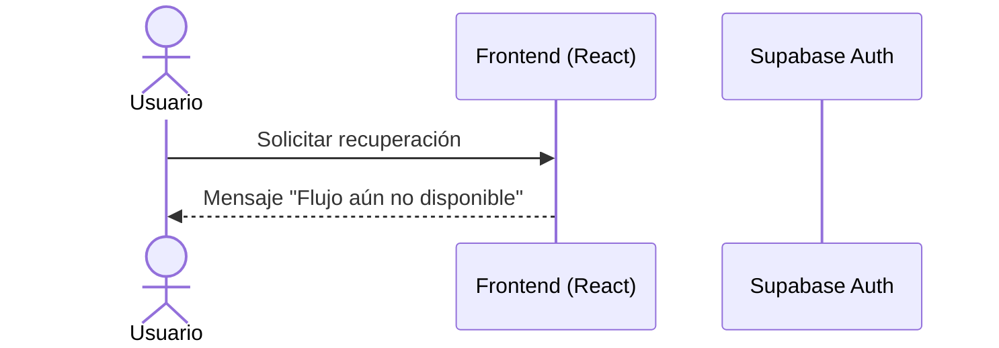

#### **UC-005: Cambiar Contraseña (pendiente de implementación)**
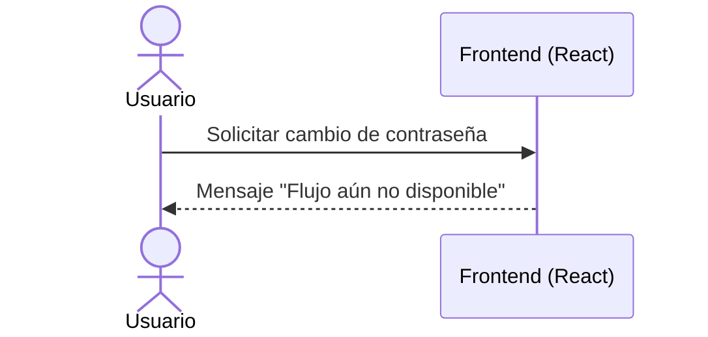

### **📅 Gestión de Eventos**

#### **UC-011: Explorar Eventos (filtros + cálculo de asistencia real)**
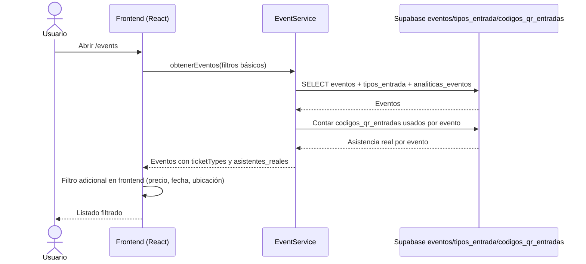

#### **UC-012: Buscar Eventos (texto + filtros)**
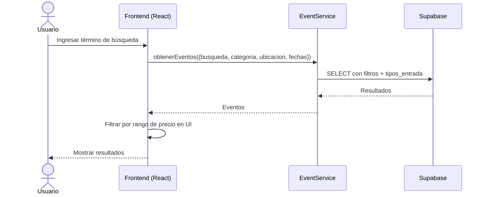

#### **UC-013: Ver Detalle de Evento**
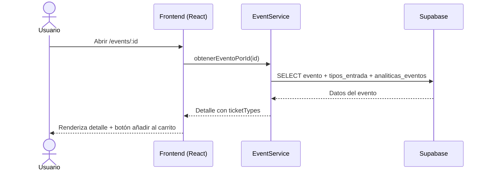

#### **UC-014: Crear Evento (sin storage, con notificación a seguidores)**
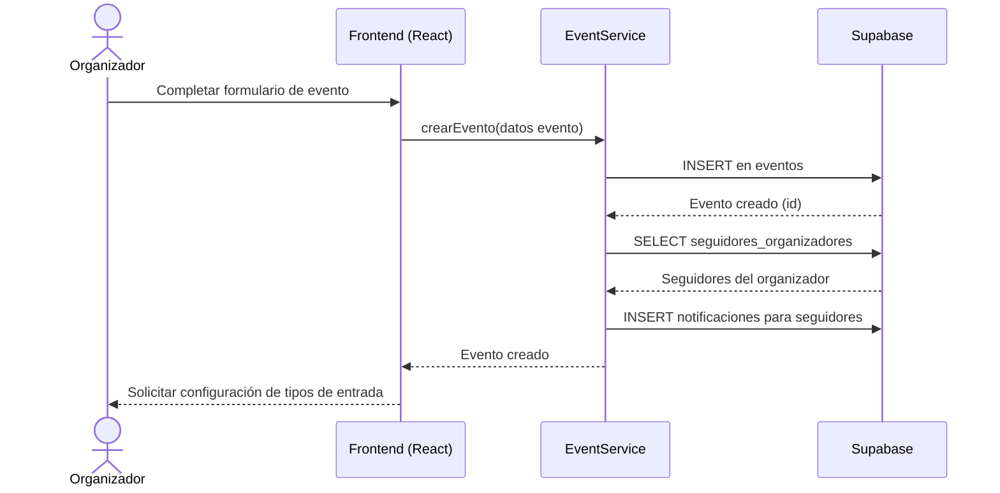

#### **UC-015: Editar Evento**
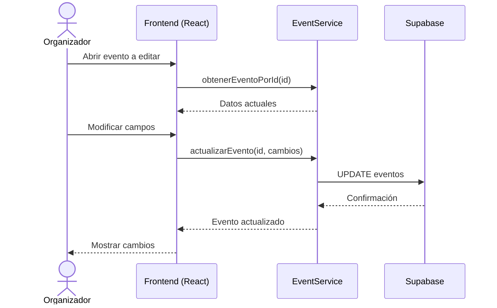

### **🎫 Gestión de Pagos**

#### **UC-017: Agregar al Carrito (store local)**
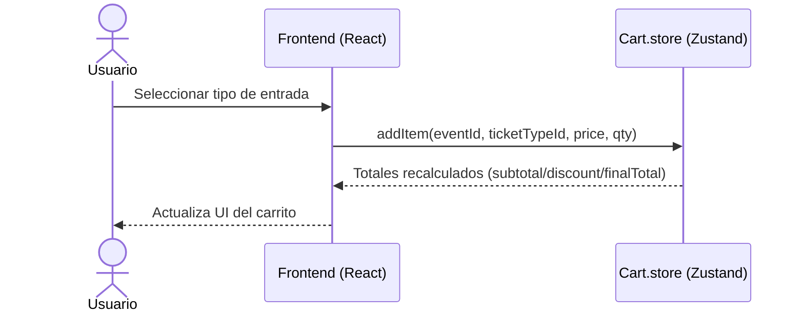

#### **UC-018: Procesar Pago (checkout con Supabase + QR)**
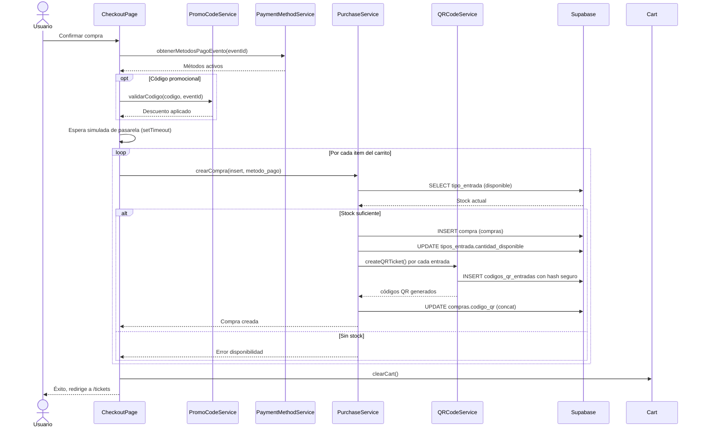

#### **UC-019: Ver Entradas (QR + compras)**
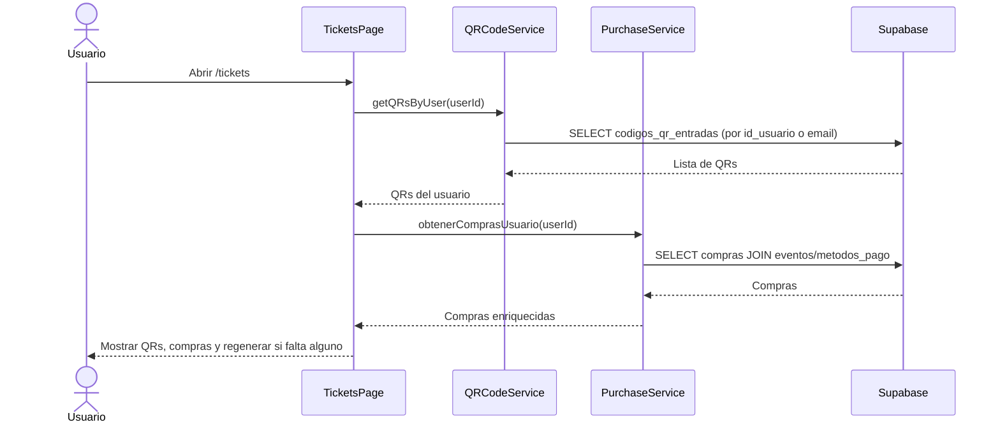

#### **UC-020: Generar QR (creación individual)**
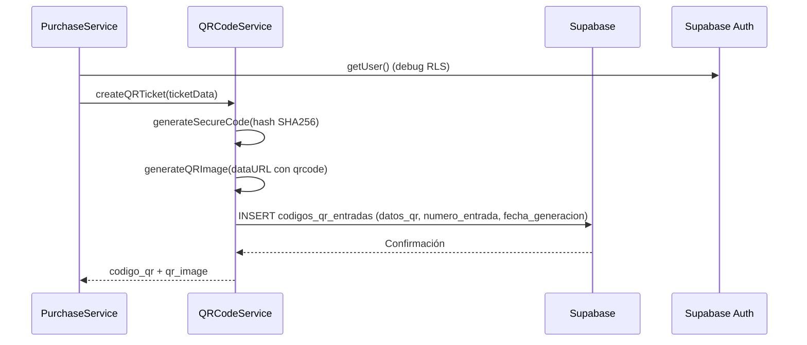

#### **UC-021: Validar Entrada (RPC en DB)**
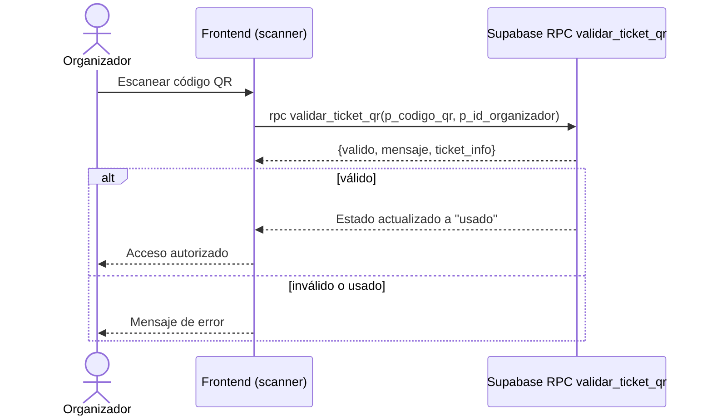

### **🔔 Gestión de Notificaciones**

#### **UC-022: Enviar Notificación (interna)**
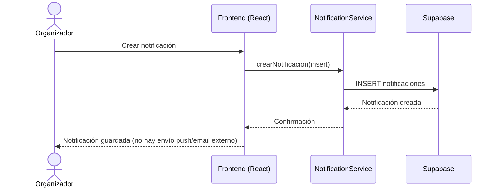

#### **UC-023: Ver Notificaciones**
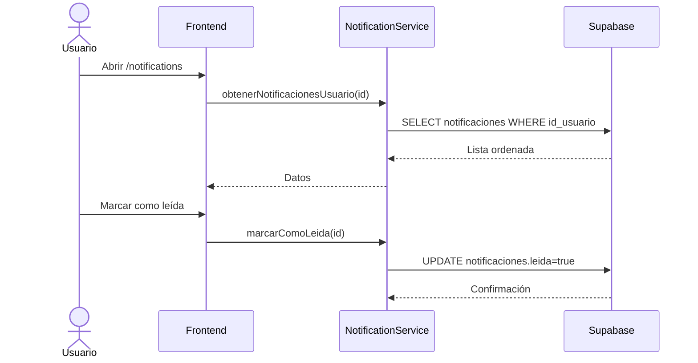

#### **UC-024: Configurar Preferencias (pendiente)**
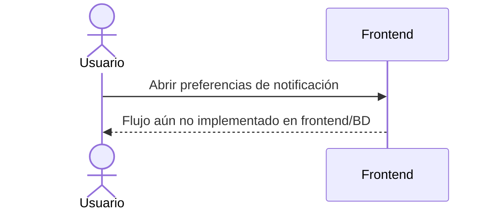

### **📊 Gestión de Analytics**

#### **UC-025: Ver Dashboard (según rol)**
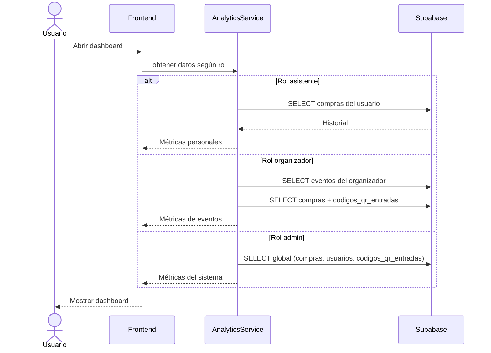

#### **UC-026: Generar Reportes (calculados en frontend)**
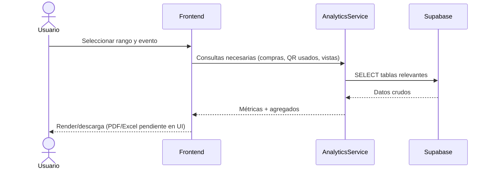

#### **UC-027: Ver Métricas en Tiempo Real**
```mermaid
sequenceDiagram
    participant App as Frontend
    participant Analytics as AnalyticsService
    participant BD as Supabase

    App->>Analytics: Polling/consultas periódicas
    Analytics->>BD: SELECT compras + codigos_qr_entradas recientes
    BD-->>Analytics: Datos actuales
    Analytics-->>App: KPIs recalculados
    App->>App: Actualizar UI en vivo
```

#### **UC-028: Dashboard del Organizador**
```mermaid
sequenceDiagram
    actor Organizador
    participant App as Frontend
    participant Analytics as AnalyticsService
    participant BD as Supabase

    Organizador->>App: Abrir /organizer/dashboard
    App->>Analytics: obtenerActividadRecienteOrganizador(id)
    Analytics->>BD: SELECT eventos del organizador
    Analytics->>BD: SELECT compras + codigos_qr_entradas (estado=usado)
    Analytics-->>App: Feed de ventas + escaneos
    App-->>Organizador: Mostrar actividad y KPIs
```

#### **UC-029: Gestionar Asistentes (foco en compras/QR)**
```mermaid
sequenceDiagram
    actor Organizador
    participant App as Frontend
    participant BD as Supabase

    Organizador->>App: Seleccionar evento
    App->>BD: SELECT compras JOIN usuarios para el evento
    BD-->>App: Lista de compradores
    App-->>Organizador: Ver/filtrar asistentes (export/mensajes masivos no implementados)
```

#### **UC-030: Ver Métricas de Eventos**
```mermaid
sequenceDiagram
    actor Organizador
    participant App as Frontend
    participant Analytics as AnalyticsService
    participant BD as Supabase

    Organizador->>App: Solicitar métricas de evento
    Analytics->>BD: SELECT analiticas_eventos + compras + codigos_qr_entradas
    BD-->>Analytics: Datos
    Analytics-->>App: totalRevenue, conversionRate, asistenciaPromedio, etc.
    App-->>Organizador: Mostrar métricas
```

### **⚙️ Gestión de Administración**

#### **UC-031: Crear Códigos Promocionales**
```mermaid
sequenceDiagram
    actor Organizador
    participant App as Frontend
    participant Promo as PromoCodeService
    participant BD as Supabase

    Organizador->>App: Completar datos del código
    App->>Promo: validar y guardar
    Promo->>BD: INSERT codigos_promocionales
    BD-->>Promo: Confirmación
    Promo-->>App: Código creado
```

#### **UC-032: Gestionar Lista de Espera (pendiente)**
```mermaid
sequenceDiagram
    actor Organizador
    participant App as Frontend

    Organizador->>App: Intentar activar lista de espera
    App-->>Organizador: Flujo no implementado en código actual
```

#### **UC-033: Configurar Check-in (a través de validación QR)**
```mermaid
sequenceDiagram
    actor Organizador
    participant App as Frontend
    participant BD as Supabase

    Organizador->>App: Ajustar parámetros (UI limitada)
    App-->>Organizador: El check-in se basa en rpc validar_ticket_qr (sin configuración extra)
```

#### **UC-034: Dashboard de Administración**
```mermaid
sequenceDiagram
    actor Administrador
    participant App as Frontend
    participant Analytics as AnalyticsService
    participant BD as Supabase

    Administrador->>App: Abrir /admin
    App->>Analytics: Consultas globales (usuarios, eventos, compras)
    Analytics->>BD: SELECT tablas globales
    BD-->>Analytics: Datos
    Analytics-->>App: KPIs globales
    App-->>Administrador: Dashboard administración
```

#### **UC-035: Gestionar Configuración del Sistema (pendiente)**
```mermaid
sequenceDiagram
    actor Administrador
    participant App as Frontend

    Administrador->>App: Abrir ajustes del sistema
    App-->>Administrador: Configuración avanzada no implementada en UI/BD
```

#### **UC-036: Ver Métricas Globales**
```mermaid
sequenceDiagram
    actor Administrador
    participant App as Frontend
    participant Analytics as AnalyticsService
    participant BD as Supabase

    Administrador->>App: Acceder a métricas globales
    Analytics->>BD: SELECT compras + usuarios + codigos_qr_entradas
    BD-->>Analytics: Datos globales
    Analytics-->>App: Métricas agregadas
    App-->>Administrador: Mostrar KPIs
```

#### **UC-037: Monitorear Rendimiento (no implementado)**
```mermaid
sequenceDiagram
    actor Administrador
    participant App as Frontend

    Administrador->>App: Consultar monitoreo
    App-->>Administrador: Flujo de monitoreo/alertas no disponible en frontend
```

#### **UC-038: Gestionar Backup y Restauración (no implementado)**
```mermaid
sequenceDiagram
    actor Administrador
    participant App as Frontend

    Administrador->>App: Iniciar backup/restauración
    App-->>Administrador: Gestión de backups no implementada en UI
```

#### **UC-039: Configurar Integraciones (no implementado)**
```mermaid
sequenceDiagram
    actor Administrador
    participant App as Frontend

    Administrador->>App: Configurar integración externa
    App-->>Administrador: Aún no disponible en código
```

---

## 📊 **Estadísticas de Diagramas de Secuencia**

### **Diagramas por Categoría**
- **Autenticación y Gestión de Usuarios**: 5 diagramas
- **Gestión de Eventos**: 5 diagramas
- **Gestión de Pagos**: 5 diagramas
- **Gestión de Notificaciones**: 3 diagramas
- **Gestión de Analytics**: 6 diagramas
- **Gestión de Administración**: 9 diagramas

### **Total de Diagramas**: 33 diagramas de secuencia

### **Participantes por Diagrama**
- **Sistema/App**: 33 diagramas
- **Supabase (BD)**: 28 diagramas
- **Supabase Auth**: 4 diagramas
- **QR/Compra/Promo Services**: 6 diagramas
- **Servicios pendientes/no implementados**: 6 diagramas marcados como tal

---

## 🎯 **Patrones de Interacción Identificados**

### **1. Patrón de Autenticación con verificación obligatoria**
- Limpieza de sesión previa, signIn con Supabase y guard de email confirmado

### **2. Patrón de Compras y QR**
- Validación de stock en `tipos_entrada`, creación en `compras`, generación de QR con hash seguro y guardado en `codigos_qr_entradas`

### **3. Patrón de Eventos con fans**
- Inserción de evento seguida de notificación interna a seguidores del organizador

### **4. Patrón de Analytics desde tablas propias**
- KPIs calculados en frontend usando `compras`, `codigos_qr_entradas` y `analiticas_eventos` (sin servicios externos)

### **5. Patrón de funcionalidad pendiente**
- Recuperación de contraseña, preferencias de notificación avanzadas, lista de espera, monitoreo e integraciones están marcados como no implementados en el código actual

---

*Diagramas actualizados según la lógica vigente del repositorio. Se mantienen los identificadores UC para trazabilidad con la documentación anterior.*
