# 📊 Diagrama Entidad-Relación - EventHub (Notación Estándar Chen)

### 📋 **Descripción del Sistema**
Este diagrama representa la arquitectura completa de la base de datos del sistema EventHub, una plataforma integral para la gestión de eventos que incluye funcionalidades de compra de entradas, control de asistencia, analytics, notificaciones y más.

### 🔍 **Entidades Clave del Negocio**
- **USUARIOS**: Gestión completa de usuarios (organizadores, asistentes, administradores)
- **EVENTOS**: Catálogo central de eventos con toda su información
- **TIPOS_ENTRADA**: Catálogo de productos/entradas por evento
- **COMPRAS**: Transacciones y flujo de ventas
- **ASISTENCIA_EVENTOS**: Control de acceso y validación

### 📐 **Notación del Diagrama**
- **Rectángulos**: Entidades
- **Óvalos**: Atributos (subrayados = clave primaria)
- **Rombos**: Relaciones
- **Líneas**: Conexiones con cardinalidades (min, max)
- **Doble óvalo**: Atributos multivaluados

## 🎨 **Diagrama ER en Mermaid (Notación Chen)**

```mermaid
graph TD
    %% Entidades principales del sistema
    U[USUARIOS]
    E[EVENTOS]
    TE[TIPOS_ENTRADA]
    C[COMPRAS]
    A[ASISTENCIA_EVENTOS]
    N[NOTIFICACIONES]
    PE[PLANTILLAS_EMAIL]
    AE[ANALITICAS_EVENTOS]
    CP[CODIGOS_PROMOCIONALES]
    FU[FAVORITOS_USUARIOS]
    CE[CALIFICACIONES_EVENTOS]
    CS[CONFIGURACIONES_SISTEMA]
    
    %% Atributos de USUARIOS (en óvalos)
    U_ID(("ID"))
    U_EMAIL(("CORREO_ELECTRONICO"))
    U_NOM(("NOMBRE_COMPLETO"))
    U_ROL(("ROL"))
    U_AVATAR(("URL_AVATAR"))
    U_PREF(("PREFERENCIAS"))
    U_PASS(("CONTRASEÑA"))
    
    %% Atributos de EVENTOS (en óvalos)
    E_ID(("ID"))
    E_TIT(("TITULO"))
    E_DESC(("DESCRIPCION"))
    E_IMG(("URL_IMAGEN"))
    E_FECHA(("FECHA_EVENTO"))
    E_HORA(("HORA_EVENTO"))
    E_UBI(("UBICACION"))
    E_CAT(("CATEGORIA"))
    E_MAX(("MAXIMO_ASISTENTES"))
    E_ACT(("ASISTENTES_ACTUALES"))
    E_ORG(("ID_ORGANIZADOR"))
    E_NOM_ORG(("NOMBRE_ORGANIZADOR"))
    E_EST(("ESTADO"))
    E_ETIQ(("ETIQUETAS"))
    
    %% Atributos de TIPOS_ENTRADA (en óvalos)
    TE_ID(("ID"))
    TE_EVENTO(("ID_EVENTO"))
    TE_NOM(("NOMBRE_TIPO"))
    TE_PREC(("PRECIO"))
    TE_DESC(("DESCRIPCION"))
    TE_MAX(("CANTIDAD_MAXIMA"))
    TE_DISP(("CANTIDAD_DISPONIBLE"))
    TE_NOM_EVENTO(("NOMBRE_EVENTO"))
    
    %% Atributos de COMPRAS (en óvalos)
    C_ID(("ID"))
    C_USUARIO(("ID_USUARIO"))
    C_EVENTO(("ID_EVENTO"))
    C_TIPO(("ID_TIPO_ENTRADA"))
    C_CANT(("CANTIDAD"))
    C_PRECIO(("PRECIO_UNITARIO"))
    C_TOTAL(("TOTAL_PAGADO"))
    C_EST(("ESTADO"))
    C_QR(("CODIGO_QR"))
    C_ORDEN(("NUMERO_ORDEN"))
    
    %% Atributos de ASISTENCIA_EVENTOS (en óvalos)
    A_ID(("ID"))
    A_COMPRA(("ID_COMPRA"))
    A_EVENTO(("ID_EVENTO"))
    A_USUARIO(("ID_USUARIO"))
    A_FECHA(("FECHA_ASISTENCIA"))
    A_VALIDADOR(("VALIDADO_POR"))
    A_METODO(("METODO_VALIDACION"))
    A_OBS(("OBSERVACIONES"))
    A_EST(("ESTADO_ASISTENCIA"))
    A_UBI(("UBICACION_VALIDACION"))
    A_DISP(("DISPOSITIVO_VALIDACION"))
    
    %% Atributos de NOTIFICACIONES (en óvalos)
    N_ID(("ID"))
    N_USUARIO(("ID_USUARIO"))
    N_TIPO(("TIPO"))
    N_TIT(("TITULO"))
    N_MSG(("MENSAJE"))
    N_LEIDA(("LEIDA"))
    N_URL(("URL_ACCION"))
    N_TEXTO(("TEXTO_ACCION"))
    
    %% Atributos de PLANTILLAS_EMAIL (en óvalos)
    PE_ID(("ID"))
    PE_NOM(("NOMBRE_PLANTILLA"))
    PE_ASUNTO(("ASUNTO"))
    PE_CONT(("CONTENIDO"))
    PE_TIPO(("TIPO"))
    
    %% Atributos de ANALITICAS_EVENTOS (en óvalos)
    AE_ID(("ID"))
    AE_EVENTO(("ID_EVENTO"))
    AE_VIS(("TOTAL_VISUALIZACIONES"))
    AE_VENTAS(("TOTAL_VENTAS"))
    AE_ING(("INGRESOS_TOTALES"))
    AE_CONV(("TASA_CONVERSION"))
    AE_PRECIO(("PRECIO_PROMEDIO_ENTRADA"))
    AE_TIPO(("TIPO_ENTRADA_MAS_VENDIDA"))
    AE_ASIST(("TASA_ASISTENCIA"))
    AE_REEM(("REEMBOLSOS"))
    AE_MONTO(("MONTO_REEMBOLSOS"))
    
    %% Atributos de CODIGOS_PROMOCIONALES (en óvalos)
    CP_ID(("ID"))
    CP_CODIGO(("CODIGO"))
    CP_DESC(("DESCRIPCION"))
    CP_TIPO(("TIPO_DESCUENTO"))
    CP_VALOR(("VALOR_DESCUENTO"))
    CP_INICIO(("FECHA_INICIO"))
    CP_FIN(("FECHA_FIN"))
    CP_MAX(("USO_MAXIMO"))
    CP_ACT(("USOS_ACTUALES"))
    CP_EVENTO(("ID_EVENTO"))
    CP_ORG(("ID_ORGANIZADOR"))
    CP_ACTIVO(("ACTIVO"))
    
    %% Atributos de FAVORITOS_USUARIOS (en óvalos)
    FU_ID(("ID"))
    FU_USUARIO(("ID_USUARIO"))
    FU_EVENTO(("ID_EVENTO"))
    FU_CAT(("CATEGORIA_FAVORITO"))
    FU_NOTAS(("NOTAS_PERSONALES"))
    FU_REC(("RECORDATORIO_ACTIVO"))
    FU_FECHA(("FECHA_RECORDATORIO"))
    FU_PRIOR(("PRIORIDAD"))
    FU_VIS(("VISIBLE"))
    
    %% Atributos de CALIFICACIONES_EVENTOS (en óvalos)
    CE_ID(("ID"))
    CE_EVENTO(("ID_EVENTO"))
    CE_USUARIO(("ID_USUARIO"))
    CE_CAL(("CALIFICACION"))
    CE_COM(("COMENTARIO"))
    CE_POS(("ASPECTOS_POSITIVOS"))
    CE_NEG(("ASPECTOS_NEGATIVOS"))
    CE_REC(("RECOMENDARIA"))
    CE_CAT(("CATEGORIA_CALIFICACION"))
    CE_FECHA(("FECHA_EVENTO_ASISTIDO"))
    CE_ANON(("ANONIMA"))
    CE_MOD(("MODERADA"))
    CE_VIS(("VISIBLE"))
    
    %% Atributos de CONFIGURACIONES_SISTEMA (en óvalos)
    CS_ID(("ID"))
    CS_CLAVE(("CLAVE"))
    CS_VALOR(("VALOR"))
    CS_TIPO(("TIPO"))
    CS_DESC(("DESCRIPCION"))
    CS_CAT(("CATEGORIA"))
    CS_SENS(("ES_SENSIBLE"))
    CS_READ(("SOLO_LECTURA"))
    CS_DEF(("VALOR_POR_DEFECTO"))
    CS_ACT(("ACTUALIZADO_POR"))
    
    %% Conexiones de atributos a entidades
    U --- U_ID
    U --- U_EMAIL
    U --- U_NOM
    U --- U_ROL
    U --- U_AVATAR
    U --- U_PREF
    U --- U_PASS
    
    E --- E_ID
    E --- E_TIT
    E --- E_DESC
    E --- E_IMG
    E --- E_FECHA
    E --- E_HORA
    E --- E_UBI
    E --- E_CAT
    E --- E_MAX
    E --- E_ACT
    E --- E_ORG
    E --- E_NOM_ORG
    E --- E_EST
    E --- E_ETIQ
    
    TE --- TE_ID
    TE --- TE_EVENTO
    TE --- TE_NOM
    TE --- TE_PREC
    TE --- TE_DESC
    TE --- TE_MAX
    TE --- TE_DISP
    TE --- TE_NOM_EVENTO
    
    C --- C_ID
    C --- C_USUARIO
    C --- C_EVENTO
    C --- C_TIPO
    C --- C_CANT
    C --- C_PRECIO
    C --- C_TOTAL
    C --- C_EST
    C --- C_QR
    C --- C_ORDEN
    
    A --- A_ID
    A --- A_COMPRA
    A --- A_EVENTO
    A --- A_USUARIO
    A --- A_FECHA
    A --- A_VALIDADOR
    A --- A_METODO
    A --- A_OBS
    A --- A_EST
    A --- A_UBI
    A --- A_DISP
    
    N --- N_ID
    N --- N_USUARIO
    N --- N_TIPO
    N --- N_TIT
    N --- N_MSG
    N --- N_LEIDA
    N --- N_URL
    N --- N_TEXTO
    
    PE --- PE_ID
    PE --- PE_NOM
    PE --- PE_ASUNTO
    PE --- PE_CONT
    PE --- PE_TIPO
    
    AE --- AE_ID
    AE --- AE_EVENTO
    AE --- AE_VIS
    AE --- AE_VENTAS
    AE --- AE_ING
    AE --- AE_CONV
    AE --- AE_PRECIO
    AE --- AE_TIPO
    AE --- AE_ASIST
    AE --- AE_REEM
    AE --- AE_MONTO
    
    CP --- CP_ID
    CP --- CP_CODIGO
    CP --- CP_DESC
    CP --- CP_TIPO
    CP --- CP_VALOR
    CP --- CP_INICIO
    CP --- CP_FIN
    CP --- CP_MAX
    CP --- CP_ACT
    CP --- CP_EVENTO
    CP --- CP_ORG
    CP --- CP_ACTIVO
    
    FU --- FU_ID
    FU --- FU_USUARIO
    FU --- FU_EVENTO
    FU --- FU_CAT
    FU --- FU_NOTAS
    FU --- FU_REC
    FU --- FU_FECHA
    FU --- FU_PRIOR
    FU --- FU_VIS
    
    CE --- CE_ID
    CE --- CE_EVENTO
    CE --- CE_USUARIO
    CE --- CE_CAL
    CE --- CE_COM
    CE --- CE_POS
    CE --- CE_NEG
    CE --- CE_REC
    CE --- CE_CAT
    CE --- CE_FECHA
    CE --- CE_ANON
    CE --- CE_MOD
    CE --- CE_VIS
    
    CS --- CS_ID
    CS --- CS_CLAVE
    CS --- CS_VALOR
    CS --- CS_TIPO
    CS --- CS_DESC
    CS --- CS_CAT
    CS --- CS_SENS
    CS --- CS_READ
    CS --- CS_DEF
    CS --- CS_ACT

    %% Relaciones principales del sistema (en rombos)
    R1{ORGANIZA}
    R2{TIENE}
    R3{COMPRA}
    R4{VENDIDO_EN}
    R5{SE_COMPRA}
    R6{VALIDA}
    R7{REGISTRA_ASISTENCIA}
    R8{ASISTE}
    R9{RECIBE}
    R10{GENERA_ANALITICAS}
    R11{TIENE_CODIGOS}
    R12{CREA_CODIGOS}
    R13{MARCA_FAVORITO}
    R14{ES_FAVORITO}
    R15{CALIFICA}
    R16{ES_CALIFICADO}
    R17{ACTUALIZA_CONFIG}
    R18{VALIDA_ASISTENCIA}
    
    %% Conexiones de entidades a relaciones con cardinalidades
    U ---|1,N| R1
    R1 ---|1,1| E
    E ---|1,1| R2
    R2 ---|1,N| TE
    U ---|1,N| R3
    R3 ---|1,1| C
    E ---|1,1| R4
    R4 ---|1,N| C
    TE ---|1,N| R5
    R5 ---|1,N| C
    C ---|1,1| R6
    R6 ---|1,N| A
    E ---|1,1| R7
    R7 ---|1,N| A
    U ---|1,N| R8
    R8 ---|1,N| A
    U ---|1,N| R9
    R9 ---|1,1| N
    E ---|1,1| R10
    R10 ---|1,N| AE
    E ---|1,1| R11
    R11 ---|1,N| CP
    U ---|1,N| R12
    R12 ---|1,1| CP
    U ---|1,N| R13
    R13 ---|1,N| FU
    E ---|1,N| R14
    R14 ---|1,N| FU
    U ---|1,N| R15
    R15 ---|1,N| CE
    E ---|1,N| R16
    R16 ---|1,N| CE
    U ---|1,N| R17
    R17 ---|1,1| CS
    U ---|1,N| R18
    R18 ---|1,N| A
    
    %% Estilos para diferenciar elementos
    classDef entidad fill:#e1f5fe,stroke:#01579b,stroke-width:2px
    classDef atributo fill:#f3e5f5,stroke:#4a148c,stroke-width:1px
    classDef relacion fill:#fff3e0,stroke:#e65100,stroke-width:2px
    
    class U,E,TE,C,A,N,PE,AE,CP,FU,CE,CS entidad
    class U_ID,U_EMAIL,U_NOM,U_ROL,U_AVATAR,U_PREF,U_PASS,E_ID,E_TIT,E_DESC,E_IMG,E_FECHA,E_HORA,E_UBI,E_CAT,E_MAX,E_ACT,E_ORG,E_NOM_ORG,E_EST,E_ETIQ,TE_ID,TE_EVENTO,TE_NOM,TE_PREC,TE_DESC,TE_MAX,TE_DISP,TE_NOM_EVENTO,C_ID,C_USUARIO,C_EVENTO,C_TIPO,C_CANT,C_PRECIO,C_TOTAL,C_EST,C_QR,C_ORDEN,A_ID,A_COMPRA,A_EVENTO,A_USUARIO,A_FECHA,A_VALIDADOR,A_METODO,A_OBS,A_EST,A_UBI,A_DISP,N_ID,N_USUARIO,N_TIPO,N_TIT,N_MSG,N_LEIDA,N_URL,N_TEXTO,PE_ID,PE_NOM,PE_ASUNTO,PE_CONT,PE_TIPO,AE_ID,AE_EVENTO,AE_VIS,AE_VENTAS,AE_ING,AE_CONV,AE_PRECIO,AE_TIPO,AE_ASIST,AE_REEM,AE_MONTO,CP_ID,CP_CODIGO,CP_DESC,CP_TIPO,CP_VALOR,CP_INICIO,CP_FIN,CP_MAX,CP_ACT,CP_EVENTO,CP_ORG,CP_ACTIVO,FU_ID,FU_USUARIO,FU_EVENTO,FU_CAT,FU_NOTAS,FU_REC,FU_FECHA,FU_PRIOR,FU_VIS,CE_ID,CE_EVENTO,CE_USUARIO,CE_CAL,CE_COM,CE_POS,CE_NEG,CE_REC,CE_CAT,CE_FECHA,CE_ANON,CE_MOD,CE_VIS,CS_ID,CS_CLAVE,CS_VALOR,CS_TIPO,CS_DESC,CS_CAT,CS_SENS,CS_READ,CS_DEF,CS_ACT atributo
    class R1,R2,R3,R4,R5,R6,R7,R8,R9,R10,R11,R12,R13,R14,R15,R16,R17,R18 relacion
```

### 🔗 **Relaciones Completas del Sistema**

#### **Relaciones Principales del Negocio**

**1. USUARIOS ↔ EVENTOS (Organiza)**
- **Cardinalidad**: (1,N) : (1,1)
- **Descripción**: Un usuario puede organizar muchos eventos, un evento pertenece a un solo organizador

**2. EVENTOS ↔ TIPOS_ENTRADA (Tiene)**
- **Cardinalidad**: (1,1) : (1,N)
- **Descripción**: Un evento tiene muchos tipos de entrada, un tipo de entrada pertenece a un solo evento

**3. USUARIOS ↔ COMPRAS (Compra)**
- **Cardinalidad**: (1,N) : (1,1)
- **Descripción**: Un usuario puede hacer muchas compras, una compra pertenece a un solo usuario

**4. EVENTOS ↔ COMPRAS (Vendido En)**
- **Cardinalidad**: (1,1) : (1,N)
- **Descripción**: Un evento puede tener muchas compras, una compra pertenece a un solo evento

**5. TIPOS_ENTRADA ↔ COMPRAS (Se Compra)**
- **Cardinalidad**: (1,N) : (1,N)
- **Descripción**: Un tipo de entrada puede ser comprado muchas veces, una compra puede incluir varios tipos de entrada

**6. COMPRAS ↔ ASISTENCIA_EVENTOS (Valida)**
- **Cardinalidad**: (1,1) : (1,N)
- **Descripción**: Una compra puede generar muchos registros de asistencia, un registro de asistencia pertenece a una sola compra

**7. EVENTOS ↔ ASISTENCIA_EVENTOS (Registra Asistencia)**
- **Cardinalidad**: (1,1) : (1,N)
- **Descripción**: Un evento puede tener muchos registros de asistencia, un registro de asistencia pertenece a un solo evento

**8. USUARIOS ↔ ASISTENCIA_EVENTOS (Asiste)**
- **Cardinalidad**: (1,N) : (1,N)
- **Descripción**: Un usuario puede asistir a muchos eventos, un evento puede tener muchos asistentes

#### **Relaciones de Comunicación y Notificaciones**

**9. USUARIOS ↔ NOTIFICACIONES (Recibe)**
- **Cardinalidad**: (1,N) : (1,1)
- **Descripción**: Un usuario puede recibir muchas notificaciones, una notificación pertenece a un solo usuario

#### **Relaciones de Analytics y Métricas**

**10. EVENTOS ↔ ANALITICAS_EVENTOS (Genera Analytics)**
- **Cardinalidad**: (1,1) : (1,N)
- **Descripción**: Un evento puede tener muchas métricas de analytics, un registro de analytics pertenece a un solo evento

#### **Relaciones de Promociones**

**11. EVENTOS ↔ CODIGOS_PROMOCIONALES (Tiene Códigos)**
- **Cardinalidad**: (1,1) : (1,N)
- **Descripción**: Un evento puede tener muchos códigos promocionales, un código promocional pertenece a un solo evento

**12. USUARIOS ↔ CODIGOS_PROMOCIONALES (Crea Códigos)**
- **Cardinalidad**: (1,N) : (1,1)
- **Descripción**: Un usuario organizador puede crear muchos códigos promocionales, un código promocional pertenece a un solo organizador

#### **Relaciones de Experiencia del Usuario**

**13. USUARIOS ↔ FAVORITOS_USUARIOS (Marca Favorito)**
- **Cardinalidad**: (1,N) : (1,N)
- **Descripción**: Un usuario puede marcar muchos eventos como favoritos, un evento puede ser favorito de muchos usuarios

**14. EVENTOS ↔ FAVORITOS_USUARIOS (Es Favorito)**
- **Cardinalidad**: (1,N) : (1,N)
- **Descripción**: Un evento puede ser marcado como favorito por muchos usuarios, un favorito pertenece a un solo evento

**15. USUARIOS ↔ CALIFICACIONES_EVENTOS (Califica)**
- **Cardinalidad**: (1,N) : (1,N)
- **Descripción**: Un usuario puede calificar muchos eventos, un evento puede ser calificado por muchos usuarios

**16. EVENTOS ↔ CALIFICACIONES_EVENTOS (Es Calificado)**
- **Cardinalidad**: (1,N) : (1,N)
- **Descripción**: Un evento puede ser calificado por muchos usuarios, una calificación pertenece a un solo evento

#### **Relaciones de Configuración del Sistema**

**17. USUARIOS ↔ CONFIGURACIONES_SISTEMA (Actualiza Config)**
- **Cardinalidad**: (1,N) : (1,1)
- **Descripción**: Un usuario puede actualizar muchas configuraciones, una configuración es actualizada por un solo usuario

**18. USUARIOS ↔ ASISTENCIA_EVENTOS (Valida Asistencia)**
- **Cardinalidad**: (1,N) : (1,N)
- **Descripción**: Un usuario puede validar muchas asistencias, una asistencia puede ser validada por un usuario

## 🎨 **Diagrama ER Completo del Sistema EventHub**

### 🔗 **Relaciones Adicionales del Sistema**

#### **6. USUARIOS ↔ NOTIFICACIONES (Recibe)**
- **Cardinalidad**: (1,N) : (1,1)
- **Descripción**: Un usuario puede recibir muchas notificaciones, una notificación pertenece a un solo usuario

#### **7. USUARIOS ↔ FAVORITOS (Marca Favorito)**
- **Cardinalidad**: (1,N) : (1,N)
- **Descripción**: Un usuario puede marcar muchos eventos como favoritos, un evento puede ser favorito de muchos usuarios

#### **8. USUARIOS ↔ CALIFICACIONES (Califica)**
- **Cardinalidad**: (1,N) : (1,N)
- **Descripción**: Un usuario puede calificar muchos eventos, un evento puede ser calificado por muchos usuarios

#### **9. EVENTOS ↔ ANALITICAS (Analiza)**
- **Cardinalidad**: (1,1) : (1,N)
- **Descripción**: Un evento puede tener muchas métricas de analytics, un registro de analytics pertenece a un solo evento

#### **10. EVENTOS ↔ CODIGOS_PROMOCIONALES (Tiene Códigos)**
- **Cardinalidad**: (1,1) : (1,N)
- **Descripción**: Un evento puede tener muchos códigos promocionales, un código promocional pertenece a un solo evento

## 📋 **Resumen Completo del Sistema**

### 🗄️ **Todas las Tablas del Sistema (12 Entidades)**

1. **USUARIOS** - Gestión de usuarios del sistema
2. **EVENTOS** - Catálogo de eventos
3. **TIPOS_ENTRADA** - Tipos de entradas por evento
4. **COMPRAS** - Transacciones y ventas
5. **ASISTENCIA_EVENTOS** - Control de asistencia
6. **NOTIFICACIONES** - Sistema de notificaciones
7. **PLANTILLAS_EMAIL** - Plantillas de correo electrónico
8. **ANALITICAS_EVENTOS** - Métricas y analytics
9. **CODIGOS_PROMOCIONALES** - Códigos de descuento
10. **FAVORITOS_USUARIOS** - Sistema de favoritos
11. **CALIFICACIONES_EVENTOS** - Sistema de calificaciones
12. **CONFIGURACIONES_SISTEMA** - Configuraciones del sistema

### 🔗 **Resumen de Relaciones (18 Relaciones Principales)**

#### **USUARIOS como Entidad Central (9 relaciones)**
1. **USUARIOS → EVENTOS** (1:N) - "organiza"
2. **USUARIOS → COMPRAS** (1:N) - "compra"
3. **USUARIOS → NOTIFICACIONES** (1:N) - "recibe"
4. **USUARIOS → ASISTENCIA_EVENTOS** (1:N) - "asiste"
5. **USUARIOS → ASISTENCIA_EVENTOS** (1:N) - "valida_asistencia"
6. **USUARIOS → CODIGOS_PROMOCIONALES** (1:N) - "crea_codigos"
7. **USUARIOS → FAVORITOS_USUARIOS** (1:N) - "marca_favorito"
8. **USUARIOS → CALIFICACIONES_EVENTOS** (1:N) - "califica"
9. **USUARIOS → CONFIGURACIONES_SISTEMA** (1:N) - "actualiza_config"

#### **EVENTOS como Entidad Central (7 relaciones)**
10. **EVENTOS → TIPOS_ENTRADA** (1:N) - "tiene"
11. **EVENTOS → COMPRAS** (1:N) - "vendido_en"
12. **EVENTOS → ASISTENCIA_EVENTOS** (1:N) - "registra_asistencia"
13. **EVENTOS → ANALITICAS_EVENTOS** (1:N) - "genera_analytics"
14. **EVENTOS → CODIGOS_PROMOCIONALES** (1:N) - "tiene_codigos"
15. **EVENTOS → FAVORITOS_USUARIOS** (1:N) - "es_favorito"
16. **EVENTOS → CALIFICACIONES_EVENTOS** (1:N) - "es_calificado"

#### **Relaciones de Flujo de Negocio (2 relaciones)**
17. **TIPOS_ENTRADA → COMPRAS** (1:N) - "se_compra"
18. **COMPRAS → ASISTENCIA_EVENTOS** (1:N) - "valida"

## 🔄 **Flujos de Negocio Principales**

### 📈 **Flujo de Venta de Entradas**
1. **USUARIOS** organiza **EVENTOS**
2. **EVENTOS** tiene **TIPOS_ENTRADA**
3. **USUARIOS** realiza **COMPRAS** de **TIPOS_ENTRADA**
4. **COMPRAS** genera **ASISTENCIA_EVENTOS** (validación)

### 📊 **Flujo de Analytics y Métricas**
1. **EVENTOS** genera **ANALITICAS_EVENTOS**
2. **COMPRAS** alimenta métricas de ventas
3. **ASISTENCIA_EVENTOS** calcula tasas de asistencia

### 🔔 **Flujo de Comunicación**
1. **USUARIOS** recibe **NOTIFICACIONES**
2. **PLANTILLAS_EMAIL** para comunicación automatizada
3. **CONFIGURACIONES_SISTEMA** controla parámetros

### ⭐ **Flujo de Experiencia del Usuario**
1. **USUARIOS** marca **FAVORITOS_USUARIOS**
2. **USUARIOS** realiza **CALIFICACIONES_EVENTOS**
3. **CODIGOS_PROMOCIONALES** para descuentos

## 🎯 **Características del Diagrama **

### ✅ **Diagrama Mermaid Profesional (Notación Chen )**
- **Entidades** en rectángulos con colores diferenciados
- **Atributos** en óvalos conectados a sus entidades
- **Relaciones** en rombos con nombres descriptivos
- **Cardinalidades** explícitas en todas las conexiones (1,N), (1,1), (N,M)
- **Colores diferenciados** para entidades, atributos y relaciones
- **Estructura visual clara** que sigue la notación Chen estándar
- **Renderizado automático** en GitHub y editores Markdown

### ✅ **Estructura Profesional**
- **Claridad Visual** - Colores y formas diferenciadas por tipo de elemento
- **Relaciones Explícitas** - Cardinalidades claras (1:N, N:1, N:M)
- **Atributos Organizados** - Conectados a sus entidades correspondientes
- **Documentación Completa** - Explicación de cada relación

### ✅ **Ventajas del Diagrama Mermaid**
- **Renderizado Automático** - Se visualiza automáticamente en GitHub/Markdown
- **Mantenible** - Fácil de actualizar y modificar
- **Estándar** - Formato reconocido en la industria
- **Profesional** - Apariencia limpia y organizada
- **Completo** - Incluye todas las entidades y relaciones del sistema
