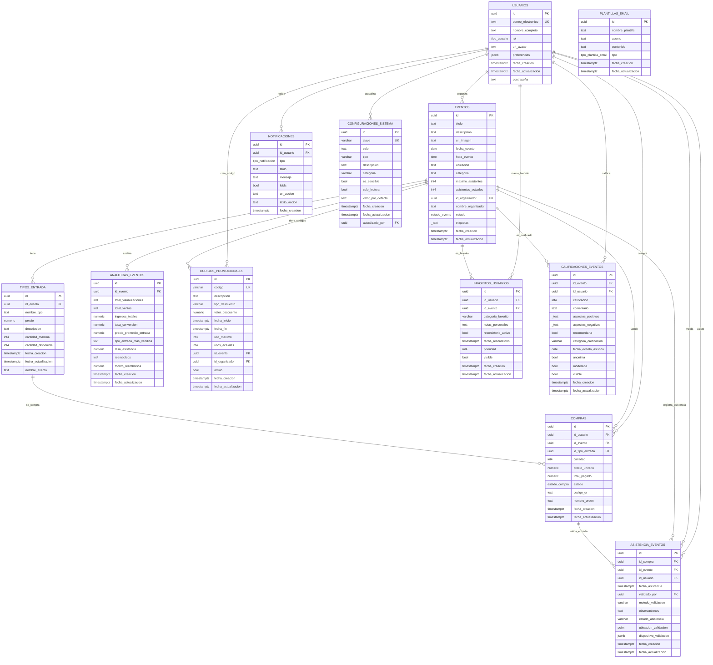

# 📊 Diagrama Entidad-Relación - EventHub

## 🎯 Diagrama ER Completo - EventHub

### 📋 **Descripción del Sistema**
Este diagrama representa la arquitectura completa de la base de datos del sistema EventHub, una plataforma integral para la gestión de eventos que incluye funcionalidades de compra de entradas, control de asistencia, analytics, notificaciones y más.

### 🔍 **Entidades Clave del Negocio**
- **USUARIOS**: Gestión completa de usuarios (organizadores, asistentes, administradores)
- **EVENTOS**: Catálogo central de eventos con toda su información
- **TIPOS_ENTRADA**: Catálogo de productos/entradas por evento
- **COMPRAS**: Transacciones y flujo de ventas
- **ASISTENCIA_EVENTOS**: Control de acceso y validación

## 📋 Resumen Completo de Relaciones

### 🔗 **Relaciones Principales del Sistema (1:N)**

#### **USUARIOS como Entidad Central**
1. **USUARIOS → EVENTOS** (1:N) - "organiza"
   - Un usuario puede organizar muchos eventos
   - Un evento pertenece a un solo organizador

2. **USUARIOS → COMPRAS** (1:N) - "compra"
   - Un usuario puede hacer muchas compras
   - Una compra pertenece a un solo usuario

3. **USUARIOS → NOTIFICACIONES** (1:N) - "recibe"
   - Un usuario puede recibir muchas notificaciones
   - Una notificación pertenece a un solo usuario

4. **USUARIOS → FAVORITOS_USUARIOS** (1:N) - "marca_favorito"
   - Un usuario puede marcar muchos eventos como favoritos
   - Un favorito pertenece a un solo usuario

5. **USUARIOS → CALIFICACIONES_EVENTOS** (1:N) - "califica"
   - Un usuario puede calificar muchos eventos
   - Una calificación pertenece a un solo usuario

6. **USUARIOS → CODIGOS_PROMOCIONALES** (1:N) - "crea_codigo"
   - Un usuario organizador puede crear muchos códigos promocionales
   - Un código promocional pertenece a un solo organizador

7. **USUARIOS → ASISTENCIA_EVENTOS** (1:N) - "asiste"
   - Un usuario puede asistir a muchos eventos
   - Un registro de asistencia pertenece a un solo usuario

8. **USUARIOS → ASISTENCIA_EVENTOS** (1:N) - "valida"
   - Un usuario puede validar muchas asistencias
   - Una validación de asistencia es realizada por un solo usuario

9. **USUARIOS → CONFIGURACIONES_SISTEMA** (1:N) - "actualiza"
   - Un usuario puede actualizar muchas configuraciones
   - Una configuración es actualizada por un solo usuario

#### **EVENTOS como Entidad Central**
10. **EVENTOS → TIPOS_ENTRADA** (1:N) - "tiene"
    - Un evento puede tener muchos tipos de entrada
    - Un tipo de entrada pertenece a un solo evento

11. **EVENTOS → COMPRAS** (1:N) - "vende"
    - Un evento puede tener muchas compras
    - Una compra pertenece a un solo evento

12. **EVENTOS → ANALITICAS_EVENTOS** (1:N) - "analiza"
    - Un evento puede tener muchas métricas de analytics
    - Un registro de analytics pertenece a un solo evento

13. **EVENTOS → CODIGOS_PROMOCIONALES** (1:N) - "tiene_codigos"
    - Un evento puede tener muchos códigos promocionales
    - Un código promocional pertenece a un solo evento

14. **EVENTOS → ASISTENCIA_EVENTOS** (1:N) - "registra_asistencia"
    - Un evento puede tener muchos registros de asistencia
    - Un registro de asistencia pertenece a un solo evento

15. **EVENTOS → FAVORITOS_USUARIOS** (1:N) - "es_favorito"
    - Un evento puede ser marcado como favorito por muchos usuarios
    - Un favorito pertenece a un solo evento

16. **EVENTOS → CALIFICACIONES_EVENTOS** (1:N) - "es_calificado"
    - Un evento puede ser calificado por muchos usuarios
    - Una calificación pertenece a un solo evento

#### **Relaciones de Flujo de Negocio**
17. **TIPOS_ENTRADA → COMPRAS** (1:N) - "se_compra"
    - Un tipo de entrada puede ser comprado muchas veces
    - Una compra es de un solo tipo de entrada

18. **COMPRAS → ASISTENCIA_EVENTOS** (1:N) - "valida_entrada"
    - Una compra puede generar muchos registros de asistencia
    - Un registro de asistencia pertenece a una sola compra

### 🔗 **Entidades Independientes**
- **PLANTILLAS_EMAIL** - Sin relaciones (entidad independiente)

## 🔄 **Flujos de Negocio Principales**

### 📈 **Flujo de Venta de Entradas**
1. **USUARIOS** organiza **EVENTOS**
2. **EVENTOS** tiene **TIPOS_ENTRADA**
3. **USUARIOS** realiza **COMPRAS** de **TIPOS_ENTRADA**
4. **COMPRAS** genera **ASISTENCIA_EVENTOS** (validación)

### 📊 **Flujo de Analytics y Métricas**
1. **EVENTOS** genera **ANALITICAS_EVENTOS**
2. **COMPRAS** alimenta métricas de ventas
3. **ASISTENCIA_EVENTOS** calcula tasas de asistencia

### 🔔 **Flujo de Comunicación**
1. **USUARIOS** recibe **NOTIFICACIONES**
2. **PLANTILLAS_EMAIL** para comunicación automatizada
3. **CONFIGURACIONES_SISTEMA** controla parámetros

### ⭐ **Flujo de Experiencia del Usuario**
1. **USUARIOS** marca **FAVORITOS_USUARIOS**
2. **USUARIOS** realiza **CALIFICACIONES_EVENTOS**
3. **CODIGOS_PROMOCIONALES** para descuentos

## 🎯 **Características del Diagrama**

✅ **Claridad Visual** - Colores y formas diferenciadas
✅ **Relaciones Explícitas** - Cardinalidades claras (1:N, N:1)
✅ **Atributos Principales** - Campos clave visibles
✅ **Estructura Profesional** - Formato estándar ER
✅ **Documentación Completa** - Explicación de cada relación
