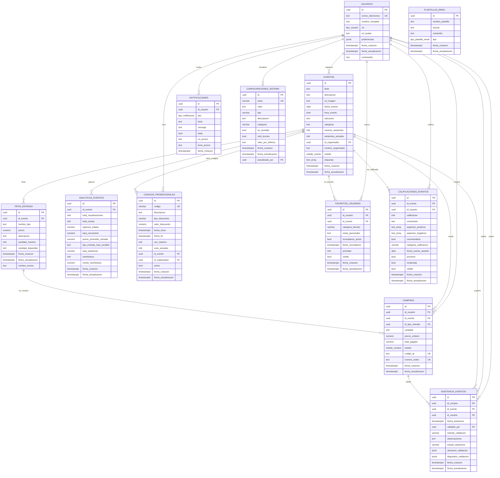

# 📊 Diagrama Relacional - EventHub

## 🎯 **Diagrama Relacional de la Base de Datos**

### 📋 **Descripción del Sistema**
El diagrama relacional muestra la estructura física de la base de datos EventHub, incluyendo todas las tablas, campos, tipos de datos, claves primarias, claves foráneas y relaciones entre tablas.

---

## 🗄️ **Diagrama Relacional Completo**

---

## 🔗 **Relaciones Detalladas del Sistema**

### **Tablas Principales (4)**

#### **1. USUARIOS (Tabla Central)**
- **Clave Primaria:** `id` (UUID)
- **Clave Única:** `correo_electronico`
- **Relaciones Salientes:** 9 relaciones
- **Función:** Gestión completa de usuarios del sistema

#### **2. EVENTOS (Tabla Central)**
- **Clave Primaria:** `id` (UUID)
- **Clave Foránea:** `id_organizador` → USUARIOS.id
- **Relaciones Salientes:** 7 relaciones
- **Función:** Catálogo central de eventos

#### **3. TIPOS_ENTRADA (Tabla de Soporte)**
- **Clave Primaria:** `id` (UUID)
- **Clave Foránea:** `id_evento` → EVENTOS.id
- **Relaciones Salientes:** 1 relación
- **Función:** Tipos de entradas por evento

#### **4. COMPRAS (Tabla de Transacciones)**
- **Clave Primaria:** `id` (UUID)
- **Claves Foráneas:** 
  - `id_usuario` → USUARIOS.id
  - `id_evento` → EVENTOS.id
  - `id_tipo_entrada` → TIPOS_ENTRADA.id
- **Relaciones Salientes:** 1 relación
- **Función:** Registro de transacciones

### **Tablas de Soporte (8)**

#### **5. NOTIFICACIONES**
- **Clave Primaria:** `id` (UUID)
- **Clave Foránea:** `id_usuario` → USUARIOS.id
- **Función:** Sistema de notificaciones

#### **6. PLANTILLAS_EMAIL**
- **Clave Primaria:** `id` (UUID)
- **Sin relaciones:** Tabla independiente
- **Función:** Plantillas de correo electrónico

#### **7. ANALITICAS_EVENTOS**
- **Clave Primaria:** `id` (UUID)
- **Clave Foránea:** `id_evento` → EVENTOS.id
- **Función:** Métricas y analytics

#### **8. CODIGOS_PROMOCIONALES**
- **Clave Primaria:** `id` (UUID)
- **Claves Foráneas:**
  - `id_evento` → EVENTOS.id
  - `id_organizador` → USUARIOS.id
- **Función:** Sistema de descuentos

#### **9. ASISTENCIA_EVENTOS**
- **Clave Primaria:** `id` (UUID)
- **Claves Foráneas:**
  - `id_compra` → COMPRAS.id
  - `id_evento` → EVENTOS.id
  - `id_usuario` → USUARIOS.id
  - `validado_por` → USUARIOS.id
- **Función:** Control de asistencia

#### **10. FAVORITOS_USUARIOS**
- **Clave Primaria:** `id` (UUID)
- **Claves Foráneas:**
  - `id_usuario` → USUARIOS.id
  - `id_evento` → EVENTOS.id
- **Función:** Sistema de favoritos

#### **11. CALIFICACIONES_EVENTOS**
- **Clave Primaria:** `id` (UUID)
- **Claves Foráneas:**
  - `id_evento` → EVENTOS.id
  - `id_usuario` → USUARIOS.id
- **Función:** Sistema de calificaciones

#### **12. CONFIGURACIONES_SISTEMA**
- **Clave Primaria:** `id` (UUID)
- **Clave Foránea:** `actualizado_por` → USUARIOS.id
- **Función:** Configuraciones del sistema

---

## 📊 **Estadísticas del Diagrama Relacional**

### **Resumen de Tablas**
- **Total de tablas:** 12
- **Tablas principales:** 4 (USUARIOS, EVENTOS, TIPOS_ENTRADA, COMPRAS)
- **Tablas de soporte:** 8 (NOTIFICACIONES, PLANTILLAS_EMAIL, etc.)

### **Resumen de Relaciones**
- **Total de relaciones:** 18
- **Relaciones de USUARIOS:** 9 (como entidad central)
- **Relaciones de EVENTOS:** 7 (como entidad central)
- **Relaciones de flujo:** 2 (TIPOS_ENTRADA → COMPRAS, COMPRAS → ASISTENCIA)

### **Tipos de Datos Utilizados**
- **UUID:** Claves primarias y foráneas
- **TEXT:** Campos de texto libre
- **NUMERIC:** Valores monetarios y decimales
- **INT4:** Contadores y cantidades
- **BOOL:** Valores booleanos
- **TIMESTAMPTZ:** Fechas y horas
- **DATE/TIME:** Fechas específicas
- **JSONB:** Datos estructurados
- **POINT:** Coordenadas geográficas
- **TEXT_ARRAY:** Arrays de texto

### **Claves y Restricciones**
- **Claves Primarias:** 12 (una por tabla)
- **Claves Foráneas:** 18 (relaciones entre tablas)
- **Claves Únicas:** 4 (correo_electronico, codigo_qr, numero_orden, clave)
- **Restricciones de Integridad:** Implementadas en todas las relaciones

---

## 🎯 **Características del Diagrama Relacional**

### ✅ **Estructura Profesional**
- **Tablas claramente definidas** con todos sus campos
- **Tipos de datos explícitos** para cada campo
- **Claves primarias y foráneas** identificadas
- **Relaciones explícitas** entre tablas
- **Restricciones de integridad** implementadas

### ✅ **Funcionalidades Cubiertas**
- **Gestión de Usuarios** - Registro, autenticación, roles
- **Gestión de Eventos** - Creación, edición, categorización
- **Sistema de Compras** - Proceso completo de compra
- **Control de Asistencia** - Validación de entradas
- **Analytics** - Métricas y reportes
- **Notificaciones** - Sistema de comunicación
- **Códigos Promocionales** - Descuentos y promociones
- **Calificaciones** - Sistema de reseñas
- **Favoritos** - Gestión de preferencias
- **Configuraciones** - Parámetros del sistema

### ✅ **Ventajas del Diseño**
- **Normalización adecuada** - Evita redundancia de datos
- **Integridad referencial** - Mantiene consistencia de datos
- **Escalabilidad** - Estructura preparada para crecimiento
- **Flexibilidad** - Fácil adición de nuevas funcionalidades
- **Rendimiento** - Índices y claves optimizadas

---
