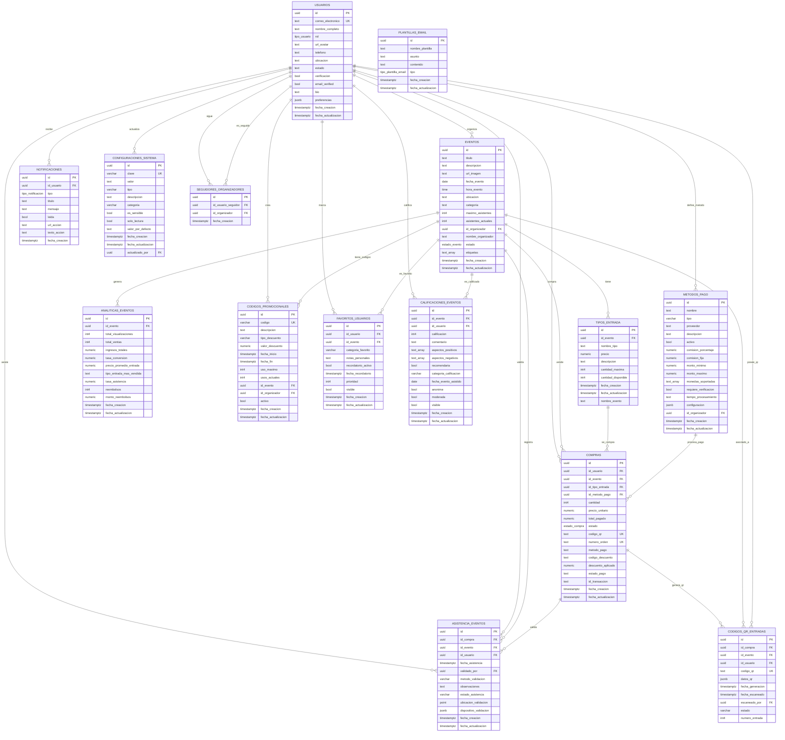

# üìä Diagrama Relacional - EventHub

## 🎯 **Diagrama Relacional de la Base de Datos**

### 📋 **Descripción del Sistema**
El diagrama relacional muestra la estructura física de la base de datos EventHub, incluyendo todas las tablas, campos, tipos de datos, claves primarias, claves foráneas y relaciones entre tablas.

---

## 🗄️ **Diagrama Relacional Completo**

```mermaid
erDiagram
    USUARIOS {
        uuid id PK
        text correo_electronico UK
        text nombre_completo
        tipo_usuario rol
        text url_avatar
        text telefono
        text ubicacion
        text estado
        bool verificacion
        bool email_verified
        text bio
        jsonb preferencias
        timestamptz fecha_creacion
        timestamptz fecha_actualizacion
    }

    EVENTOS {
        uuid id PK
        text titulo
        text descripcion
        text url_imagen
        date fecha_evento
        time hora_evento
        text ubicacion
        text categoria
        int4 maximo_asistentes
        int4 asistentes_actuales
        uuid id_organizador FK
        text nombre_organizador
        estado_evento estado
        text_array etiquetas
        timestamptz fecha_creacion
        timestamptz fecha_actualizacion
    }

    TIPOS_ENTRADA {
        uuid id PK
        uuid id_evento FK
        text nombre_tipo
        numeric precio
        text descripcion
        int4 cantidad_maxima
        int4 cantidad_disponible
        timestamptz fecha_creacion
        timestamptz fecha_actualizacion
        text nombre_evento
    }

    COMPRAS {
        uuid id PK
        uuid id_usuario FK
        uuid id_evento FK
        uuid id_tipo_entrada FK
        uuid id_metodo_pago FK
        int4 cantidad
        numeric precio_unitario
        numeric total_pagado
        estado_compra estado
        text codigo_qr UK
        text numero_orden UK
        text metodo_pago
        text codigo_descuento
        numeric descuento_aplicado
        text estado_pago
        text id_transaccion
        timestamptz fecha_creacion
        timestamptz fecha_actualizacion
    }

    NOTIFICACIONES {
        uuid id PK
        uuid id_usuario FK
        tipo_notificacion tipo
        text titulo
        text mensaje
        bool leida
        text url_accion
        text texto_accion
        timestamptz fecha_creacion
    }

    PLANTILLAS_EMAIL {
        uuid id PK
        text nombre_plantilla
        text asunto
        text contenido
        tipo_plantilla_email tipo
        timestamptz fecha_creacion
        timestamptz fecha_actualizacion
    }

    ANALITICAS_EVENTOS {
        uuid id PK
        uuid id_evento FK
        int4 total_visualizaciones
        int4 total_ventas
        numeric ingresos_totales
        numeric tasa_conversion
        numeric precio_promedio_entrada
        text tipo_entrada_mas_vendida
        numeric tasa_asistencia
        int4 reembolsos
        numeric monto_reembolsos
        timestamptz fecha_creacion
        timestamptz fecha_actualizacion
    }

    CODIGOS_PROMOCIONALES {
        uuid id PK
        varchar codigo UK
        text descripcion
        varchar tipo_descuento
        numeric valor_descuento
        timestamptz fecha_inicio
        timestamptz fecha_fin
        int4 uso_maximo
        int4 usos_actuales
        uuid id_evento FK
        uuid id_organizador FK
        bool activo
        timestamptz fecha_creacion
        timestamptz fecha_actualizacion
    }

    ASISTENCIA_EVENTOS {
        uuid id PK
        uuid id_compra FK
        uuid id_evento FK
        uuid id_usuario FK
        timestamptz fecha_asistencia
        uuid validado_por FK
        varchar metodo_validacion
        text observaciones
        varchar estado_asistencia
        point ubicacion_validacion
        jsonb dispositivo_validacion
        timestamptz fecha_creacion
        timestamptz fecha_actualizacion
    }

    FAVORITOS_USUARIOS {
        uuid id PK
        uuid id_usuario FK
        uuid id_evento FK
        varchar categoria_favorito
        text notas_personales
        bool recordatorio_activo
        timestamptz fecha_recordatorio
        int4 prioridad
        bool visible
        timestamptz fecha_creacion
        timestamptz fecha_actualizacion
    }

    CALIFICACIONES_EVENTOS {
        uuid id PK
        uuid id_evento FK
        uuid id_usuario FK
        int4 calificacion
        text comentario
        text_array aspectos_positivos
        text_array aspectos_negativos
        bool recomendaria
        varchar categoria_calificacion
        date fecha_evento_asistido
        bool anonima
        bool moderada
        bool visible
        timestamptz fecha_creacion
        timestamptz fecha_actualizacion
    }

    CONFIGURACIONES_SISTEMA {
        uuid id PK
        varchar clave UK
        text valor
        varchar tipo
        text descripcion
        varchar categoria
        bool es_sensible
        bool solo_lectura
        text valor_por_defecto
        timestamptz fecha_creacion
        timestamptz fecha_actualizacion
        uuid actualizado_por FK
    }

    CODIGOS_QR_ENTRADAS {
        uuid id PK
        uuid id_compra FK
        uuid id_evento FK
        uuid id_usuario FK
        text codigo_qr UK
        jsonb datos_qr
        timestamptz fecha_generacion
        timestamptz fecha_escaneado
        uuid escaneado_por FK
        varchar estado
        int4 numero_entrada
    }

    SEGUIDORES_ORGANIZADORES {
        uuid id PK
        uuid id_usuario_seguidor FK
        uuid id_organizador FK
        timestamptz fecha_creacion
    }

    METODOS_PAGO {
        uuid id PK
        text nombre
        varchar tipo
        text proveedor
        text descripcion
        bool activo
        numeric comision_porcentaje
        numeric comision_fija
        numeric monto_minimo
        numeric monto_maximo
        text_array monedas_soportadas
        bool requiere_verificacion
        text tiempo_procesamiento
        jsonb configuracion
        uuid id_organizador FK
        timestamptz fecha_creacion
        timestamptz fecha_actualizacion
    }

    %% Relaciones principales
    USUARIOS ||--o{ EVENTOS : "organiza"
    USUARIOS ||--o{ COMPRAS : "compra"
    USUARIOS ||--o{ NOTIFICACIONES : "recibe"
    USUARIOS ||--o{ ASISTENCIA_EVENTOS : "asiste"
    USUARIOS ||--o{ ASISTENCIA_EVENTOS : "valida"
    USUARIOS ||--o{ CODIGOS_PROMOCIONALES : "crea"
    USUARIOS ||--o{ FAVORITOS_USUARIOS : "marca"
    USUARIOS ||--o{ CALIFICACIONES_EVENTOS : "califica"
    USUARIOS ||--o{ CONFIGURACIONES_SISTEMA : "actualiza"

    EVENTOS ||--o{ TIPOS_ENTRADA : "tiene"
    EVENTOS ||--o{ COMPRAS : "vende"
    EVENTOS ||--o{ ANALITICAS_EVENTOS : "genera"
    EVENTOS ||--o{ CODIGOS_PROMOCIONALES : "tiene_codigos"
    EVENTOS ||--o{ ASISTENCIA_EVENTOS : "registra"
    EVENTOS ||--o{ FAVORITOS_USUARIOS : "es_favorito"
    EVENTOS ||--o{ CALIFICACIONES_EVENTOS : "es_calificado"

    TIPOS_ENTRADA ||--o{ COMPRAS : "se_compra"
    COMPRAS ||--o{ ASISTENCIA_EVENTOS : "valida"
    METODOS_PAGO ||--o{ COMPRAS : "procesa_pago"

    %% Relaciones QR
    COMPRAS ||--o{ CODIGOS_QR_ENTRADAS : "genera_qr"
    EVENTOS ||--o{ CODIGOS_QR_ENTRADAS : "asociado_a"
    USUARIOS ||--o{ CODIGOS_QR_ENTRADAS : "posee_qr"
    USUARIOS ||--o{ SEGUIDORES_ORGANIZADORES : "sigue"
    USUARIOS ||--o{ SEGUIDORES_ORGANIZADORES : "es_seguido"
    USUARIOS ||--o{ METODOS_PAGO : "define_metodo"
```

## üîó **Relaciones Detalladas del Sistema**

### **Tablas Principales (4)**

#### **1. USUARIOS (Tabla Central)**
- **Clave Primaria:** `id` (UUID)
- **Clave √önica:** `correo_electronico`
- **Relaciones Salientes:** 12
- **Función:** Gestión completa de usuarios del sistema

#### **2. EVENTOS (Tabla Central)**
- **Clave Primaria:** `id` (UUID)
- **Clave For√°nea:** `id_organizador` ‚Üí USUARIOS.id
- **Relaciones Salientes:** 8
- **Función:** Catálogo central de eventos

#### **3. TIPOS_ENTRADA (Tabla de Soporte)**
- **Clave Primaria:** `id` (UUID)
- **Clave For√°nea:** `id_evento` ‚Üí EVENTOS.id
- **Relaciones Salientes:** 1
- **Función:** Tipos de entradas por evento

#### **4. COMPRAS (Tabla de Transacciones)**
- **Clave Primaria:** `id` (UUID)
- **Claves For√°neas:** 
    - `id_usuario` ‚Üí USUARIOS.id
    - `id_evento` ‚Üí EVENTOS.id
    - `id_tipo_entrada` ‚Üí TIPOS_ENTRADA.id
    - `id_metodo_pago` ‚Üí METODOS_PAGO.id
- **Relaciones Salientes:** 2 (ASISTENCIA_EVENTOS, CODIGOS_QR_ENTRADAS)
- **Función:** Registro de transacciones

### **Tablas de Soporte (11)**

#### **5. NOTIFICACIONES**
- **Clave Primaria:** `id` (UUID)
- **Clave For√°nea:** `id_usuario` ‚Üí USUARIOS.id
- **Función:** Sistema de notificaciones

#### **6. PLANTILLAS_EMAIL**
- **Clave Primaria:** `id` (UUID)
- **Sin relaciones:** Tabla independiente
- **Función:** Plantillas de correo electrónico

#### **7. ANALITICAS_EVENTOS**
- **Clave Primaria:** `id` (UUID)
- **Clave For√°nea:** `id_evento` ‚Üí EVENTOS.id
- **Función:** Métricas y analytics

#### **8. CODIGOS_PROMOCIONALES**
- **Clave Primaria:** `id` (UUID)
- **Claves For√°neas:**
    - `id_evento` ‚Üí EVENTOS.id
    - `id_organizador` ‚Üí USUARIOS.id
- **Función:** Sistema de descuentos

#### **9. ASISTENCIA_EVENTOS**
- **Clave Primaria:** `id` (UUID)
- **Claves For√°neas:**
    - `id_compra` ‚Üí COMPRAS.id
    - `id_evento` ‚Üí EVENTOS.id
    - `id_usuario` ‚Üí USUARIOS.id
    - `validado_por` ‚Üí USUARIOS.id
- **Función:** Control de asistencia

#### **10. FAVORITOS_USUARIOS**
- **Clave Primaria:** `id` (UUID)
- **Claves For√°neas:**
    - `id_usuario` ‚Üí USUARIOS.id
    - `id_evento` ‚Üí EVENTOS.id
- **Función:** Sistema de favoritos

#### **11. CALIFICACIONES_EVENTOS**
- **Clave Primaria:** `id` (UUID)
- **Claves For√°neas:**
    - `id_evento` ‚Üí EVENTOS.id
    - `id_usuario` ‚Üí USUARIOS.id
- **Función:** Sistema de calificaciones

#### **12. CONFIGURACIONES_SISTEMA**
- **Clave Primaria:** `id` (UUID)
- **Clave For√°nea:** `actualizado_por` ‚Üí USUARIOS.id
- **Función:** Configuraciones del sistema

#### **13. CODIGOS_QR_ENTRADAS**
- **Clave Primaria:** `id` (UUID)
- **Claves For√°neas:**
    - `id_compra` ‚Üí COMPRAS.id
    - `id_evento` ‚Üí EVENTOS.id
    - `id_usuario` ‚Üí USUARIOS.id
    - `escaneado_por` ‚Üí USUARIOS.id
- **Campos Clave:** `codigo_qr` (UK), `estado`, `numero_entrada`
- **Función:** Almacena QR por entrada con metadatos y estado

#### **14. SEGUIDORES_ORGANIZADORES**
- **Clave Primaria:** `id` (UUID)
- **Claves For√°neas:**
    - `id_usuario_seguidor` ‚Üí USUARIOS.id
    - `id_organizador` ‚Üí USUARIOS.id
- **Función:** Vínculo seguidor ↔ organizador para funcionalidades sociales.

#### **15. METODOS_PAGO**
- **Clave Primaria:** `id` (UUID)
- **Clave For√°nea:** `id_organizador` ‚Üí USUARIOS.id
- **Relaciones Salientes:** 1 (COMPRAS)
- **Función:** Catálogo de métodos/pasarelas de pago configurados por cada organizador.

---
- **Total de tablas:** 15
- **Tablas principales:** 4
- **Tablas de soporte:** 11 

### **Resumen de Relaciones**
- **Total de relaciones:** 25
- **Relaciones de USUARIOS:** 13 (central: eventos, compras, notificaciones, asiste, valida, códigos, favoritos, calificaciones, configuraciones, QR, sigue, es_seguido, métodos_pago)
- **Relaciones de EVENTOS:** 8 (incluye relación con CODIGOS_QR_ENTRADAS)
- **Relaciones de COMPRAS:** 4 (usuarios, eventos, tipos_entrada, metodos_pago)
- **Relaciones de flujo:** 2 (TIPOS_ENTRADA ‚Üí COMPRAS, COMPRAS ‚Üí ASISTENCIA)
- **Relaciones QR:** 3 (COMPRAS ‚Üí CODIGOS_QR_ENTRADAS, EVENTOS ‚Üí CODIGOS_QR_ENTRADAS, USUARIOS ‚Üí CODIGOS_QR_ENTRADAS)
- **Relaciones de pago:** 2 (METODOS_PAGO ‚Üí COMPRAS, USUARIOS ‚Üí METODOS_PAGO)

### **Tipos de Datos Utilizados**
- **UUID:** Claves primarias y for√°neas
- **TEXT:** Campos de texto libre
- **NUMERIC:** Valores monetarios y decimales
- **INT4:** Contadores y cantidades
- **BOOL:** Valores booleanos
- **TIMESTAMPTZ:** Fechas y horas
- **DATE/TIME:** Fechas específicas
- **JSONB:** Datos estructurados
- **POINT:** Coordenadas geogr√°ficas
- **TEXT_ARRAY:** Arrays de texto

### **Claves y Restricciones**
- **Claves Primarias:** 15 (una por tabla)
- **Claves For√°neas:** 25 (relaciones entre tablas)
- **Claves √önicas:** 9
    - `usuarios.correo_electronico`
    - `compras.numero_orden`
    - `compras.codigo_qr`
    - `codigos_promocionales.codigo`
    - `configuraciones_sistema.clave`
    - `codigos_qr_entradas.codigo_qr`
    - `codigos_qr_entradas (id_compra, numero_entrada)`
    - `favoritos_usuarios (id_usuario, id_evento)`
    - `seguidores_organizadores (id_usuario_seguidor, id_organizador)`
- **Restricciones de Integridad:** Implementadas en todas las relaciones

---

## 🎯 **Características del Diagrama Relacional**

### ‚úÖ **Estructura Profesional**
- **Tablas claramente definidas** con todos sus campos
- **Tipos de datos explícitos** para cada campo
- **Claves primarias y for√°neas** identificadas
- **Relaciones explícitas** entre tablas
- **Restricciones de integridad** implementadas

### ‚úÖ **Funcionalidades Cubiertas**
- **Gestión de Usuarios** - Registro, autenticación, roles
- **Gestión de Eventos** - Creación, edición, categorización
- **Sistema de Compras** - Proceso completo de compra
- **Control de Asistencia** - Validación de entradas
- **Analytics** - Métricas y reportes
- **Notificaciones** - Sistema de comunicación
- **Códigos Promocionales** - Descuentos y promociones
- **Calificaciones** - Sistema de reseñas
- **Favoritos** - Gestión de preferencias
- **Configuraciones** - Par√°metros del sistema

### ✅ **Ventajas del Diseño**
- **Normalización adecuada** - Evita redundancia de datos
- **Integridad referencial** - Mantiene consistencia de datos
- **Escalabilidad** - Estructura preparada para crecimiento
- **Flexibilidad** - Fácil adición de nuevas funcionalidades
- **Rendimiento** - Índices y claves optimizadas

---

## üìù **Notas Importantes sobre Cambios Recientes**

### **Migración a Supabase Auth (USUARIOS)**
- ✅ **Campo eliminado:** `contraseña` - Las credenciales ahora se gestionan en `auth.users` con encriptación nativa de Supabase
- ‚úÖ **Campos agregados:**
  - `telefono` - Almacena el número de teléfono del usuario
  - `ubicacion` - Ubicación geográfica del usuario (default: 'Colombia')
  - `estado` - Estado del usuario: activo, inactivo, suspendido, pendiente
  - `verificacion` - Indicador booleano de verificación
  - `email_verified` - Sincronizado con `auth.users.email_confirmed_at`
  - `bio` - Biografía del usuario (especialmente para organizadores)
- ✅ **Sincronización:** El trigger `handle_new_user()` mantiene sincronizados `auth.users` y `usuarios` usando el mismo UUID

### **Mejoras en Sistema de Pagos (COMPRAS)**
- ‚úÖ **Campos agregados:**
  - `metodo_pago` - Método de pago utilizado (tarjeta, efectivo, transferencia)
  - `codigo_descuento` - Código promocional aplicado
  - `descuento_aplicado` - Monto numérico del descuento
  - `estado_pago` - Estado del pago: completado, pendiente, fallido, reembolsado
  - `id_transaccion` - ID de la transacción del procesador de pagos
  - `id_metodo_pago` - **FK** hacia `metodos_pago` para tracking avanzado

### **Nueva Tabla: METODOS_PAGO**
- ‚úÖ Permite a cada organizador configurar sus propias pasarelas de pago
- ‚úÖ Soporta m√∫ltiples proveedores (Stripe, PayPal, transferencias, etc.)
- ✅ Incluye configuración de comisiones, límites y monedas
- ✅ Campo `configuracion` (JSONB) para parámetros específicos del proveedor

### **Sistema de QR Mejorado (CODIGOS_QR_ENTRADAS)**
- ‚úÖ QR individual por entrada dentro de cada compra
- ‚úÖ Estados: activo, usado, cancelado, expirado
- ✅ Tracking de quién y cuándo escaneó cada entrada
- ✅ Restricción única: `(id_compra, numero_entrada)`

### **Funcionalidades Sociales (SEGUIDORES_ORGANIZADORES)**
- ‚úÖ Sistema de seguimiento entre usuarios y organizadores
- ‚úÖ Permite notificaciones personalizadas
- ✅ Restricción única: `(id_usuario_seguidor, id_organizador)`

---

**Última Actualización:** Diciembre 2025  
**Versión del Diagrama:** 2.0

---
